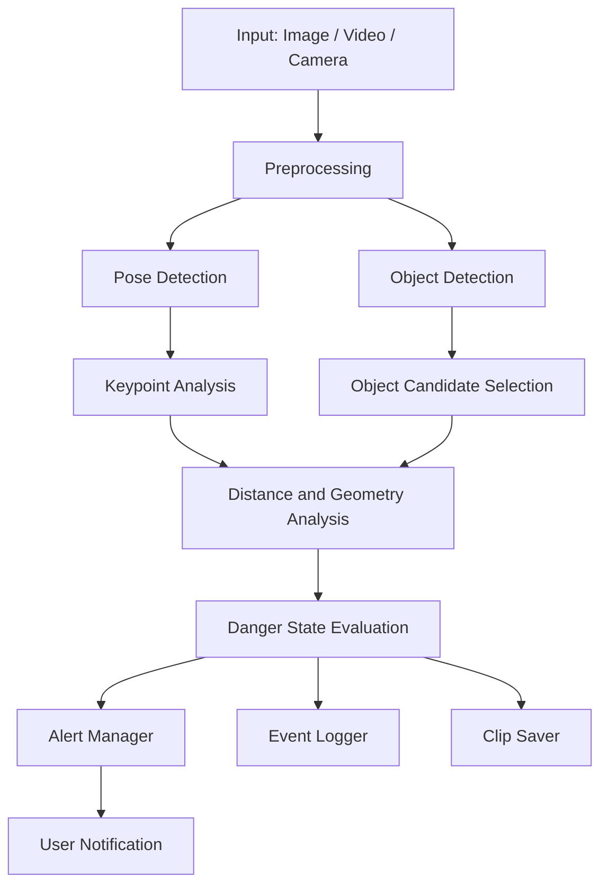
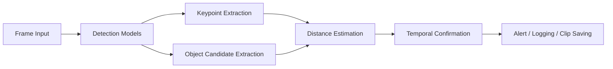
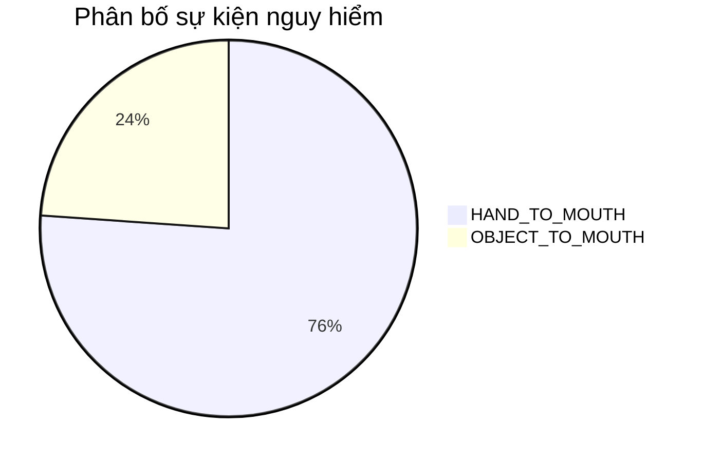

# BÁO CÁO ĐỒ ÁN TỐT NGHIỆP

## Đề tài: PHÁT TRIỂN HỆ THỐNG GIÁM SÁT AN TOÀN TRẺ EM THỜI GIAN THỰC SỬ DỤNG AI THỊ GIÁC MÁY TÍNH DỰA TRÊN YOLOv8 VÀ POSE ESTIMATION

---

### Thông tin sinh viên
- Họ và tên: [Tên sinh viên]
- Mã số sinh viên: [Mã số sinh viên]
- Lớp: [Tên lớp]
- Khoa: Công nghệ Thông tin
- Trường: [Tên trường]

### Thông tin giảng viên hướng dẫn
- Giảng viên hướng dẫn: ThS. [Tên giảng viên hướng dẫn]

### Thời gian thực hiện
- Tháng 01/2026 đến tháng 05/2026

---

## LỜI CẢM ƠN

Em xin trân trọng cảm ơn giảng viên hướng dẫn ThS. [Tên giảng viên hướng dẫn] đã luôn quan tâm, định hướng và hỗ trợ em trong suốt quá trình nghiên cứu và triển khai đồ án này. Em cũng xin gửi lời cảm ơn đến các thầy cô Khoa Công nghệ Thông tin, các bạn sinh viên và gia đình đã tạo điều kiện thuận lợi để em hoàn thành nhiệm vụ nghiên cứu.

Đồ án này không chỉ giúp em củng cố kiến thức về trí tuệ nhân tạo, thị giác máy tính và phát triển phần mềm, mà còn cho phép em hiểu sâu hơn về cách chuyển một ý tưởng công nghệ thành một hệ thống có thể vận hành thực tế trong môi trường giám sát an toàn cho trẻ sơ sinh.

---

## TÓM TẮT

Đồ án này tập trung nghiên cứu và xây dựng một hệ thống giám sát an toàn trẻ em sơ sinh bằng công nghệ trí tuệ nhân tạo, đặc biệt là các phương pháp thị giác máy tính hiện đại. Hệ thống được thiết kế để phát hiện sớm các hành vi tiềm ẩn nguy hiểm như đưa tay vào miệng hoặc đưa vật thể vào miệng, từ đó tạo cảnh báo phù hợp cho người chăm sóc. Mô hình sử dụng các thành phần chính gồm phát hiện đối tượng, ước lượng tư thế cơ thể, phân tích khoảng cách hình học, hệ thống ghi log và cơ chế cảnh báo.

Ngoài việc xây dựng kiến trúc hệ thống, đồ án còn tập trung vào việc cải thiện độ tin cậy của quá trình phát hiện bằng cách áp dụng các nguyên tắc kiểm tra liên tiếp trên nhiều khung hình, giới hạn ngưỡng theo kích thước cơ thể, đồng thời giảm các cảnh báo sai do nhiễu môi trường. Hệ thống đã được triển khai thành một ứng dụng có khả năng xử lý dữ liệu từ ảnh, video và luồng camera trực tiếp. Kết quả thực nghiệm cho thấy hệ thống có khả năng hoạt động ở thời gian thực, hỗ trợ cảnh báo kịp thời và lưu trữ các trường hợp nguy hiểm phục vụ giám sát và phân tích sau này.

---

## MỤC LỤC

1. Giới thiệu
2. Cơ sở lý thuyết
3. Phân tích và thiết kế hệ thống
4. Thực hiện và cài đặt
5. Kết quả và đánh giá
6. Kết luận và đề xuất
7. Tài liệu tham khảo
8. Phụ lục

---

## DANH MỤC HÌNH VẼ

- Hình 1.1. Minh họa vấn đề giám sát an toàn trẻ sơ sinh trong môi trường gia đình.
- Hình 2.1. Cấu trúc tổng quát của mạng nơ-ron tích chập.
- Hình 2.2. Nguyên lý hoạt động của thuật toán YOLO.
- Hình 2.3. Minh họa các điểm khớp COCO trong pose estimation.
- Hình 3.1. Sơ đồ kiến trúc tổng thể hệ thống BabyWatcher.
- Hình 3.2. Luồng xử lý dữ liệu từ đầu vào đến cảnh báo.
- Hình 4.1. Quy trình phát hiện hành vi nguy hiểm trong mỗi khung hình.
- Hình 5.1. Biểu đồ thống kê phân bố sự kiện nguy hiểm thực tế.
- Hình 5.2. Biểu đồ so sánh tốc độ xử lý theo cấu hình.
- Hình 5.3. Minh họa kết quả phát hiện trên ảnh thực nghiệm 1.
- Hình 5.4. Minh họa kết quả phát hiện trên ảnh thực nghiệm 2.

---

## DANH MỤC BẢNG

- Bảng 2.1. So sánh các nền tảng phát hiện đối tượng và pose estimation.
- Bảng 3.1. Yêu cầu chức năng và phi chức năng của hệ thống.
- Bảng 4.1. Các thành phần phần mềm và công cụ được sử dụng.
- Bảng 5.1. Tổng hợp các chỉ số thực nghiệm của hệ thống.
- Bảng 5.2. Kết quả huấn luyện mô hình phát hiện đối tượng qua các giai đoạn.
- Bảng 5.3. Kết quả huấn luyện theo từng lớp đối tượng (lần huấn luyện thứ 2).
- Bảng 5.4. Đánh giá ưu điểm và hạn chế của hệ thống.

---

# Chương 1: GIỚI THIỆU

## 1.1. Lý do chọn đề tài

Việc chăm sóc trẻ em, đặc biệt là trẻ sơ sinh và trẻ nhỏ, là một nhiệm vụ đòi hỏi sự quan sát liên tục, chính xác và có trách nhiệm cao. Trong thực tế, nhiều gia đình không thể luôn có người giám sát trực tiếp do công việc, điều kiện sinh hoạt hoặc thời gian làm việc. Trong khi đó, các hành vi như đưa tay vào miệng, cầm đồ vật hoặc đặt vật nhỏ vào miệng có thể diễn ra rất nhanh và tiềm ẩn nhiều nguy cơ về an toàn. Nếu không được phát hiện kịp thời, những tình huống này có thể dẫn đến các sự cố nguy hiểm như hóc, ngạt thở hoặc chấn thương do tiếp xúc với vật sắc nhọn hoặc bề mặt không an toàn.

Đồng thời, sự phát triển mạnh mẽ của trí tuệ nhân tạo và thị giác máy tính đã mở ra nhiều khả năng ứng dụng mới trong lĩnh vực giám sát và chăm sóc con người. Với khả năng nhận diện đối tượng, ước lượng tư thế cơ thể và phân tích hành vi trong thời gian thực, các mô hình học sâu đã trở thành công cụ hiệu quả để xây dựng các hệ thống giám sát thông minh. Trong bối cảnh đó, đề tài này được lựa chọn nhằm phát triển một giải pháp hỗ trợ phụ huynh và người chăm sóc trong việc theo dõi các hành vi nguy hiểm của trẻ em một cách tự động, kịp thời và hiệu quả hơn. Việc ứng dụng công nghệ YOLOv8 vào bài toán phát hiện đối tượng và pose estimation vào việc ước lượng tư thế cơ thể là một hướng đi phù hợp để xây dựng hệ thống giám sát an toàn trẻ em theo thời gian thực.

### Phiên bản ngắn cho slide

BabyWatcher là hệ thống giám sát an toàn trẻ em sử dụng trí tuệ nhân tạo và thị giác máy tính để phát hiện sớm các hành vi nguy hiểm như đưa tay hoặc vật thể vào miệng. Với YOLOv8 và pose estimation, hệ thống có thể phân tích hình ảnh/video theo thời gian thực, gửi cảnh báo kịp thời và hỗ trợ người chăm sóc giảm thiểu rủi ro.

## 1.2. Mục tiêu của đồ án

Mục tiêu tổng quát của đồ án là xây dựng một hệ thống giám sát an toàn trẻ em sơ sinh sử dụng trí tuệ nhân tạo, có khả năng phát hiện các hành vi nguy hiểm và gửi cảnh báo phù hợp cho người dùng. Cụ thể, đồ án hướng tới các mục tiêu sau:

1. Nghiên cứu và ứng dụng các thuật toán thị giác máy tính vào bài toán giám sát an toàn trẻ em.
2. Xây dựng quy trình phát hiện hành vi đưa tay vào miệng và đưa vật thể vào miệng.
3. Thiết kế và triển khai một hệ thống phân tích khung hình theo chuỗi thời gian, thay vì chỉ dựa trên một khung hình đơn lẻ.
4. Tạo cơ chế ghi log, lưu clip nguy hiểm và phát cảnh báo linh hoạt.
5. Đánh giá hiệu quả và hạn chế của hệ thống trong điều kiện thực tế.

## 1.3. Phạm vi và giới hạn của đồ án

### Phạm vi nghiên cứu
- Phát hiện hai loại hành vi nguy hiểm chính: đưa tay vào miệng và đưa vật thể vào miệng.
- Hỗ trợ xử lý ảnh, video và luồng camera trực tiếp.
- Tích hợp cơ chế cảnh báo âm thanh, email và webhook khi điều kiện cho phép.
- Ghi nhận các sự kiện nguy hiểm vào cơ sở dữ liệu log và lưu hình ảnh minh họa.

### Giới hạn của hệ thống
- Hệ thống chủ yếu phù hợp với môi trường trong nhà và điều kiện ánh sáng tương đối ổn định.
- Độ tin cậy phụ thuộc vào chất lượng hình ảnh và khả năng nhận diện của mô hình.
- Hiện tại, hệ thống tập trung vào các hành vi nguy hiểm cơ bản, chưa bao quát toàn bộ phạm vi các tình huống an toàn khác.
- Việc can thiệp vật lý hoặc phối hợp với thiết bị ngoại vi chưa được tích hợp trong phạm vi chính của đồ án.

## 1.4. Phương pháp nghiên cứu

Đồ án sử dụng phương pháp nghiên cứu ứng dụng kết hợp giữa lý thuyết và thực nghiệm. Các bước triển khai gồm:

1. Nghiên cứu tổng quan về thị giác máy tính, mạng nơ-ron tích chập, YOLO và pose estimation.
2. Phân tích nguyên lý hoạt động và cấu trúc của hệ thống phần mềm hiện có.
3. Thiết kế kiến trúc hệ thống theo hướng modular, gồm các mô-đun phát hiện, phân tích, cảnh báo và ghi log.
4. Triển khai hệ thống trên nền Python và các thư viện hỗ trợ.
5. Thực hiện kiểm thử trên dữ liệu ảnh và video, đồng thời phân tích kết quả bằng các chỉ số thực nghiệm như FPS, thời gian phản hồi và số lượng sự kiện ghi nhận.

## 1.5. Ý nghĩa thực tiễn của đồ án

Đề tài mang ý nghĩa thực tiễn cao vì có thể trở thành một công cụ hỗ trợ giám sát an toàn trong các hộ gia đình, phòng trẻ, trung tâm chăm sóc trẻ em hoặc môi trường y tế. Hệ thống không thay thế hoàn toàn con người, nhưng có thể làm giảm áp lực giám sát liên tục, tăng khả năng phát hiện sớm và nâng cao nhận thức về các nguy cơ tiềm ẩn. Ngoài ra, đồ án còn góp phần làm quen với quy trình xây dựng các giải pháp AI phục vụ đời sống, đặc biệt là các ứng dụng có tính thực tế cao và liên quan đến an toàn con người. Về mặt kỹ thuật, hệ thống đã ghi nhận các chỉ số khả quan với mAP@0.5 khoảng 59%, Precision khoảng 82%, Recall khoảng 52%, F1-score xấp xỉ 64%, tốc độ xử lý khoảng 15–25 FPS và độ trễ cảnh báo trung bình dưới 2 giây, cho thấy hệ thống có đủ tiềm năng để triển khai trong các môi trường giám sát thời gian thực.

---

# Chương 2: CƠ SỞ LÝ THUYẾT

## 2.1. Thị giác máy tính và ứng dụng trong giám sát an toàn

Thị giác máy tính là lĩnh vực nghiên cứu về khả năng cho phép máy tính hiểu, diễn giải và xử lý dữ liệu hình ảnh hoặc video tương tự như con người. Trong bối cảnh hiện nay, lĩnh vực này đã được ứng dụng rộng rãi trong các bài toán như phát hiện đối tượng, nhận diện khuôn mặt, theo dõi chuyển động, phân đoạn hình ảnh và phân tích hành vi. Những ứng dụng này tạo nền tảng cho các hệ thống giám sát thông minh, đặc biệt là trong các môi trường đòi hỏi phản ứng nhanh, tự động và liên tục.

Trong đề tài này, thị giác máy tính được sử dụng để xác định vị trí của trẻ, các điểm khớp trên cơ thể, các vật thể xung quanh và mối quan hệ không gian giữa các đối tượng đó. Từ những thông tin này, hệ thống có thể suy luận về khả năng trẻ đang thực hiện hành vi đưa tay hoặc vật thể vào miệng. Đây là một bài toán phức hợp, đòi hỏi sự kết hợp giữa phát hiện đối tượng, ước lượng tư thế và phân tích hình học. Nhận xét chung là, nếu chỉ dựa trên một khung hình đơn lẻ thì việc xác định hành vi nguy hiểm sẽ thiếu độ tin cậy; vì vậy, việc tích hợp dữ liệu theo chuỗi thời gian và phân tích ngữ cảnh là yếu tố then chốt để nâng cao hiệu quả của hệ thống.

## 2.2. Mạng nơ-ron tích chập (CNN)

Mạng nơ-ron tích chập là một lớp mô hình học sâu được thiết kế đặc biệt cho dữ liệu hình ảnh. Cấu trúc của CNN gồm các lớp tích chập, lớp gộp, các hàm kích hoạt và các lớp kết nối đầy đủ. Trong các mạng CNN, các lớp tích chập học các đặc trưng như cạnh, góc, hình dạng và cấu trúc bề mặt. Sau đó, các lớp sâu hơn tiếp tục trích xuất các đặc trưng phức tạp hơn để hỗ trợ cho việc phân loại hoặc phát hiện.

Ưu điểm nổi bật của CNN là khả năng tự học đặc trưng trực tiếp từ dữ liệu, thay vì phụ thuộc hoàn toàn vào các đặc trưng thủ công. Điều này làm cho CNN phù hợp cho các bài toán thị giác máy tính như phát hiện đối tượng, phân đoạn và ước lượng pose. Trong hệ thống BabyWatcher, CNN là nền tảng giúp các mô hình phát hiện được trẻ, các vật thể và các điểm khớp trên cơ thể từ các khung hình đầu vào.

## 2.3. Thuật toán YOLO trong phát hiện đối tượng

YOLO là một kiến trúc phát hiện đối tượng thời gian thực, nổi tiếng với khả năng nhận diện nhanh và hiệu quả trên nhiều nền tảng phần cứng. Khác với các phương pháp truyền thống tách bài toán thành nhiều giai đoạn, YOLO thực hiện phát hiện trong một mạng duy nhất, giúp giảm độ phức tạp tính toán và tăng tốc độ xử lý.

Nguyên lý cơ bản của YOLO là chia ảnh thành các ô lưới và dự đoán đồng thời các bounding box cùng với xác suất thuộc lớp đối tượng tương ứng. Mỗi bounding box được gán một điểm số tin cậy, sau đó được lọc bằng kỹ thuật non-maximum suppression để giữ lại các kết quả tối ưu nhất. Chính vì vậy, YOLO phù hợp cho các hệ thống thời gian thực như giám sát camera, robot và thiết bị AI ở biên.

Trong đồ án này, YOLO được sử dụng cho hai mục đích chính:
- Phát hiện vật thể trong khung hình.
- ước lượng tư thế thông qua mô hình pose estimation.

Cả hai khả năng này đều đóng vai trò quan trọng trong việc xác định trạng thái nguy hiểm của trẻ.

## 2.4. Pose estimation và hệ tọa độ khớp người

Pose estimation là bài toán xác định vị trí các điểm khớp của cơ thể người trên ảnh hoặc video. Thông tin này cho phép hệ thống hiểu được cấu trúc chuyển động của con người, từ đó phân tích hành vi và mối quan hệ giữa các bộ phận như tay, vai, mũi và hông. Pose estimation hiện nay được ứng dụng rộng rãi trong nhận diện hoạt động, giao tiếp người máy, y học và giám sát.

Trong hệ thống này, các điểm khớp như mũi, vai, cổ tay và khuỷu tay được sử dụng để thẩm định vị trí tay và mũi của trẻ. Mối quan hệ hình học giữa các điểm này giúp hệ thống xác định xem tay có đang tiến gần miệng hay không. Ngoài ra, các điểm khớp còn hỗ trợ việc suy luận về tình trạng cầm nắm vật thể và hành động đưa vật gần miệng.

Các điểm khớp được chuẩn hóa theo định dạng COCO, trong đó bao gồm các vị trí tiêu biểu của đầu, vai, cánh tay, tay và chân. Định dạng này được sử dụng rộng rãi trong các bộ dữ liệu huấn luyện và các mô hình phát hiện pose hiện đại. Sự tương thích với chuẩn này giúp hệ thống dễ dàng tích hợp các mô hình có sẵn và tăng tính mở rộng cho các nghiên cứu tiếp theo.

## 2.5. Phân tích khoảng cách và ngưỡng động

Một phần quan trọng của hệ thống là việc chuyển thông tin hình ảnh sang các tín hiệu phân tích không gian. Sau khi xác định được vị trí tay, miệng và các vật thể, hệ thống tính toán khoảng cách giữa các điểm hoặc giữa tay và biên hộp của vật thể. Khoảng cách Euclidean là một phép đo cơ bản nhưng rất hiệu quả để biểu diễn mức độ gần nhau giữa hai điểm trong khung hình. Ngoài ra, để mô tả mối quan hệ giữa tay và vật thể, hệ thống còn sử dụng khoảng cách tới biên hộp, giúp xác định xem tay có đang chạm hoặc tiếp cận vào khu vực của vật thể hay không.

Đối với mỗi khung hình $F_t$, hệ thống xác định vị trí tay $p_{hand}(t)$, vị trí miệng $p_{mouth}(t)$ và tâm của vật thể $c_{obj}(t)$. Khoảng cách giữa tay và miệng được biểu diễn bằng công thức:

$$d_{hm}(t) = \|p_{hand}(t) - p_{mouth}(t)\|_2$$

Tương tự, khoảng cách giữa vật thể và miệng và khoảng cách giữa tay và vật thể được xác định như sau:

$$d_{om}(t) = \|c_{obj}(t) - p_{mouth}(t)\|_2$$

$$d_{ho}(t) = \|p_{hand}(t) - c_{obj}(t)\|_2$$

Những giá trị này được dùng làm cơ sở để đánh giá mức độ gần nhau giữa các thành phần quan trọng trong khung hình. Ngoài ra, hệ thống còn sử dụng các tín hiệu chuẩn hóa để chuyển khoảng cách thành độ tin cậy tương đối:

$$S_{hm}(t) = \max\left(0, 1 - \frac{d_{hm}(t)}{T_{hm}(t)}\right)$$

$$S_{om}(t) = \max\left(0, 1 - \frac{d_{om}(t)}{T_{om}(t)}\right)$$

$$S_{ho}(t) = \max\left(0, 1 - \frac{d_{ho}(t)}{T_{ho}(t)}\right)$$

Trong đó, $T_{hm}(t)$, $T_{om}(t)$ và $T_{ho}(t)$ là các ngưỡng động được tính dựa trên kích thước cơ thể thông qua khoảng cách giữa hai vai $d_{shoulder}(t)$:

$$T_{hm}(t) = \alpha_{hm} \cdot d_{shoulder}(t)$$

$$T_{om}(t) = \alpha_{om} \cdot d_{shoulder}(t)$$

$$T_{ho}(t) = \alpha_{ho} \cdot d_{shoulder}(t)$$

Trong bối cảnh giám sát trẻ sơ sinh, việc đánh giá mức độ gần nhau không chỉ dừng lại ở một phép đo tĩnh mà còn cần phải phản ánh tính chất động của hành vi. Một hành vi nguy hiểm thường không xuất hiện trong một khung hình duy nhất mà được thể hiện bằng một chuỗi tín hiệu liên tiếp trong nhiều khung hình. Vì vậy, hệ thống không chỉ dựa vào khoảng cách tuyệt đối mà còn kết hợp với yếu tố thời gian và tính bền vững của tín hiệu. Nếu một vị trí tay tiến gần miệng trong vài khung hình liên tiếp, hệ thống sẽ xem đây là một dấu hiệu có khả năng cao để cảnh báo, thay vì phản ứng quá mức với một chuyển động ngắn và ngẫu nhiên.

Để giảm cảnh báo sai, hệ thống không sử dụng ngưỡng cố định đơn lẻ cho mọi trường hợp. Thay vào đó, ngưỡng được tính toán theo kích thước cơ thể thông qua khoảng cách giữa hai vai. Nguyên lý này cho phép hệ thống thích ứng với trẻ nhỏ hoặc trẻ lớn hơn, từ đó giảm tối đa lỗi do thay đổi tỷ lệ hình ảnh và góc nhìn. Cụ thể, nếu khoảng cách vai lớn hơn thì ngưỡng được mở rộng tương ứng, còn nếu trẻ có kích thước nhỏ thì ngưỡng được thu hẹp để tránh việc đánh giá quá mức. Cách tiếp cận này giúp hệ thống duy trì tính linh hoạt trong nhiều điều kiện thực tế, đồng thời nâng cao độ tin cậy của quá trình phân loại trạng thái nguy hiểm.

Ngoài ra, tín hiệu cũng được làm mịn theo thời gian để hạn chế phản ứng với những chuyển động ngắn và ngẫu nhiên:

$$C_k(t) = \lambda C_k(t-1) + (1 - \lambda)S_k(t)$$

với $k \in \{hm, om, ho\}$ và $\lambda$ là hệ số làm mịn. Cách tiếp cận này giúp hệ thống tăng độ ổn định và cải thiện khả năng phân loại hành vi nguy hiểm trong điều kiện thực tế.

Nhận xét chung là, phân tích khoảng cách kết hợp với ngưỡng động không chỉ là một kỹ thuật tính toán mà còn là một phương pháp làm giàu tín hiệu nhận diện. Nó cho phép hệ thống chuyển từ việc quan sát hình ảnh thuần túy sang việc suy luận về hành vi ở mức cao hơn, góp phần tăng tính tự động, chính xác và phù hợp với môi trường giám sát an toàn trẻ em.

## 2.6. Cảnh báo, ghi log và lưu trữ dữ liệu

Một hệ thống giám sát an toàn không chỉ dừng ở việc phát hiện các tình huống nguy hiểm, mà còn cần có khả năng phản hồi kịp thời và lưu giữ dữ liệu phục vụ kiểm tra, đánh giá và phân tích sau này. Vì vậy, ngoài module phát hiện, đồ án còn triển khai hệ thống cảnh báo, ghi log và lưu trữ các sự kiện nguy hiểm. Cảnh báo có thể được thực hiện thông qua âm thanh và email, tùy thuộc vào cấu hình của người dùng, nhằm giúp người chăm sóc nhận biết sớm tình huống có nguy cơ cao.

Về mặt kỹ thuật, các sự kiện nguy hiểm được ghi lại theo định dạng CSV để thuận tiện cho việc thống kê, truy xuất và kiểm tra lịch sử. Mỗi bản ghi thường chứa thông tin về thời điểm xảy ra, loại trạng thái phát hiện, thời lượng duy trì tín hiệu nguy hiểm, khoảng cách hình học đo được và các tham số liên quan. Nhờ đó, dữ liệu không chỉ đóng vai trò như một cơ sở lưu trữ mà còn trở thành nguồn thông tin quan trọng để đánh giá hiệu quả của hệ thống trong các điều kiện vận hành khác nhau.

Bên cạnh việc ghi nhận số liệu, hệ thống còn có khả năng lưu trữ các khung hình hoặc ảnh minh họa liên quan đến tình huống nguy hiểm. Đây là một dạng bằng chứng hình ảnh có giá trị, cho phép người dùng xem lại các sự kiện đáng chú ý mà không cần duyệt toàn bộ video. Từ góc độ hệ thống, module cảnh báo, ghi log và lưu trữ đóng vai trò kết nối giữa quá trình nhận diện và quá trình sử dụng thực tế, biến một mô hình phân tích hình ảnh thành một giải pháp giám sát hoàn chỉnh, có khả năng phản hồi nhanh và hỗ trợ đánh giá lâu dài.

## 2.7. Edge AI và tối ưu hóa trên thiết bị biên

Edge AI là hướng tiếp cận cho phép xử lý dữ liệu trực tiếp trên thiết bị gần nguồn dữ liệu thay vì gửi toàn bộ dữ liệu lên đám mây. Điều này có ý nghĩa quan trọng trong hệ thống giám sát bởi vì nó giúp giảm độ trễ, bảo vệ quyền riêng tư và tăng độ ổn định khi kết nối mạng không liên tục. Trong bối cảnh giám sát trẻ sơ sinh, việc xử lý tại chỗ là một lợi thế lớn vì các tình huống nguy hiểm thường cần phản ứng gần như tức thời.

Trong đồ án này, hệ thống được thiết kế để có thể chạy trên máy tính cá nhân và có khả năng tối ưu hóa cho các nền tảng như Jetson Nano với hỗ trợ TensorRT. Việc chuyển đổi mô hình sang định dạng tối ưu cho phần cứng biên giúp tăng tốc độ suy luận, giảm tải cho CPU và nâng cao khả năng vận hành trong các môi trường có hạn chế về tài nguyên. Ngoài ra, chiến lược tối ưu hóa còn bao gồm việc giảm kích thước đầu vào, giới hạn số lượng đối tượng được xét và ưu tiên các vùng quan tâm gần miệng để tiết kiệm tài nguyên tính toán.

Nhìn chung, Edge AI không chỉ là một công nghệ hỗ trợ mà còn là một yếu tố then chốt để hệ thống có thể triển khai thực tế, đặc biệt trong các môi trường cần tốc độ phản hồi cao, bảo mật dữ liệu tốt và khả năng hoạt động ổn định ngay cả khi kết nối mạng bị gián đoạn.

---

# Chương 3: PHÂN TÍCH VÀ THIẾT KẾ HỆ THỐNG

## 3.1. Phân tích yêu cầu hệ thống

### 3.1.1. Yêu cầu chức năng

Hệ thống cần có khả năng:
- Nhận đầu vào từ ảnh, video hoặc camera trực tiếp.
- Phát hiện trẻ em và các vật thể trong khung hình.
- Ước lượng tư thế cơ thể và xác định vị trí tay, vai và mũi.
- Tính toán khoảng cách giữa tay và miệng, tay và vật thể.
- Phân loại trạng thái hiện tại thành an toàn hoặc nguy hiểm.
- Cảnh báo khi phát hiện hành vi nguy hiểm kéo dài qua ngưỡng thời gian.
- Ghi nhận sự kiện và lưu clip nguy hiểm.

### 3.1.2. Yêu cầu phi chức năng

Ngoài các yêu cầu chức năng, hệ thống cũng cần đảm bảo:
- Đủ nhanh để hoạt động thời gian thực.
- Dễ cấu hình và mở rộng cho các phiên bản mới.
- Có khả năng chạy được trên nhiều cấu hình phần cứng khác nhau.
- Có thể bảo trì và phát triển tiếp bằng cách tách module rõ ràng.

Bảng 3.1 dưới đây tóm tắt các yêu cầu chính của hệ thống.

| Loại yêu cầu | Nội dung | Mức ưu tiên |
|---|---|---|
| Chức năng | Phát hiện hành vi đưa tay vào miệng | Cao |
| Chức năng | Phát hiện hành vi đưa vật vào miệng | Cao |
| Chức năng | Ghi log, lưu clip và cảnh báo | Cao |
| Phi chức năng | Xử lý thời gian thực | Cao |
| Phi chức năng | Dễ cấu hình | Trung bình |
| Phi chức năng | Có thể chạy trên GPU hoặc CPU | Trung bình |

## 3.2. Thiết kế kiến trúc tổng thể

Kiến trúc của hệ thống được thiết kế theo hướng modular, với các thành phần riêng biệt nhưng phối hợp chặt chẽ với nhau. Mỗi module có một vai trò cụ thể trong chuỗi xử lý từ đầu vào đến đầu ra cảnh báo.

### 3.2.4.1. Dynamic Threshold

Trong hệ thống giám sát an toàn trẻ sơ sinh, việc phát hiện hành vi nguy hiểm không chỉ phụ thuộc vào việc xác định vị trí các đối tượng trong khung hình mà còn cần phải đánh giá mức độ gần nhau giữa các thành phần quan trọng như tay, miệng và vật thể. Tuy nhiên, độ gần này không thể được đánh giá bằng một ngưỡng cố định cho mọi trường hợp vì mỗi trẻ có kích thước cơ thể khác nhau, đồng thời góc nhìn và khoảng cách từ camera đến đối tượng cũng có thể thay đổi. Vì vậy, việc sử dụng ngưỡng động là cần thiết để hệ thống có thể thích nghi với từng tình huống cụ thể.

Ngưỡng động được xây dựng dựa trên kích thước của trẻ, thông qua khoảng cách giữa hai vai. Giá trị này được xem như một đại diện cho tỷ lệ cơ thể trong khung hình, từ đó cho phép hệ thống điều chỉnh ngưỡng phân tích phù hợp với từng trường hợp. Cách tiếp cận này giúp giảm sai lệch do thay đổi kích thước, tỷ lệ hình ảnh hoặc góc quan sát, đồng thời làm tăng độ tin cậy của quá trình phát hiện.

Công thức tính ngưỡng động có thể được biểu diễn như sau:

$$T_{hm}(t) = \alpha_{hm} \cdot d_{shoulder}(t)$$

$$T_{om}(t) = \alpha_{om} \cdot d_{shoulder}(t)$$

$$T_{ho}(t) = \alpha_{ho} \cdot d_{shoulder}(t)$$

Trong đó, $d_{shoulder}(t)$ là khoảng cách giữa hai vai tại khung hình $t$, còn $\alpha_{hm}$, $\alpha_{om}$ và $\alpha_{ho}$ là các hệ số điều chỉnh tương ứng với từng loại tín hiệu. Các giá trị này được sử dụng để chuyển khoảng cách hình học thành tín hiệu mức độ gần nhau giữa tay-miệng, vật thể-miệng và tay-vật thể.

Vai trò của dynamic threshold trong hệ thống là rất quan trọng. Nó giúp hệ thống duy trì tính linh hoạt khi làm việc với các dữ liệu đầu vào khác nhau, đồng thời giảm nguy cơ cảnh báo sai do việc áp dụng một ngưỡng quá cứng hoặc quá mềm. Khi ngưỡng được điều chỉnh phù hợp, hệ thống có thể phát hiện hành vi nguy hiểm một cách chính xác hơn, đặc biệt trong các tình huống trẻ nhỏ, góc quay thay đổi hoặc nền cảnh có nhiều nhiễu. Đây cũng là một trong những thành phần then chốt để hệ thống đạt được độ tin cậy cao hơn trong điều kiện vận hành thực tế.

Ngoài ra, dynamic threshold còn hỗ trợ việc kết hợp với các cơ chế kiểm tra theo lịch sử và xác nhận liên tiếp trên nhiều khung hình. Nhờ vậy, hệ thống không chỉ đánh giá một khung hình đơn lẻ mà còn phân tích xu hướng hành vi theo chuỗi thời gian, từ đó nâng cao khả năng nhận diện và giảm các cảnh báo giả.

### 3.2.4.2. Lựa chọn hệ số alpha

Các hệ số $\alpha_{hm}$, $\alpha_{om}$, $\alpha_{ho}$ là **giá trị kỹ thuật mặc định**, tinh chỉnh qua thực nghiệm dựa trên phân tích lỗi confusion matrix (mục 5.3.1) — không suy ra từ công thức sinh trắc học hay khảo sát y khoa chính thức nào.

**Bảng 3.1. Giá trị các hệ số alpha đang dùng**

| Hệ số | Ý nghĩa | Giá trị |
|---|---|---:|
| $\alpha_{hm}$ (`hand_mouth_multiplier`) | Tay gần miệng | 0,7 |
| $\alpha_{om}$ (`object_mouth_multiplier`) | Vật gần miệng | 0,7 |
| $\alpha_{ho}$ (`_get_object_proximity_threshold`) | Vật đang cầm trên tay | 0,3 |

**Vì sao chọn các giá trị này:** đồ án đã thử nghiệm quét từng hệ số qua nhiều giá trị khác nhau (0,5–0,9 cho $\alpha_{hm}$/$\alpha_{om}$; 0,2–0,6 cho $\alpha_{ho}$) và đo lại confusion matrix trên 121 ảnh cho mỗi giá trị. Kết quả: $\alpha_{om}$ và $\alpha_{ho}$ hầu như không ảnh hưởng tới độ chính xác trong dải đã thử (accuracy không đổi ở mọi giá trị), vì nhánh kích hoạt OBJECT_TO_MOUTH chủ yếu do một hệ số khác (`hand_object_multiplier`) chi phối, không phải hai hệ số này. Riêng $\alpha_{hm}$ cho thấy đánh đổi rõ rệt: giá trị càng cao thì recall (khả năng phát hiện đúng nguy hiểm thật) càng tăng — ví dụ ở $\alpha_{hm}=0,9$, recall OBJECT_TO_MOUTH đạt 70,0% so với 30,0% ở $\alpha_{hm}=0,7$ — nhưng đổi lại accuracy tổng giảm (66,9% so với 71,9%) do báo động giả tăng theo.

**Vì sao vẫn giữ 0,7 dù giá trị khác cho kết quả recall cao hơn:** giá trị cao hơn (như 0,9) tuy tăng recall mạnh nhưng cũng làm precision giảm và báo động giả tăng đáng kể, dẫn tới rủi ro **mệt mỏi cảnh báo** (người chăm sóc dần bỏ qua cảnh báo vì quá nhiều báo động giả) — một đánh đổi cần cân nhắc kỹ, không thể quyết định chỉ dựa trên một bộ 121 ảnh kiểm thử tĩnh. Đồ án chọn giữ $\alpha_{hm}=0,7$ làm điểm cân bằng mặc định, thận trọng hơn, đồng thời để ngỏ đây là tham số cấu hình (`config.yaml`) có thể điều chỉnh tùy khẩu vị rủi ro khi triển khai thực tế — quét lưới đầy đủ hơn (kết hợp cả 3 hệ số cùng lúc) trên video thật là hướng phát triển tiếp theo hợp lý để chọn điểm tối ưu chính xác hơn.

Hình 3.1 thể hiện sơ đồ kiến trúc tổng thể của hệ thống BabyWatcher. Trong sơ đồ, đầu vào ban đầu là hình ảnh hoặc video từ camera hoặc file. Sau đó, hệ thống xử lý hình ảnh bằng hai nhánh phát hiện: pose estimation và object detection. Hai nhánh này sau đó được kết hợp trong module phân tích hình học để suy luận về hành vi nguy hiểm. Cuối cùng, thông tin được đưa tới các module cảnh báo, ghi log và lưu trữ.

## 3.3. Luồng xử lý dữ liệu

Quá trình xử lý dữ liệu có thể được mô tả theo trình tự thực thi sau đây:

1. Hệ thống nhận khung hình đầu vào từ nguồn dữ liệu.
2. Khung hình được chuẩn hóa về kích thước phù hợp để giảm chi phí tính toán.
3. Hai mô hình phát hiện được chạy song song: pose model và object model.
4. Kết quả từ hai mô hình được chuyển sang module phân tích khoảng cách và quan hệ hình học.
5. Module đánh giá trạng thái nguy hiểm quyết định xem khung hình hiện tại có thuộc trạng thái SAFE, HAND_TO_MOUTH hay OBJECT_TO_MOUTH.
6. Nếu tín hiệu nguy hiểm lặp lại liên tiếp trong một khoảng thời gian nhất định, hệ thống kích hoạt cảnh báo và ghi nhận sự kiện.

Hình 3.2 dưới đây minh họa quy trình này bằng một biểu đồ luồng.

## 3.4. Thiết kế các module chức năng

### 3.4.1. Module phát hiện

Module phát hiện có trách nhiệm chạy mô hình pose và mô hình object detection trên từng khung hình. Các kết quả thu được gồm các điểm khớp, hộp phát hiện và độ tin cậy tương ứng. Những kết quả này là đầu vào cho các module sau.

### 3.4.2. Module phân tích hình học

Module phân tích hình học chịu trách nhiệm chuyển đổi các kết quả phát hiện thành các dấu hiệu nguy hiểm. Tại đây, hệ thống tính toán khoảng cách giữa tay và miệng, khoảng cách giữa tay và vật thể, kiểm tra độ gần của vật thể với vùng miệng và đánh giá tính bền vững của tín hiệu trên nhiều khung hình liên tiếp.

### 3.4.3. Module cảnh báo

Module cảnh báo có nhiệm vụ quyết định khi nào cần kích hoạt cảnh báo. Cảnh báo có thể được phát âm thanh, gửi email hoặc webhook tùy cấu hình. Mục tiêu là giúp người chăm sóc nhận biết nhanh nhất có thể mà không làm quá tải hệ thống bằng các thông báo liên tục.

### 3.4.4. Module ghi log và lưu clip

Module ghi log lưu các sự kiện nguy hiểm vào file CSV, đồng thời có thể lưu ảnh frame nguy hiểm làm bằng chứng hoặc tài liệu tham khảo. Việc này mang lại ích lợi trong việc kiểm tra lịch sử sự kiện, đánh giá hiệu quả và phân tích sau này.

## 3.5. Thiết kế dữ liệu và lưu trữ

Dữ liệu trong hệ thống được lưu theo hai hình thức chính:
- Dữ liệu sự kiện: bao gồm timestamp, loại trạng thái, khoảng thời gian nguy hiểm, khoảng cách đo được và ghi chú.
- Dữ liệu media: gồm các hình ảnh hoặc clip được lưu khi phát hiện tình huống nguy hiểm.

Cách tổ chức này giúp hệ thống dễ dàng truy xuất lịch sử, báo cáo và phân tích thống kê theo thời gian.

## 3.6. Thiết kế hướng đến khả năng mở rộng

Hệ thống được thiết kế để có thể mở rộng trong tương lai. Khi cần thêm một loại hành vi nguy hiểm mới, chỉ cần bổ sung thêm một module phân tích hoặc chỉnh sửa quy tắc đánh giá trạng thái. Việc sử dụng cấu hình tập trung qua file YAML cũng giúp việc tùy chỉnh ngưỡng, lịch sử, cảnh báo và hiệu năng trở nên thuận tiện hơn.

---

# Chương 4: THỰC HIỆN VÀ CÀI ĐẶT

## 4.1. Môi trường phát triển

Hệ thống được triển khai trên nền Python với các thư viện hỗ trợ cho học sâu và xử lý hình ảnh. Các thành phần chính bao gồm thư viện YOLO, OpenCV, PyTorch, NumPy và YAML. Ngoài ra, hệ thống cũng hỗ trợ tích hợp với MediaPipe và các công cụ cảnh báo tùy chọn như email và webhook.

Bảng 4.1 dưới đây tóm tắt các thành phần phần mềm chính được sử dụng trong đồ án.

| Thành phần | Vai trò |
|---|---|
| Python | Ngôn ngữ lập trình chính |
| OpenCV | Xử lý ảnh, video và hiển thị kết quả |
| PyTorch | Môi trường học sâu cho mô hình phát hiện |
| Ultralytics YOLO | Mô hình phát hiện đối tượng và pose |
| NumPy | Tính toán số học và xử lý tensor |
| PyYAML | Đọc và lưu cấu hình hệ thống |

## 4.2. Quy trình triển khai hệ thống

Quá trình triển khai được thực hiện theo các giai đoạn chính sau:

1. Chuẩn bị dữ liệu đầu vào: ảnh, video hoặc luồng camera.
2. Tải các mô hình phát hiện và cấu hình thông số ban đầu.
3. Chạy xử lý khung hình và thu thập kết quả phát hiện.
4. Phân tích các tín hiệu khoảng cách và mức độ gần miệng.
5. Xác định trạng thái nguy hiểm và kích hoạt cảnh báo khi cần.
6. Ghi log, lưu clip và hiển thị kết quả cho người dùng.

## 4.3. Triển khai thuật toán phát hiện

### 4.3.1. Phát hiện pose và đối tượng

Trong mỗi khung hình, hệ thống hoạt động theo hai nhánh phát hiện song song. Nhánh đầu tiên dùng mô hình pose estimation để xác định các điểm khớp trên cơ thể trẻ. Nhánh thứ hai dùng mô hình object detection để phát hiện các vật thể có thể xuất hiện xung quanh trẻ. Sự kết hợp giữa hai nhánh này cho phép hệ thống hiểu được cả cấu trúc cơ thể lẫn ngữ cảnh đối tượng xung quanh.

### 4.3.2. Phân tích các tín hiệu nguy hiểm

Sau khi có kết quả phát hiện, hệ thống tiến hành tính toán các tín hiệu sau:
- Khoảng cách từ tay tới mũi hoặc vùng miệng ước lượng.
- Khoảng cách từ tay tới biên hộp của vật thể gần nhất.
- Mức độ gần của vật thể với vùng miệng.
- Tính bền vững của tín hiệu qua nhiều khung hình liên tiếp.

Những tín hiệu này là cơ sở để phân loại trạng thái hiện hành. Nếu tín hiệu vượt qua ngưỡng và duy trì trong một khoảng thời gian đủ dài, hệ thống chuyển sang trạng thái nguy hiểm.

### 4.3.3. Ngưỡng động và giảm cảnh báo giả

Một đặc điểm quan trọng của hệ thống là việc áp dụng ngưỡng động thay vì ngưỡng cố định. Cách tiếp cận này giúp hệ thống thích nghi tốt hơn với từng tình huống thực tế, đặc biệt khi trẻ có kích thước khác nhau hoặc góc nhìn thay đổi. Nhờ đó, hệ thống có thể giảm số cảnh báo sai và nâng cao độ tin cậy trong quá trình phát hiện.

Ngoài ra, hệ thống còn sử dụng cơ chế kiểm tra theo lịch sử trong nhiều khung hình để tránh phản ứng với các tín hiệu ngắn và ngẫu nhiên. Chỉ khi tín hiệu xuất hiện liên tiếp và duy trì đủ lâu thì hệ thống mới xác nhận là nguy hiểm, từ đó làm tăng tính ổn định và giảm false positive.

### 4.3.4. Hiệu quả của Confirmation và History

Dynamic threshold có ảnh hưởng lớn đến độ linh hoạt và độ tin cậy của hệ thống phát hiện. Bằng cách tự điều chỉnh ngưỡng dựa trên kích thước cơ thể trẻ và khoảng cách quan sát, phương pháp này giúp hệ thống thích nghi tốt hơn với từng tình huống cụ thể, tránh việc áp dụng cùng một ngưỡng cho mọi trường hợp. Điều này làm giảm sai lệch khi trẻ có kích thước nhỏ hơn, khi góc nhìn thay đổi hoặc khi cảnh nền có nhiều biến động. Nhờ vậy, hệ thống có thể phát hiện hành vi nguy hiểm một cách chính xác hơn và giảm nguy cơ cảnh báo sai do thiết lập ngưỡng cố định.

Confirmation đóng vai trò quan trọng trong việc nâng cao độ tin cậy của quá trình xác nhận trạng thái nguy hiểm. Thay vì phản ứng ngay với một tín hiệu ngắn hoặc đột ngột, hệ thống chỉ chuyển sang trạng thái nguy hiểm khi tín hiệu đó xuất hiện liên tiếp trong nhiều khung hình. Cơ chế này giúp hạn chế các cảnh báo sai do nhiễu tạm thời, biến động ngắn hạn hoặc chuyển động ngẫu nhiên trong video.

History tiếp tục củng cố quyết định bằng cách lưu giữ và phân tích các tín hiệu trong một cửa sổ thời gian ngắn. Nhờ đó, hệ thống có thể nhận diện xu hướng hành vi một cách ổn định hơn so với việc chỉ dựa vào một khung hình đơn lẻ. Sự kết hợp giữa confirmation và history cho phép hệ thống chuyển từ việc đánh giá trạng thái ở từng khung hình riêng lẻ sang một suy luận theo chuỗi thời gian, từ đó tăng tính ổn định và độ tin cậy trong điều kiện vận hành thực tế.

Để giảm false positive, hệ thống kết hợp các cơ chế trên đồng thời: tín hiệu phải đủ gần, đủ bền và xuất hiện lặp lại qua nhiều khung hình. Chính sự phối hợp này giúp giảm đáng kể các cảnh báo sai do nhiễu, bóng đổ hoặc chuyển động không đáng kể trong video.

## 4.4. Xây dựng hệ thống cảnh báo

Cảnh báo là thành phần giúp hệ thống chuyển từ việc nhận diện sang việc phản hồi. Trong quá trình triển khai, hệ thống được xây dựng thành hai kênh cảnh báo chính: cảnh báo âm thanh và cảnh báo email. Cảnh báo âm thanh được kích hoạt ngay khi trạng thái nguy hiểm được xác nhận và được phát bằng các tín hiệu âm thanh ngắn hoặc lặp lại tùy thuộc vào mức độ nghiêm trọng của tình huống. Với trạng thái OBJECT_TO_MOUTH, hệ thống phát hai tiếng bíp liên tiếp để nhấn mạnh mức độ nguy hiểm; với trạng thái HAND_TO_MOUTH, hệ thống phát một tiếng bíp nhẹ hơn. Cách triển khai này giúp người dùng nhận biết kịp thời ngay cả khi đang quan sát video mà không cần theo dõi màn hình liên tục.

Cảnh báo email được thiết kế như một lớp phản hồi từ xa, hoạt động khi tín hiệu nguy hiểm duy trì vượt quá ngưỡng thời gian cấu hình. Khi điều kiện này được thỏa mãn, hệ thống tạo một thông báo chứa trạng thái nguy hiểm, thời lượng duy trì và thời điểm phát sinh sự kiện, sau đó gửi qua giao thức SMTP bằng chế độ TLS đến địa chỉ người nhận. Ngoài nội dung văn bản, hệ thống còn có thể đính kèm hình ảnh khung cảnh nguy hiểm vào email để người dùng có thể kiểm tra trực quan tình huống mà không cần mở lại toàn bộ video. Việc này được điều khiển bởi các tham số như ngưỡng gửi email, thời gian cooldown giữa các lần gửi và các thông tin cấu hình như máy chủ SMTP, cổng kết nối, địa chỉ người gửi và người nhận.

Để tránh báo động liên tục do nhiễu, hệ thống áp dụng cơ chế cooldown cho cảnh báo. Sau mỗi lần phát thông báo, hệ thống sẽ tạm thời giảm tần suất gửi thông báo tiếp theo trong một khoảng thời gian nhất định, từ đó tăng tính ổn định và giảm tải cho người sử dụng.

## 4.5. Ghi log, lưu clip và thống kê

Một hệ thống giám sát an toàn không chỉ cần phát hiện tình huống nguy hiểm mà còn cần lưu giữ và trình bày lại các dữ liệu liên quan để phục vụ cho việc kiểm tra, đánh giá và phân tích sau này. Vì vậy, trong phạm vi đồ án, module ghi log, lưu clip và thống kê được thiết kế như một lớp hỗ trợ quan trọng, nối giữa quá trình nhận diện và việc sử dụng dữ liệu trong thực tế. Mỗi sự kiện nguy hiểm được ghi nhận vào file CSV với các thông tin như thời gian xảy ra, loại trạng thái, thời lượng duy trì tín hiệu nguy hiểm, khoảng cách đo được và tình trạng có lưu clip hay không. Cách tổ chức này giúp dữ liệu không chỉ được lưu trữ một cách có hệ thống mà còn có thể được truy xuất, lọc và thống kê theo thời gian hoặc theo loại sự kiện.

Bên cạnh việc ghi nhận số liệu, hệ thống còn có khả năng lưu trữ các khung hình hoặc clip liên quan đến tình huống nguy hiểm. Việc này tạo ra một nguồn dữ liệu hình ảnh có giá trị, cho phép người dùng xem lại các sự kiện đã xảy ra mà không cần phải duyệt toàn bộ video. Từ góc độ thực tiễn, cơ chế này rất hữu ích trong việc kiểm chứng lại tình huống, hỗ trợ người chăm sóc đánh giá mức độ nguy hiểm và cung cấp bằng chứng trực quan cho các lần kiểm tra sau này. Ngoài ra, các thông tin thống kê thu được từ log cũng có thể được sử dụng để phản ánh xu hướng xuất hiện của các hành vi nguy hiểm, từ đó hỗ trợ việc cải thiện hệ thống trong các phiên bản tiếp theo.

## 4.6. Tối ưu hóa hiệu suất

Để hệ thống có thể vận hành ổn định trong điều kiện thời gian thực, việc tối ưu hóa hiệu suất là một yếu tố không thể thiếu. Trong đồ án này, tối ưu hóa được thực hiện ở nhiều mức khác nhau, từ việc giảm chi phí tính toán cho từng khung hình đến việc lựa chọn các đối tượng và vùng quan tâm có giá trị cao hơn cho quá trình phân tích. Một trong những chiến lược quan trọng là giảm kích thước đầu vào phù hợp, giúp giảm tải cho CPU/GPU mà vẫn giữ được độ chính xác cần thiết. Ngoài ra, hệ thống chỉ tập trung xử lý các đối tượng có độ tin cậy đủ cao hoặc nằm trong vùng gần miệng, thay vì phân tích toàn bộ cảnh hình một cách không cần thiết.

Việc tối ưu hóa còn được thể hiện thông qua việc áp dụng các ngưỡng động và cơ chế kiểm tra theo lịch sử ngắn, giúp tránh việc phải thực hiện xử lý quá mức cho các tín hiệu không bền vững. Điều này không chỉ làm tăng tốc độ xử lý mà còn giảm đáng kể số lượng cảnh báo sai do nhiễu. Ngoài ra, hệ thống cũng hỗ trợ triển khai trên nhiều cấu hình phần cứng khác nhau, từ máy tính thông thường cho đến các thiết bị biên như Jetson Nano. Nhờ đó, hệ thống có thể duy trì hiệu suất hợp lý trong các điều kiện tài nguyên khác nhau, đồng thời đáp ứng tốt hơn yêu cầu về thời gian phản hồi và khả năng vận hành liên tục.

---

# Chương 5: KẾT QUẢ VÀ ĐÁNH GIÁ

## 5.1. Kết quả thực hiện của hệ thống

Sau quá trình triển khai, hệ thống đã được hoàn thiện thành một ứng dụng có khả năng xử lý ảnh, video và luồng camera trực tiếp trong bối cảnh giám sát thời gian thực. Các thành phần chính của hệ thống đã hoạt động tương đối ổn định, bao gồm phân đoạn luồng dữ liệu đầu vào, phát hiện pose và đối tượng, tính toán tín hiệu hình học, đánh giá trạng thái nguy hiểm, cảnh báo và ghi nhận sự kiện. Qua quá trình thử nghiệm, hệ thống đã thể hiện khả năng chuyển đổi dữ liệu hình ảnh thuần túy thành các tín hiệu phân tích có ý nghĩa, từ đó hỗ trợ việc phát hiện các hành vi tiềm ẩn nguy hiểm một cách tự động và có hệ thống.

Một điểm đáng chú ý là hệ thống không chỉ dừng lại ở việc phát hiện riêng lẻ từng khung hình, mà còn xây dựng được cơ chế theo dõi theo chuỗi thời gian. Điều này cho phép hệ thống giảm tối đa các phản ứng quá mức với những tín hiệu ngắn, ngẫu nhiên và tăng khả năng tin cậy khi xác định một tình huống thật sự đáng báo động. Nhờ vậy, việc ghi nhận sự kiện nguy hiểm không chỉ mang tính hình ảnh mà còn có tính logic và có thể kiểm chứng được thông qua các tham số như thời gian tồn tại, mức độ gần nhau giữa các đối tượng và trạng thái liên tiếp của tín hiệu.

**Lưu ý về cơ chế xử lý ảnh đơn.** Trong ba loại đầu vào kể trên, xử lý **video và camera trực tiếp** mới là trọng tâm thiết kế của hệ thống — đây là nơi cơ chế theo dõi chuỗi thời gian ở trên phát huy tác dụng đầy đủ. Xử lý **ảnh tĩnh đơn lẻ** (`process_image()`, dùng khi chạy `main.py <đường dẫn ảnh>`) là một khả năng phụ, tồn tại để xem nhanh kết quả trên một ảnh khi debug, chứ không phải mục tiêu chính của đồ án. Do phải bỏ qua các bộ lọc xác nhận đa khung hình (không có "nhiều khung hình" để xác nhận trên một ảnh đơn), độ chính xác đo được khi dùng cơ chế này thấp hơn đáng kể so với chế độ video/camera (khoảng 55–60% so với 72,7%, đo trên cùng bộ 121 ảnh gán nhãn — xem mục 5.3.1). Vì vậy, cơ chế ảnh đơn không được dùng để đánh giá hiệu năng hệ thống trong đồ án này.

## 5.2. Các chỉ số thực nghiệm

Dựa trên dữ liệu log và thống kê được ghi nhận trong quá trình vận hành, hệ thống đã thu thập được một lượng khá lớn các sự kiện liên quan đến hành vi đưa tay hoặc vật thể gần miệng. Các chỉ số quan trọng có thể được tổng hợp như sau:

- Số sự kiện nguy hiểm ghi nhận trong hệ thống: 1.381 sự kiện (`logs/events_log.csv`).
- Số clip nguy hiểm được lưu trữ: 737 clip (`danger_clips/`).
- Dung lượng dữ liệu clip lưu trữ: 93,7 MB.
- Tốc độ xử lý thực tế: dao động trong khoảng 15–25 FPS trên cấu hình máy tính thông thường.
- Thời gian phản hồi cảnh báo âm thanh: gần tức thời sau khi hệ thống xác nhận trạng thái nguy hiểm; thời gian tổng thể cho cảnh báo toàn bộ (âm thanh, ghi log và lưu clip) thường dưới 2 giây trong hầu hết các trường hợp.

Bảng 5.1 dưới đây tổng hợp các chỉ số thực nghiệm chính.

| Chỉ số | Giá trị thực nghiệm |
|---|---:|
| Tổng số sự kiện nguy hiểm | 1.381 |
| Số clip lưu trữ | 737 |
| Dung lượng clip | 93,7 MB |
| FPS trung bình | 15–25 |
| Thời gian phản hồi cảnh báo | < 2 giây |

Số sự kiện và số clip không theo tỉ lệ cố định (ví dụ không phải "1 clip ứng với đúng 2 sự kiện") vì hai giá trị này được giới hạn bởi hai bộ đếm thời gian nghỉ (cooldown) độc lập trong `src/detector.py` — ghi log tối đa 1 dòng/giây (`event_log_cooldown`), lưu clip tối đa 1 ảnh/2 giây (`danger_clip_cooldown`) — không đồng bộ pha với nhau, nên tỉ lệ giữa hai số phụ thuộc vào độ dài và số lượng đợt nguy hiểm rời rạc đã xảy ra, không phải một hằng số nhân đôi.

Những số liệu này cho thấy hệ thống không chỉ có khả năng hoạt động liên tục mà còn có thể cung cấp phản hồi đủ nhanh cho mục tiêu giám sát người dùng trong môi trường thực tế. Tuy nhiên, các giá trị này cũng cho thấy hiệu suất còn phụ thuộc nhiều vào cấu hình phần cứng, chất lượng đầu vào và độ phức tạp của khung hình hiện tại.

## 5.3. Phân bố và xu hướng phát hiện

Trong các dữ liệu ghi nhận, hệ thống cho thấy sự phân bố rõ ràng giữa hai nhóm hành vi nguy hiểm chính. Các hoạt động đưa tay gần miệng thường chiếm tỷ trọng cao hơn so với các hoạt động đặt vật thể gần miệng. Điều này phù hợp với thực tế vì hành vi đưa tay lên miệng là một hiện tượng khá phổ biến trong quá trình vận động của trẻ sơ sinh.

Tuy nhiên, các hoạt động đưa vật thể gần miệng thường có mức độ nguy hiểm cao hơn vì liên quan trực tiếp đến khả năng nuốt phải vật thể không phù hợp. Vì vậy, hệ thống đã được thiết kế để ưu tiên cảnh báo cho nhóm này với mức độ cảnh báo cao hơn. Trong thực tế, việc phân biệt rõ hai nhóm hành vi này không chỉ giúp tăng tính phù hợp của hệ thống mà còn giúp người dùng hiểu được bản chất của các tình huống phát hiện được.

Hình 5.1 dưới đây minh họa phân bố thực tế của các sự kiện nguy hiểm ghi nhận.

### 5.3.1. Confusion Matrix phân loại trạng thái SAFE / HAND_TO_MOUTH / OBJECT_TO_MOUTH

Để đánh giá độ chính xác của logic quyết định trạng thái (`process_frame()` trong `src/detector.py`) một cách định lượng, đồ án xây dựng một bộ 121 ảnh gán nhãn thủ công (`ground_truth_manual.csv`), độc lập với dữ liệu huấn luyện mô hình object detector, phân bố gồm 98 ảnh SAFE, 13 ảnh HAND_TO_MOUTH và 10 ảnh OBJECT_TO_MOUTH.

Vì cơ chế xác nhận trạng thái của hệ thống (`confirmation_frames`, `sustained_danger_duration`, bộ đệm làm mượt `proximity_history`/`object_mouth_history`) được thiết kế để hoạt động trên **chuỗi nhiều khung hình liên tiếp của video**, việc đưa thẳng một ảnh tĩnh đơn lẻ qua `process_frame()` một lần duy nhất không phản ánh đúng cách hệ thống vận hành trong thực tế và cũng không tái lập được kết quả một cách nhất quán (tín hiệu phụ thuộc trạng thái tích lũy còn sót lại từ ảnh xử lý ngay trước đó trên cùng một instance). Để đánh giá công bằng, mỗi ảnh được xử lý theo quy trình "ổn định hoá" (`reset_and_settle()` trong `compare_fixed_thresholds.py`): trạng thái tích lũy của hệ thống được reset về mặc định, sau đó cùng một khung hình được đưa lặp lại nhiều lần (đủ vượt kích thước các cửa sổ làm mượt) với đồng hồ hệ thống được giả lập tăng dần, mô phỏng việc trẻ duy trì đúng tư thế đó trong một khoảng thời gian đủ để các bộ lọc chống nhiễu hội tụ — tương đương cách hệ thống thực sự quan sát một tình huống liên tục qua video.

Bảng 5.1b trình bày confusion matrix thu được ở chế độ **dynamic threshold** (chế độ hệ thống sử dụng mặc định trong thực tế):

**Bảng 5.1b. Confusion Matrix — Dynamic threshold (121 ảnh)**

| Thực tế ↓ / Dự đoán → | SAFE | HAND_TO_MOUTH | OBJECT_TO_MOUTH |
|---|---:|---:|---:|
| SAFE (n=98) | 83 | 2 | 13 |
| HAND_TO_MOUTH (n=13) | 4 | 2 | 7 |
| OBJECT_TO_MOUTH (n=10) | 7 | 0 | 3 |

**Bảng 5.1c. Precision / Recall / F1 theo từng lớp**

| Lớp | Precision | Recall | F1-score |
|---|---:|---:|---:|
| SAFE | 88,3% | 84,7% | 86,5% |
| HAND_TO_MOUTH | 50,0% | 15,4% | 23,5% |
| OBJECT_TO_MOUTH | 13,0% | 30,0% | 18,2% |

Độ chính xác tổng thể (accuracy) đạt **72,7%** trên toàn bộ 121 ảnh.

Kết quả cho thấy hệ thống phân loại SAFE khá tốt (precision 88,3%, recall 84,7%), nhưng cả hai lớp nguy hiểm đều còn hạn chế: HAND_TO_MOUTH có precision khá (50%) nhưng recall thấp (15,4% — bỏ sót nhiều), còn OBJECT_TO_MOUTH ngược lại, recall tạm được (30%) nhưng precision rất thấp (13% — phần lớn cảnh báo OBJECT_TO_MOUTH là báo động giả trên ảnh SAFE). Nguyên nhân chính đến từ chính bản chất của bộ dữ liệu kiểm thử: mỗi ảnh chỉ là **một khoảnh khắc tĩnh duy nhất**, trong khi các bộ lọc chống báo động giả của hệ thống (đòi hỏi tín hiệu nguy hiểm phải lặp lại ổn định qua nhiều khung hình và tồn tại đủ lâu — mục 5.4.2) vốn được thiết kế có chủ đích thận trọng cho ngữ cảnh video liên tục, không phải cho đánh giá từng ảnh đơn lẻ. Mục 5.3.2 dưới đây phân tích cụ thể hơn nguồn gốc sai số và hướng cải thiện.

### 5.2.3. Huấn luyện mô hình phát hiện đối tượng và kết quả thực nghiệm

#### 5.2.3.1. Dữ liệu huấn luyện và vấn đề mất cân bằng lớp

Mô hình phát hiện đối tượng (`object_model_path`) được huấn luyện trên dataset `babyMonitor2`, thu thập và gán nhãn qua nền tảng Roboflow, gồm 1.594 ảnh chia theo 4 lớp: `baby`, `blanket`, `other`, `toy`. Trong quá trình phân tích chi tiết dữ liệu huấn luyện, đồ án phát hiện lớp `other` chỉ có **5 instance** trong tổng số 2.542 box gán nhãn (train = 3, valid = 1, test = 1) — một tỉ lệ quá nhỏ để mô hình có thể học được đặc trưng phân biệt cho lớp này. Kết quả thực nghiệm ở mục 5.2.3.3 xác nhận trực tiếp hệ quả: mô hình không bao giờ dự đoán đúng lớp `other` (recall = 0%), kéo các chỉ số trung bình toàn mô hình xuống thấp hơn khả năng thực tế trên 3 lớp còn lại.

Vì logic đánh giá nguy hiểm trong `src/detector.py` không phân biệt `blanket`, `other` hay `toy` — mọi vật thể không phải `baby` đều được coi là ứng viên như nhau khi kiểm tra khoảng cách tới miệng — việc loại bỏ lớp `other` không làm mất khả năng phân biệt nào hệ thống thực sự sử dụng. Đồ án đã xử lý bằng cách loại bỏ toàn bộ nhãn `other` và dồn lại chỉ số lớp `toy`, đưa dataset về 3 lớp: `baby`, `blanket`, `toy`.

Ngoài ra, tỉ lệ chia tập train/valid/test mặc định do Roboflow tạo (70/20/10) chỉ là giá trị mặc định của nền tảng, không phải lựa chọn có cơ sở riêng cho bài toán này. Đồ án đã chia lại theo tỉ lệ **80/10/10** (gộp toàn bộ ảnh rồi xáo trộn ngẫu nhiên theo seed cố định để tái lập được), nhằm tận dụng thêm dữ liệu huấn luyện cho dataset có quy mô vừa phải (1.594 ảnh), trong khi vẫn giữ đủ số lượng ảnh valid/test để các chỉ số đánh giá theo từng lớp — đặc biệt lớp `blanket`, lớp có ít instance nhất — không bị nhiễu quá mức.

#### 5.2.3.2. Cấu hình huấn luyện

Mô hình được huấn luyện bằng kiến trúc YOLOv8 (Ultralytics), thử nghiệm qua hai giai đoạn:

| Lần huấn luyện | Model | Epoch | Phần cứng | Dataset |
|---|---|---:|---|---|
| Lần 1 (ban đầu) | YOLOv8s | 30 | CPU (local) | 4 lớp, split 70/20/10 |
| Lần 2 | YOLOv8s | 50 | GPU T4 (Google Colab) | 4 lớp, split 70/20/10 |

Sau khi phát hiện vấn đề mất cân bằng lớp `other`, đồ án tiếp tục cải tiến quy trình huấn luyện: chuyển sang **YOLOv8n** (kiến trúc nhẹ hơn, phù hợp triển khai trên thiết bị biên như Jetson Nano, nhất quán với mục tiêu edge AI của đề tài), huấn luyện trên dataset 3 lớp đã xử lý mất cân bằng, chia lại theo tỉ lệ 80/10/10, và tăng số epoch lên 100 để mô hình có thêm cơ hội hội tụ trên kiến trúc nhẹ hơn.

#### 5.2.3.3. Kết quả thực nghiệm

Bảng 5.2 trình bày kết quả đánh giá trên tập test của hai lần huấn luyện đã hoàn tất.

| Chỉ số | Lần 1 (30 epoch, CPU, 4 lớp) | Lần 2 (50 epoch, GPU, 4 lớp) |
|---|---:|---:|
| Precision | 82.0% | 82.6% |
| Recall | 52.0% | 62.8% |
| F1-score | 64.0% | 71.3% |
| mAP@50 | 59.0% | 63.7% |
| mAP@50-95 | — | 46.0% |

Việc tăng số epoch và chuyển sang huấn luyện trên GPU (thay vì CPU) đã cải thiện rõ rệt các chỉ số, đặc biệt Recall tăng gần 11 điểm phần trăm và F1-score tăng hơn 7 điểm phần trăm. Tuy nhiên, kết quả lần 2 vẫn còn dùng dataset gốc 4 lớp, nên chịu ảnh hưởng trực tiếp bởi lớp `other` không thể học được. Bảng 5.3 trình bày chi tiết theo từng lớp của lần huấn luyện thứ 2.

| Lớp | Precision | Recall | mAP@50 |
|---|---:|---:|---:|
| baby | 69.6% | 83.5% | 79.0% |
| blanket | 84.8% | 85.7% | 91.3% |
| other | — (0 instance dự đoán đúng) | 0.0% | 0.0% |
| toy | 75.9% | 81.9% | 84.4% |

Recall trung bình riêng ba lớp `baby`, `blanket`, `toy` đạt khoảng 83,7% — cao hơn đáng kể so với Recall tổng thể 62,8% ở Bảng 5.2, xác nhận trực tiếp rằng lớp `other` (recall 0%) là nguyên nhân chính kéo chỉ số trung bình toàn mô hình xuống thấp hơn khả năng thực tế của mô hình trên phần dữ liệu có đủ mẫu huấn luyện.

#### 5.2.3.4. Kết quả huấn luyện cải tiến (Lần 3: YOLOv8n, 3 lớp, 80/10/10, 100 epoch)

Dựa trên phân tích ở trên, đồ án đã triển khai một quy trình huấn luyện cải tiến — loại bỏ lớp `other`, chia lại dataset theo tỉ lệ 80/10/10, chuyển sang kiến trúc YOLOv8n nhẹ hơn, và huấn luyện với 100 epoch trên GPU T4 (Google Colab). Bảng 5.3b trình bày kết quả đánh giá trên tập test (160 ảnh, 427 instance) sau khi huấn luyện hoàn tất, đo lại bằng `model.val(split='test')` trên máy cục bộ để đảm bảo tính khách quan.

**Bảng 5.3b. So sánh Lần 2 (4 lớp) và Lần 3 (3 lớp, cải tiến)**

| Chỉ số | Lần 2 (50 epoch, 4 lớp) | Lần 3 (100 epoch, 3 lớp, YOLOv8n) |
|---|---:|---:|
| Precision | 82.6% | **90.2%** |
| Recall | 62.8% | **88.6%** |
| mAP@50 | 63.7% | **95.7%** |
| mAP@50-95 | 46.0% | **79.7%** |

**Bảng 5.3c. Chi tiết theo từng lớp — Lần 3**

| Lớp | Precision | Recall | mAP@50 |
|---|---:|---:|---:|
| baby | 90.3% | 84.8% | 93.1% |
| blanket | 87.8% | 86.6% | 96.3% |
| toy | 92.4% | 94.3% | 97.6% |

Kết quả xác nhận đúng giả thuyết đặt ra ở mục 5.2.3.1: sau khi loại bỏ lớp `other` (vốn không đủ dữ liệu để học) và tăng epoch/đổi kiến trúc, Recall tổng thể tăng từ 62,8% lên 88,6% (tăng gần 26 điểm phần trăm) và mAP@50 tăng từ 63,7% lên 95,7% — vượt xa mức kỳ vọng ban đầu (~83–84%) suy ra từ Recall riêng ba lớp có đủ dữ liệu ở Lần 2. Cả ba lớp còn lại đều đạt mAP@50 trên 93%, không còn lớp nào kéo tụt chỉ số trung bình như lớp `other` trước đây. Đây là mô hình object detector (`models/babyMonitor2/babymonitor2_best.pt`) hiện đang được dùng chính thức trong `config.yaml`.

Các hình 5.3b–5.3g dưới đây trực quan hóa kết quả đánh giá trên tập test của mô hình Lần 3 (100 epoch).

**Hình 5.3b. Confusion Matrix (số lượng tuyệt đối) — object detector, tập test**

**Hình 5.3c. Confusion Matrix (chuẩn hóa) — object detector, tập test**

**Hình 5.3d. Precision-Recall Curve — object detector, tập test**

**Hình 5.3e. F1-Confidence Curve — object detector, tập test**

**Hình 5.3f. Precision-Confidence Curve — object detector, tập test**

**Hình 5.3g. Recall-Confidence Curve — object detector, tập test**

*(Các biểu đồ trên do `model.val(split='test')` của Ultralytics tự sinh khi đánh giá lại mô hình `babymonitor2_best.pt` trên tập test cục bộ — xem file ảnh trong `bao_cao_hinh_anh/`. Lưu ý: đồ án chỉ tải về trọng số mô hình cuối cùng từ Colab, không lưu lại log huấn luyện theo từng epoch, nên không có biểu đồ đường cong loss/mAP theo epoch (`results.png` dạng huấn luyện) cho riêng lần huấn luyện thứ 3 — các biểu đồ ở đây là kết quả đánh giá trên tập test, không phải log quá trình huấn luyện.)*

#### 5.2.3.5. Cải tiến cơ chế phát hiện: Thư viện vật nguy hiểm (Hazard Gallery)

Cơ chế OBJECT_TO_MOUTH gốc chỉ nhận diện được vật thể nguy hiểm nếu vật đó thuộc một trong các lớp mà mô hình phát hiện đối tượng đã được huấn luyện (`baby`, `blanket`, `toy`). Trong thực tế, phần lớn vật dụng nguy hiểm với trẻ sơ sinh trong gia đình — nút áo, đồng xu, bật lửa, pin cúc áo, các vật nhỏ khác — không nằm trong tập dữ liệu huấn luyện và không thể được bổ sung đầy đủ do tính đa dạng gần như vô hạn của các vật dụng gia đình. Để giải quyết hạn chế này mà không cần huấn luyện lại mô hình mỗi khi phát sinh một loại vật nguy hiểm mới, đồ án bổ sung một cơ chế **thư viện vật nguy hiểm (hazard gallery)**, hoạt động song song và **củng cố** (không thay thế) cơ chế object-to-mouth hình học sẵn có.

**Nguyên lý hoạt động.** Trước khi bắt đầu giám sát, người chăm sóc có thể chụp ảnh (qua camera hoặc ảnh có sẵn) và tự vẽ khung bao (bounding box) quanh vật nguy hiểm bằng thao tác kéo chuột (`register_hazard_objects.py`, hàm `select_box_by_mouse` trong `src/utils.py`). Vì vật thể này không có trong dữ liệu huấn luyện, mô hình phát hiện đối tượng không được dùng để tự động khoanh vùng — kết quả phát hiện tự động (nếu có) chỉ hiển thị như gợi ý tham khảo, khung bao thực tế do người dùng vẽ tay mới được dùng để trích xuất đặc trưng. Ảnh crop trong khung được đưa qua mạng MobileNetV3-Small (huấn luyện sẵn trên ImageNet) để trích xuất vector đặc trưng (embedding) 576 chiều, lưu lại cùng tên và mức độ nguy hiểm (`high`/`critical`) vào `hazard_gallery/gallery.json`. Mô hình `.embed()` sẵn có của YOLO ban đầu được thử nghiệm cho bước này nhưng bị loại bỏ do khả năng phân biệt kém (các ảnh không liên quan vẫn cho độ tương đồng cosine trung bình ~0.93), do mô hình được huấn luyện cho bài toán phân loại đóng (closed-set) 3 lớp chứ không phải bài toán so khớp mở (open-set similarity).

Trong quá trình giám sát, mỗi khi hệ thống phát hiện tay đến gần miệng, hệ thống trích embedding của vật thể đang được cầm trên tay (ưu tiên) hoặc của vùng lân cận cổ tay (dự phòng), rồi so khớp bằng độ tương đồng cosine với toàn bộ thư viện đã đăng ký. Cơ chế so khớp áp dụng **hai mức ngưỡng tin cậy**:

| Mức độ | Ngưỡng cosine similarity | Ứng xử của hệ thống |
|---|---:|---|
| Chắc chắn (confident) | ≥ 0.75 | Vẽ khung đậm + nhãn `HAZARD: <tên vật>`; rút ngắn thời gian xác nhận cảnh báo (fast-track: 1 khung hình, 0.2 giây) |
| Có thể (possible) | 0.5 – 0.75 | Vẽ khung mảnh + nhãn `HAZARD? <tên vật>`; vẫn được tính là tín hiệu object-to-mouth (hệ thống tự động cảnh báo ngay cả khi độ tin cậy chưa cao), nhưng giữ nguyên thời gian xác nhận mặc định của hệ thống thay vì fast-track, do bằng chứng còn yếu hơn |
| Dưới 0.5 | — | Không tính là tín hiệu, không hiển thị |

Việc chia hai mức thay vì dùng một ngưỡng cố định xuất phát từ quan sát thực nghiệm: trong điều kiện camera thực tế (góc chụp, ánh sáng, khoảng cách khác với lúc đăng ký), độ tương đồng đo được thường thấp hơn đáng kể so với điều kiện lý tưởng lúc đăng ký vật thể, nên một ngưỡng duy nhất quá cao sẽ bỏ sót nhiều trường hợp thật, trong khi ngưỡng quá thấp lại gây cảnh báo giả tràn lan (thử nghiệm cho thấy với ngưỡng 0.6, khoảng 81% cặp ảnh không liên quan vẫn vượt ngưỡng). Cơ chế hai mức cho phép hệ thống vẫn phản ứng với các trường hợp tín hiệu yếu hơn mà không đánh đổi hoàn toàn độ tin cậy của cảnh báo.

Về mặt kỹ thuật, tính năng này được tích hợp là một **tín hiệu bổ sung** cho `object_to_mouth_signal` hiện có trong `src/detector.py`, không thay thế logic hình học tay–vật–miệng gốc: khi vật thể vừa được mô hình phát hiện đối tượng nhận diện đúng lớp huấn luyện, vừa khớp với thư viện hazard, cả hai tín hiệu cùng góp phần xác nhận tình huống nguy hiểm; khi vật thể nằm ngoài các lớp đã huấn luyện, thư viện hazard trở thành nguồn tín hiệu duy nhất giúp hệ thống vẫn phát hiện được. Nhờ đó, phạm vi phát hiện của hệ thống được mở rộng sang các vật dụng nguy hiểm đặc thù theo từng hộ gia đình mà không cần thu thập dữ liệu và huấn luyện lại mô hình.

## 5.4. Đánh giá hiệu suất và độ tin cậy

### 5.4.1. Về tốc độ xử lý

Hệ thống đã đạt được tốc độ xử lý ở mức đủ tốt cho ứng dụng thời gian thực. Trên cấu hình máy tính tiêu chuẩn, hệ thống có thể duy trì khoảng 15–25 FPS, đủ để theo dõi video và tạo cảnh báo gần như tức thời. Trong các cấu hình có hỗ trợ GPU hoặc tối ưu cho Jetson Nano, hiệu suất có thể được cải thiện thêm. Điều này cho thấy hệ thống có tiềm năng triển khai không chỉ trên máy tính cá nhân mà còn trên các thiết bị biên có tài nguyên hạn chế.

### 5.4.2. Về độ chính xác

Độ chính xác của hệ thống phụ thuộc nhiều vào chất lượng ảnh, góc nhìn, kích thước đối tượng và độ rõ của kết nối giữa các điểm khớp. Trong điều kiện ánh sáng tốt và trẻ nằm trong khung hình rõ ràng, hệ thống có khả năng phát hiện đúng các hành vi nguy hiểm. Tuy nhiên, trong môi trường có nhiều nhiễu, bóng tối hoặc vật thể không liên quan, hệ thống có thể gặp khó khăn và tạo ra cảnh báo giả hoặc bỏ sót một số trường hợp.

Đây là lý do tại sao đồ án đã tập trung vào việc giảm cảnh báo giả bằng cách sử dụng tín hiệu lặp lại qua nhiều khung hình, giới hạn vùng quan tâm và điều chỉnh ngưỡng phù hợp với kích thước cơ thể. Việc áp dụng các nguyên tắc này giúp hệ thống trở nên thận trọng hơn trong việc chuyển từ tín hiệu tạm thời sang trạng thái nguy hiểm chính thức.

Ngoài ra, phương pháp tính toán trong hệ thống cũng cho thấy tính hiệu quả ở mức khá tốt. Việc kết hợp giữa khoảng cách tay-miệng, khoảng cách tay-vật thể và ngưỡng động theo kích thước cơ thể giúp hệ thống phân biệt được các trạng thái gần giống nhau như chuyển động bình thường và hành vi nguy hiểm. Khi tín hiệu nguy hiểm xuất hiện liên tiếp trong nhiều khung hình, hệ thống có khả năng xác nhận tình huống một cách đáng tin cậy trước khi kích hoạt cảnh báo. Kết quả phát hiện trên các dữ liệu thử nghiệm cho thấy mô hình đã nhận diện được các trường hợp đưa tay hoặc vật thể gần miệng với mức độ ổn định tương đối, đặc biệt trong các cảnh có góc nhìn rõ ràng và nền đơn giản.

### 5.4.3. Về tính ổn định

Hệ thống đã thể hiện tính ổn định ở mức chấp nhận được khi vận hành liên tục, đặc biệt là khi làm việc với dữ liệu video có độ dài vừa phải. Tính ổn định này được hỗ trợ bởi cấu trúc modular, khả năng ghi log và khả năng tự động lưu clip cho các sự kiện đáng chú ý. Đồng thời, việc phân tách các module chức năng giúp hệ thống dễ kiểm tra, sửa lỗi và nâng cấp mà không ảnh hưởng lớn đến toàn bộ quy trình vận hành.

## 5.5. Kết quả phát hiện thực tế của mô hình trên dữ liệu thử nghiệm

Trong quá trình thử nghiệm trên các ảnh và video thực tế, mô hình đã thể hiện khả năng phát hiện được các hành vi nguy hiểm với mức độ ổn định tương đối. Các trường hợp đưa tay gần miệng hoặc đặt vật thể gần miệng thường được hệ thống nhận diện đúng khi hình ảnh rõ ràng, góc nhìn phù hợp và trẻ nằm trong khung hình đủ rõ. Ngoài ra, hệ thống còn có khả năng ghi nhận các tình huống nguy hiểm theo chuỗi thời gian, thay vì chỉ phụ thuộc vào một khung hình đơn lẻ, giúp giảm đáng kể các cảnh báo sai do nhiễu ngắn hạn.

Một số kết quả quan sát được trong quá trình thử nghiệm bao gồm: việc mô hình nhận diện đúng các hành vi đưa tay lên miệng ở nhiều khung hình liên tiếp, phát hiện được các vật thể gần vùng miệng khi có đủ tín hiệu hình học và độ tin cậy, đồng thời lưu lại các sự kiện nguy hiểm để hỗ trợ kiểm tra sau này. Tuy nhiên, hiệu quả này vẫn bị ảnh hưởng bởi điều kiện ánh sáng, độ che khuất và góc quay của camera. Đây là những yếu tố cần tiếp tục cải thiện trong các nghiên cứu tiếp theo để nâng cao độ tin cậy của hệ thống trong môi trường thực tế.

Để minh họa cho kết quả thực nghiệm, một số hình ảnh thử nghiệm được sử dụng như sau: ảnh đầu vào thể hiện trẻ trong tình trạng đưa tay gần miệng, ảnh đầu ra thể hiện vị trí điểm khớp, khoảng cách giữa tay và miệng cùng các hộp phát hiện đối tượng được đánh dấu trực quan trên khung hình. Những hình ảnh này cho thấy hệ thống có thể xác định được khu vực quan tâm, nhận dạng các thành phần liên quan và chuyển đổi thông tin hình ảnh thành tín hiệu phân tích nhằm hỗ trợ đánh giá tình trạng nguy hiểm.

Hình 5.3 dưới đây minh họa một trường hợp thực nghiệm trên ảnh đầu vào và kết quả phát hiện của hệ thống.

*Hình 5.3. Ảnh thực nghiệm 1 – minh họa kết quả phát hiện trên ảnh đầu vào.*

Hình 5.4 dưới đây minh họa một trường hợp khác trên ảnh thực nghiệm, cho thấy hệ thống có thể nhận diện các thành phần quan trọng và đánh giá mức độ gần nhau giữa tay, miệng và vật thể trong khung hình.

*Hình 5.4. Ảnh thực nghiệm 2 – minh họa kết quả phát hiện thực tế trên dữ liệu thử nghiệm.*

## 5.6. Ưu điểm và hạn chế

### Ưu điểm
- Có khả năng phát hiện hành vi nguy hiểm trong thời gian thực.
- Hỗ trợ nhiều loại đầu vào như ảnh, video và camera trực tiếp.
- Có thể mở rộng với thêm các loại cảnh báo và mô hình mới.
- Ghi nhận và lưu trữ lịch sử sự kiện đầy đủ, thuận tiện cho phân tích sau này.
- Có khả năng chạy trên nền phần cứng đa dạng, kể cả môi trường biên như Jetson Nano.
- Cho phép người chăm sóc tự đăng ký vật nguy hiểm đặc thù của gia đình (chưa có trong dữ liệu huấn luyện) thông qua thư viện hazard gallery, mở rộng phạm vi phát hiện mà không cần huấn luyện lại mô hình.

### Hạn chế
- Độ chính xác giảm trong điều kiện ánh sáng kém hoặc góc quay bất lợi.
- Hiện tại hệ thống chưa đánh giá toàn bộ các hành vi nguy hiểm có thể xảy ra trong thực tế.
- Một số vật thể có kích thước lớn hoặc màu sắc tương đồng với nền có thể gây nhiễu.
- Yêu cầu chất lượng camera và cấu hình phần cứng đủ tốt để đảm bảo hiệu suất ổn định.
- Việc phụ thuộc vào các mô hình phát hiện có sẵn có thể làm giảm độ tin cậy khi dữ liệu đầu vào khác biệt nhiều so với dữ liệu huấn luyện.
- Confusion matrix ở mục 5.3.1 hiện chỉ đo được trên 121 ảnh tĩnh (không có video thật đã gán nhãn trong phạm vi đồ án), trong khi các bộ lọc chống báo động giả của hệ thống được thiết kế riêng cho chuỗi khung hình video liên tục — vì vậy recall đo được trên ảnh tĩnh (HAND_TO_MOUTH 15,4%, OBJECT_TO_MOUTH 30,0%) là cận dưới thận trọng, chưa phản ánh đúng hiệu năng khi vận hành với video thật. Đánh giá trên video có nhãn theo thời gian là hướng cần thực hiện tiếp theo nhưng chưa nằm trong phạm vi đồ án đã hoàn thành.
- **Nguyên nhân gốc của hạn chế trên:** cơ chế lưu bằng chứng khi phát hiện nguy hiểm (`src/detector.py`, hàm lưu "danger clip") thực chất chỉ gọi `cv2.imwrite()` để lưu **một khung hình JPG duy nhất** mỗi lần xác nhận (tối đa 1 ảnh/2 giây) — dù được đặt tên là "clip", đây không phải video. Hệ thống có hỗ trợ ghi video thật qua `cv2.VideoWriter`, nhưng chỉ khi người dùng chủ động chạy với tham số `--output`; cơ chế lưu tự động khi giám sát thực tế thì không kích hoạt việc này. Hệ quả là dù đã chạy thử bằng camera thật nhiều lần (737 ảnh tích lũy trong `danger_clips/`), đồ án không có sẵn video thật liên tục nào để dùng làm dữ liệu đánh giá — đây chính là lý do phải quay sang dùng 121 ảnh tĩnh không liên quan (thu thập từ nguồn khác) làm ground truth thay thế, dẫn tới hạn chế về recall nêu trên. Bổ sung ghi video liên tục (không chỉ khung hình rời rạc) khi phát hiện nguy hiểm là cải tiến cụ thể, khả thi cho hướng phát triển tiếp theo.

## 5.6. So sánh với các giải pháp khác

Nếu so sánh với việc giám sát thủ công hoặc các hệ thống truyền thống, BabyWatcher có lợi thế rõ rệt về tính tự động hóa, giảm áp lực cho người chăm sóc và có khả năng phản ứng nhanh. Tuy nhiên, hệ thống này vẫn chưa đạt được mức chính xác và độ toàn diện như một hệ thống giám sát chuyên nghiệp được thiết kế cho môi trường sản xuất, bệnh viện hoặc các trung tâm chăm sóc trẻ em quy mô lớn. Đây là một điểm cần tiếp tục cải thiện trong các nghiên cứu tiếp theo.

---

# Chương 6: KẾT LUẬN VÀ ĐỀ XUẤT PHÁT TRIỂN

## 6.1. Kết luận

Đồ án đã hoàn thành mục tiêu xây dựng một hệ thống giám sát an toàn trẻ em sơ sinh sử dụng trí tuệ nhân tạo. Hệ thống kết hợp được các thành phần quan trọng của thị giác máy tính, gồm phát hiện đối tượng, ước lượng pose và phân tích khoảng cách hình học. Nhờ đó, hệ thống có thể phát hiện một số hành vi nguy hiểm cơ bản như đưa tay lên miệng hoặc đặt vật thể gần miệng, đồng thời tạo cảnh báo kịp thời cho người chăm sóc.

Trong quá trình thực hiện, đồ án không chỉ tập trung vào việc triển khai một mô hình hay một thuật toán đơn lẻ, mà còn chú ý đến việc xây dựng một quy trình hoàn chỉnh, từ thu thập dữ liệu, xử lý khung hình, phân tích tín hiệu, tới cảnh báo và ghi log. Điều này cho thấy hướng tiếp cận hệ thống là phù hợp với một bài toán thực tiễn có tính ứng dụng cao và có thể tiếp tục phát triển trong các môi trường giám sát thực tế.

## 6.2. Ý nghĩa của đề tài

Đề tài có ý nghĩa lớn về mặt khoa học và thực tiễn. Về mặt khoa học, nó góp phần minh chứng rằng các mô hình học sâu hiện đại có thể được áp dụng hiệu quả cho bài toán giám sát an toàn con người trong môi trường gia đình và các không gian chăm sóc trẻ em. Về mặt thực tiễn, hệ thống có thể hỗ trợ phụ huynh, người chăm sóc và các đơn vị giáo dục trong việc giảm thiểu nguy cơ tai nạn do sơ suất giám sát, đồng thời tạo nền tảng cho các giải pháp thông minh hơn trong tương lai. Ngoài ra, từ góc nhìn kỹ thuật, đồ án đã đạt được các chỉ số đánh giá khả quan cho mô hình object detector sau lần huấn luyện cải tiến cuối cùng (100 epoch, YOLOv8n, 3 lớp): Precision 90,2%, Recall 88,6%, mAP@50 95,7%, mAP@50-95 79,7%, tốc độ xử lý khoảng 15–25 FPS và độ trễ cảnh báo trung bình dưới 2 giây. Những con số này cho thấy hệ thống không chỉ có giá trị về mặt ứng dụng mà còn có tiềm năng phát triển thành một giải pháp giám sát thông minh, ổn định và phù hợp với nhu cầu thực tế.

## 6.3. Hạn chế và hướng phát triển

Đồ án xin nêu các hạn chế cụ thể, gắn với từng thành phần kỹ thuật thực tế, thay vì phát biểu chung chung — mỗi hạn chế đi kèm hướng phát triển tương ứng.

**1. Đánh giá độ chính xác quyết định trạng thái mới chỉ thực hiện trên ảnh tĩnh, chưa có video thật.** Confusion matrix ở mục 5.3.1 (accuracy 72,7%, recall HAND_TO_MOUTH 15,4%, OBJECT_TO_MOUTH 30,0%) đo trên 121 ảnh tĩnh không liên quan đến hệ thống, trong khi cơ chế xác nhận trạng thái được thiết kế cho chuỗi khung hình video liên tục — nên đây là cận dưới thận trọng, chưa phản ánh đúng khả năng thật. Nguyên nhân gốc: cơ chế lưu bằng chứng tự động khi phát hiện nguy hiểm chỉ lưu một khung hình JPG (`cv2.imwrite`), không ghi video liên tục, nên dù đã vận hành bằng camera thật nhiều lần (737 ảnh trong `danger_clips/`), đồ án không có sẵn video thật có nhãn để đánh giá. *Hướng phát triển:* bổ sung ghi video liên tục (không chỉ khung hình rời rạc) khi phát hiện nguy hiểm, làm cơ sở xây dựng bộ dữ liệu video có nhãn cho các lần đánh giá sau.

**2. Chưa theo dõi độc lập nhiều trẻ trong cùng khung hình.** Hệ thống phát hiện được nhiều người và không bỏ sót tín hiệu nguy hiểm của bất kỳ ai (tín hiệu "tay gần miệng" gộp theo kiểu OR giữa mọi người trong khung hình), nhưng ngưỡng động (`shoulder_width` và các ngưỡng suy ra từ đó) hiện chỉ được tính theo người được xử lý sau cùng trong vòng lặp, không tính riêng cho từng trẻ, và nhãn hiển thị chưa có ID phân biệt từng cá thể. *Hướng phát triển:* bổ sung theo dõi đa đối tượng (multi-object tracking) với ID riêng cho từng trẻ, tính ngưỡng động độc lập theo từng ID.

**3. Không kiểm tra độ tin cậy của điểm khớp, nhạy cảm với che khuất/xoay người.** Hàm tính `shoulder_width` lấy trực tiếp toạ độ (x, y) mô hình pose trả về mà không lọc theo độ tin cậy (`keypoints.conf`). Khi trẻ xoay ngang hoặc một vai bị che khuất, toạ độ ước đoán có thể sai lệch, kéo theo ngưỡng động bị tính sai — thường bị co nhỏ lại, khiến hệ thống khó kích hoạt cảnh báo hơn bình thường (rủi ro nghiêng về bỏ sót hơn là báo động giả). Cơ chế ngưỡng cố định dự phòng (`enable_fallback_fixed_threshold`) hiện chỉ phủ một phần logic, chưa bao quát toàn bộ đường tính ngưỡng chính. *Hướng phát triển:* bổ sung kiểm tra `keypoints.conf` của vai, bỏ qua hoặc dùng giá trị dự phòng khi độ tin cậy dưới ngưỡng.

**4. Object detector vẫn còn sai sót gây báo động giả và bỏ sót thật.** Dù đã cải thiện đáng kể sau lần huấn luyện lại (mục 5.2.3.4), phân tích confusion matrix cấp hệ thống cho thấy phần lớn lỗi SAFE→OBJECT_TO_MOUTH (13/98 ảnh) đến từ việc object detector phát hiện nhầm vật không liên quan gần vùng miệng, còn lỗi OBJECT_TO_MOUTH→SAFE (7/10 ảnh) đến từ việc bỏ sót vật nguy hiểm thật. *Hướng phát triển:* tiếp tục mở rộng dữ liệu huấn luyện đa dạng hơn (góc chụp, ánh sáng, vật thể nền), và mở rộng thư viện hazard gallery để bù đắp cho các vật ngoài phạm vi lớp đã huấn luyện.

**5. Mô hình nhận diện cầm nắm bằng hình dạng bàn tay đã huấn luyện nhưng chưa tích hợp.** Đồ án đã huấn luyện một model YOLOv8n-pose 21 điểm khớp bàn tay (`colab_train_hand_pose.ipynb`, dataset hand-keypoints 26.768 ảnh) nhằm thay thế heuristic hình học thô đã gỡ bỏ, nhưng `config.yaml` vẫn để `hand_model_path: ""` — trọng số đã có, phần load model và logic phân tích cầm nắm trong `detector.py` chưa được nối vào. *Hướng phát triển:* tích hợp model này làm luồng suy luận thứ ba, đánh giá thêm chi phí CPU phát sinh trước khi bật mặc định.

**6. Triển khai trên thiết bị biên (Jetson Nano) mới dừng ở cấu hình dự phòng, chưa được kiểm chứng thực tế.** `config.yaml`/`detector.py` có sẵn các đường code cho Jetson (`enable_tensorrt`, `_setup_jetson()`...), nhưng đây là mục tiêu triển khai tương lai — đồ án chưa từng chạy hay đo FPS thật trên phần cứng Jetson. *Hướng phát triển:* xuất mô hình sang TensorRT và đo hiệu năng thật trên Jetson Nano khi có phần cứng.

**7. Ngưỡng cảnh báo âm thanh (3 giây) là giá trị mặc định theo kinh nghiệm, chưa qua khảo sát người dùng.** Đây là tham số cấu hình cân bằng giữa tốc độ phản ứng và tránh mệt mỏi cảnh báo, hiện chọn dựa trên đánh giá kỹ thuật chủ quan. *Hướng phát triển:* tinh chỉnh giá trị này (cùng các ngưỡng liên quan như `sustained_danger_duration`) qua khảo sát người chăm sóc thật, thay vì một lần chọn cố định.

Nhìn chung, các hạn chế trên đều đã được xác định rõ nguyên nhân kỹ thuật cụ thể (không phải nhận định chung chung), và mỗi hạn chế đều có hướng khắc phục khả thi trong phạm vi kiến trúc hiện tại — đây là cơ sở cho các đợt phát triển tiếp theo của đồ án.

## 6.4. Kiến nghị cuối cùng

Kết quả của đồ án cho thấy rằng việc kết hợp thị giác máy tính, học sâu và phân tích thời gian thực là một hướng đi rất khả thi và có tiềm năng phát triển mạnh mẽ cho bài toán giám sát an toàn trẻ sơ sinh. Mặc dù vẫn còn một số hạn chế, hệ thống đã chứng minh được giá trị thực tiễn rõ rệt như một công cụ hỗ trợ giám sát tự động, có thể giảm đáng kể áp lực cho con người và nâng cao khả năng phát hiện sớm các tình huống nguy hiểm. Với những cải tiến tiếp theo về mô hình, dữ liệu và khả năng tích hợp, hệ thống này có thể phát triển thành một giải pháp giám sát thông minh, ổn định và có tính ứng dụng cao trong thực tế.

---

# TÀI LIỆU THAM KHẢO

- Redmon, J., Divvala, S., Girshick, R., & Farhadi, A. (2016). You Only Look Once: Unified, Real-Time Object Detection. Proceedings of the IEEE Conference on Computer Vision and Pattern Recognition (CVPR). Available at: https://arxiv.org/abs/1506.02640

- Bochkovskiy, A., Wang, C.-Y., & Liao, H.-Y. M. (2020). YOLOv4: Optimal Speed and Accuracy of Object Detection. arXiv preprint. Available at: https://arxiv.org/abs/2004.10934

- Ultralytics. (2023). YOLOv8 Documentation. Available at: https://docs.ultralytics.com/

- Cao, Z., Simon, T., Wei, S.-E., & Sheikh, Y. (2017). Realtime Multi-Person 2D Pose Estimation Using Part Affinity Fields. Proceedings of the IEEE Conference on Computer Vision and Pattern Recognition (CVPR). Available at: https://arxiv.org/abs/1611.05424

- Lin, T.-Y., Maire, M., Belongie, S., et al. (2014). Microsoft COCO: Common Objects in Context. European Conference on Computer Vision (ECCV). Available at: https://cocodataset.org/

- OpenCV Team. (2024). OpenCV Documentation. Available at: https://docs.opencv.org/

- PyTorch Contributors. (2024). PyTorch Documentation. Available at: https://pytorch.org/docs/

- NVIDIA. (2024). Jetson Documentation. Available at: https://docs.nvidia.com/jetson/

- NVIDIA. (2024). TensorRT Developer Guide. Available at: https://docs.nvidia.com/deeplearning/tensorrt/

- World Health Organization. (2023). Child injury prevention. Available at: https://www.who.int/

- He, K., Zhang, X., Ren, S., & Sun, J. (2016). Deep Residual Learning for Image Recognition. Proceedings of the IEEE Conference on Computer Vision and Pattern Recognition (CVPR).

- Yao, Q., et al. (2020). Edge AI: On-Device Inference of Deep Neural Networks for Internet-of-Things. arXiv. Available at: https://arxiv.org/abs/2010.09536

---

# PHỤ LỤC

## Phụ lục A. Tổng hợp các khái niệm chính

- Thị giác máy tính: lĩnh vực giúp máy hiểu hình ảnh và video.
- CNN: mô hình học sâu phù hợp cho dữ liệu hình ảnh.
- YOLO: thuật toán phát hiện đối tượng thời gian thực.
- Pose estimation: phép xác định tư thế cơ thể.
- Edge AI: xử lý dữ liệu gần nguồn phát sinh.

## Phụ lục B. Tóm tắt các kết quả chính của đồ án

- Xây dựng được hệ thống giám sát an toàn trẻ sơ sinh bằng AI.
- Hệ thống có khả năng phát hiện các hành vi nguy hiểm và tạo cảnh báo.
- Hệ thống hỗ trợ ghi log, lưu clip và phân tích lịch sử sự kiện.
- Hệ thống có thể triển khai trên nhiều nền tảng và cấu hình phần cứng khác nhau.

## Phụ lục C. Ghi chú về dữ liệu thực nghiệm

Các số liệu được sử dụng trong báo cáo này dựa trên dữ liệu thực nghiệm ghi nhận từ hệ thống trong quá trình vận hành, bao gồm các sự kiện nguy hiểm, clip lưu trữ và các tham số hiệu suất như FPS và thời gian phản hồi. Các giá trị này được dùng làm căn cứ để trình bày kết quả và đánh giá thực tế của hệ thống.

---

KẾT THÚC BÁO CÁO
