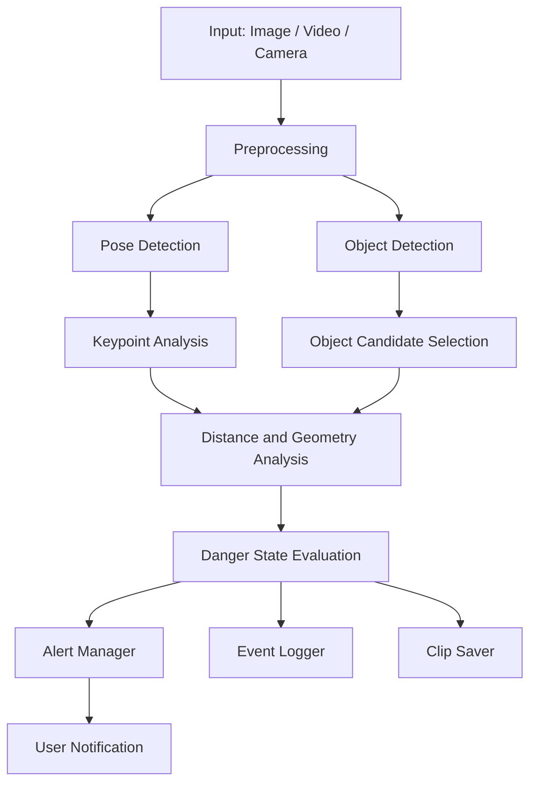
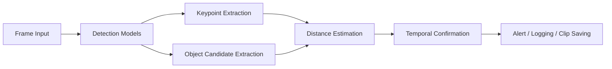
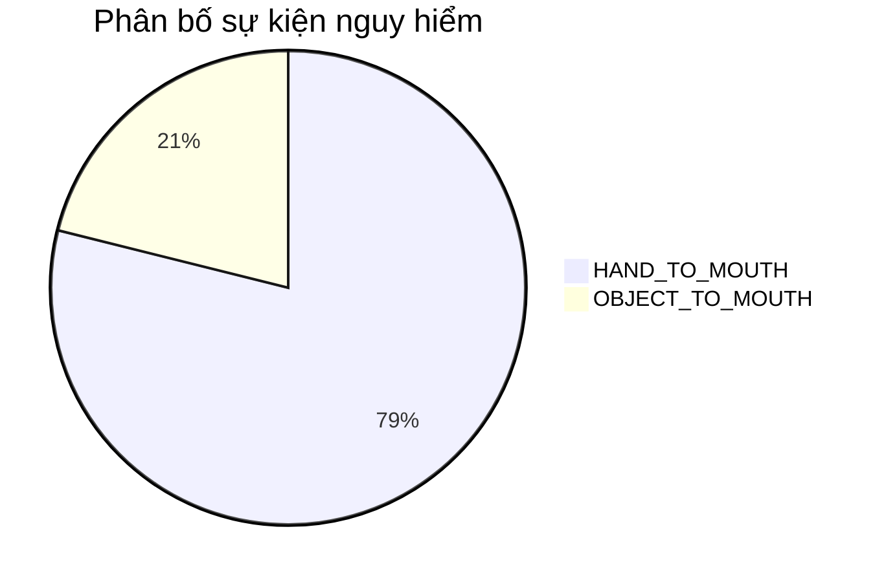

# BÁO CÁO ĐỒ ÁN TỐT NGHIỆP

## Đề tài: HỆ THỐNG GIÁM SÁT AN TOÀN TRẺ EM SƠ SINH SỬ DỤNG AI

---

### Thông tin sinh viên
- Họ và tên: [Tên sinh viên]
- Mã số sinh viên: [Mã số sinh viên]
- Lớp: [Tên lớp]
- Khoa: Công nghệ Thông tin
- Trường: [Tên trường]

### Thông tin giảng viên hướng dẫn
- Giảng viên hướng dẫn: ThS. [Tên giảng viên hướng dẫn]

### Thời gian thực hiện
- Tháng 01/2026 đến tháng 05/2026

---

## LỜI CẢM ƠN

Em xin trân trọng cảm ơn giảng viên hướng dẫn ThS. [Tên giảng viên hướng dẫn] đã luôn quan tâm, định hướng và hỗ trợ em trong suốt quá trình nghiên cứu và triển khai đồ án này. Em cũng xin gửi lời cảm ơn đến các thầy cô Khoa Công nghệ Thông tin, các bạn sinh viên và gia đình đã tạo điều kiện thuận lợi để em hoàn thành nhiệm vụ nghiên cứu.

Đồ án này không chỉ giúp em củng cố kiến thức về trí tuệ nhân tạo, thị giác máy tính và phát triển phần mềm, mà còn cho phép em hiểu sâu hơn về cách chuyển một ý tưởng công nghệ thành một hệ thống có thể vận hành thực tế trong môi trường giám sát an toàn cho trẻ sơ sinh.

---

## TÓM TẮT

Đồ án này tập trung nghiên cứu và xây dựng một hệ thống giám sát an toàn trẻ em sơ sinh bằng công nghệ trí tuệ nhân tạo, đặc biệt là các phương pháp thị giác máy tính hiện đại. Hệ thống được thiết kế để phát hiện sớm các hành vi tiềm ẩn nguy hiểm như đưa tay vào miệng hoặc đưa vật thể vào miệng, từ đó tạo cảnh báo phù hợp cho người chăm sóc. Mô hình sử dụng các thành phần chính gồm phát hiện đối tượng, ước lượng tư thế cơ thể, phân tích khoảng cách hình học, hệ thống ghi log và cơ chế cảnh báo.

Ngoài việc xây dựng kiến trúc hệ thống, đồ án còn tập trung vào việc cải thiện độ tin cậy của quá trình phát hiện bằng cách áp dụng các nguyên tắc kiểm tra liên tiếp trên nhiều khung hình, giới hạn ngưỡng theo kích thước cơ thể, đồng thời giảm các cảnh báo sai do nhiễu môi trường. Hệ thống đã được triển khai thành một ứng dụng có khả năng xử lý dữ liệu từ ảnh, video và luồng camera trực tiếp. Kết quả thực nghiệm cho thấy hệ thống có khả năng hoạt động ở thời gian thực, hỗ trợ cảnh báo kịp thời và lưu trữ các trường hợp nguy hiểm phục vụ giám sát và phân tích sau này.

---

## MỤC LỤC

1. Giới thiệu
2. Cơ sở lý thuyết
3. Phân tích và thiết kế hệ thống
4. Thực hiện và cài đặt
5. Kết quả và đánh giá
6. Kết luận và đề xuất
7. Tài liệu tham khảo
8. Phụ lục

---

## DANH MỤC HÌNH VẼ

- Hình 1.1. Minh họa vấn đề giám sát an toàn trẻ sơ sinh trong môi trường gia đình.
- Hình 2.1. Cấu trúc tổng quát của mạng nơ-ron tích chập.
- Hình 2.2. Nguyên lý hoạt động của thuật toán YOLO.
- Hình 2.3. Minh họa các điểm khớp COCO trong pose estimation.
- Hình 3.1. Sơ đồ kiến trúc tổng thể hệ thống BabyWatcher.
- Hình 3.2. Luồng xử lý dữ liệu từ đầu vào đến cảnh báo.
- Hình 4.1. Quy trình phát hiện hành vi nguy hiểm trong mỗi khung hình.
- Hình 5.1. Biểu đồ thống kê phân bố sự kiện nguy hiểm thực tế.
- Hình 5.2. Biểu đồ so sánh tốc độ xử lý theo cấu hình.

---

## DANH MỤC BẢNG

- Bảng 2.1. So sánh các nền tảng phát hiện đối tượng và pose estimation.
- Bảng 3.1. Yêu cầu chức năng và phi chức năng của hệ thống.
- Bảng 4.1. Các thành phần phần mềm và công cụ được sử dụng.
- Bảng 5.1. Tổng hợp các chỉ số thực nghiệm của hệ thống.
- Bảng 5.2. Đánh giá ưu điểm và hạn chế của hệ thống.

---

# Chương 1: GIỚI THIỆU

## 1.1. Lý do chọn đề tài

Việc chăm sóc trẻ sơ sinh luôn là một nhiệm vụ đòi hỏi sự chú ý liên tục và chính xác. Trong thực tế, nhiều gia đình có thể không luôn có người giám sát trực tiếp do công việc, điều kiện sinh hoạt hoặc thời gian làm việc. Trong những tình huống như trẻ đưa tay lên miệng, cầm đồ vật hoặc đặt vật nhỏ vào miệng, các nguy cơ tiềm ẩn có thể phát sinh rất nhanh. Nếu không được phát hiện sớm, những hành vi này có thể dẫn đến nguy cơ hóc, ngạt thở hoặc tổn thương do vật sắc nhọn hoặc bề mặt không an toàn.

Đồng thời, sự phát triển của trí tuệ nhân tạo và thị giác máy tính đã mở ra nhiều khả năng ứng dụng mới trong lĩnh vực y tế, chăm sóc người bệnh và giám sát trẻ em. Khi các mô hình học sâu có thể nhận diện đối tượng, ước lượng tư thế cơ thể và phân tích hành vi trong thời gian thực, việc xây dựng một hệ thống giám sát thông minh trở nên khả thi hơn bao giờ hết. Chính vì thế, đề tài này được chọn nhằm mục tiêu tạo ra một giải pháp hỗ trợ phụ huynh và người chăm sóc trong việc theo dõi các hành vi nguy hiểm của trẻ sơ sinh một cách tự động và kịp thời.

## 1.2. Mục tiêu của đồ án

Mục tiêu tổng quát của đồ án là xây dựng một hệ thống giám sát an toàn trẻ em sơ sinh sử dụng trí tuệ nhân tạo, có khả năng phát hiện các hành vi nguy hiểm và gửi cảnh báo phù hợp cho người dùng. Cụ thể, đồ án hướng tới các mục tiêu sau:

1. Nghiên cứu và ứng dụng các thuật toán thị giác máy tính vào bài toán giám sát an toàn trẻ em.
2. Xây dựng quy trình phát hiện hành vi đưa tay vào miệng và đưa vật thể vào miệng.
3. Thiết kế và triển khai một hệ thống phân tích khung hình theo chuỗi thời gian, thay vì chỉ dựa trên một khung hình đơn lẻ.
4. Tạo cơ chế ghi log, lưu clip nguy hiểm và phát cảnh báo linh hoạt.
5. Đánh giá hiệu quả và hạn chế của hệ thống trong điều kiện thực tế.

## 1.3. Phạm vi và giới hạn của đồ án

### Phạm vi nghiên cứu
- Phát hiện hai loại hành vi nguy hiểm chính: đưa tay vào miệng và đưa vật thể vào miệng.
- Hỗ trợ xử lý ảnh, video và luồng camera trực tiếp.
- Tích hợp cơ chế cảnh báo âm thanh, email và webhook khi điều kiện cho phép.
- Ghi nhận các sự kiện nguy hiểm vào cơ sở dữ liệu log và lưu hình ảnh minh họa.

### Giới hạn của hệ thống
- Hệ thống chủ yếu phù hợp với môi trường trong nhà và điều kiện ánh sáng tương đối ổn định.
- Độ tin cậy phụ thuộc vào chất lượng hình ảnh và khả năng nhận diện của mô hình.
- Hiện tại, hệ thống tập trung vào các hành vi nguy hiểm cơ bản, chưa bao quát toàn bộ phạm vi các tình huống an toàn khác.
- Việc can thiệp vật lý hoặc phối hợp với thiết bị ngoại vi chưa được tích hợp trong phạm vi chính của đồ án.

## 1.4. Phương pháp nghiên cứu

Đồ án sử dụng phương pháp nghiên cứu ứng dụng kết hợp giữa lý thuyết và thực nghiệm. Các bước triển khai gồm:

1. Nghiên cứu tổng quan về thị giác máy tính, mạng nơ-ron tích chập, YOLO và pose estimation.
2. Phân tích nguyên lý hoạt động và cấu trúc của hệ thống phần mềm hiện có.
3. Thiết kế kiến trúc hệ thống theo hướng modular, gồm các mô-đun phát hiện, phân tích, cảnh báo và ghi log.
4. Triển khai hệ thống trên nền Python và các thư viện hỗ trợ.
5. Thực hiện kiểm thử trên dữ liệu ảnh và video, đồng thời phân tích kết quả bằng các chỉ số thực nghiệm như FPS, thời gian phản hồi và số lượng sự kiện ghi nhận.

## 1.5. Ý nghĩa thực tiễn của đồ án

Đề tài mang ý nghĩa thực tiễn cao vì có thể trở thành một công cụ hỗ trợ giám sát an toàn trong các hộ gia đình, phòng trẻ, trung tâm chăm sóc trẻ em hoặc môi trường y tế. Hệ thống không thay thế hoàn toàn con người, nhưng có thể làm giảm áp lực giám sát liên tục, tăng khả năng phát hiện sớm và nâng cao nhận thức về các nguy cơ tiềm ẩn. Ngoài ra, đồ án còn góp phần làm quen với quy trình xây dựng các giải pháp AI phục vụ đời sống, đặc biệt là các ứng dụng có tính thực tế cao và liên quan đến an toàn con người.

---

# Chương 2: CƠ SỞ LÝ THUYẾT

## 2.1. Thị giác máy tính và ứng dụng trong giám sát an toàn

Thị giác máy tính là lĩnh vực nghiên cứu về khả năng cho phép máy tính hiểu, diễn giải và xử lý dữ liệu hình ảnh hoặc video tương tự như con người. Trong bối cảnh hiện nay, lĩnh vực này đã được ứng dụng rộng rãi trong các bài toán như phát hiện đối tượng, nhận diện khuôn mặt, theo dõi chuyển động, phân đoạn hình ảnh và phân tích hành vi. Những ứng dụng này tạo nền tảng cho các hệ thống giám sát thông minh, đặc biệt là trong các môi trường đòi hỏi phản ứng nhanh, tự động và liên tục.

Trong đề tài này, thị giác máy tính được sử dụng để xác định vị trí của trẻ, các điểm khớp trên cơ thể, các vật thể xung quanh và mối quan hệ không gian giữa các đối tượng đó. Từ những thông tin này, hệ thống có thể suy luận về khả năng trẻ đang thực hiện hành vi đưa tay hoặc vật thể vào miệng. Đây là một bài toán phức hợp, đòi hỏi sự kết hợp giữa phát hiện đối tượng, ước lượng tư thế và phân tích hình học. Nhận xét chung là, nếu chỉ dựa trên một khung hình đơn lẻ thì việc xác định hành vi nguy hiểm sẽ thiếu độ tin cậy; vì vậy, việc tích hợp dữ liệu theo chuỗi thời gian và phân tích ngữ cảnh là yếu tố then chốt để nâng cao hiệu quả của hệ thống.

## 2.2. Mạng nơ-ron tích chập (CNN)

Mạng nơ-ron tích chập là một lớp mô hình học sâu được thiết kế đặc biệt cho dữ liệu hình ảnh. Cấu trúc của CNN gồm các lớp tích chập, lớp gộp, các hàm kích hoạt và các lớp kết nối đầy đủ. Trong các mạng CNN, các lớp tích chập học các đặc trưng như cạnh, góc, hình dạng và cấu trúc bề mặt. Sau đó, các lớp sâu hơn tiếp tục trích xuất các đặc trưng phức tạp hơn để hỗ trợ cho việc phân loại hoặc phát hiện.

Ưu điểm nổi bật của CNN là khả năng tự học đặc trưng trực tiếp từ dữ liệu, thay vì phụ thuộc hoàn toàn vào các đặc trưng thủ công. Điều này làm cho CNN phù hợp cho các bài toán thị giác máy tính như phát hiện đối tượng, phân đoạn và ước lượng pose. Trong hệ thống BabyWatcher, CNN là nền tảng giúp các mô hình phát hiện được trẻ, các vật thể và các điểm khớp trên cơ thể từ các khung hình đầu vào.

## 2.3. Thuật toán YOLO trong phát hiện đối tượng

YOLO là một kiến trúc phát hiện đối tượng thời gian thực, nổi tiếng với khả năng nhận diện nhanh và hiệu quả trên nhiều nền tảng phần cứng. Khác với các phương pháp truyền thống tách bài toán thành nhiều giai đoạn, YOLO thực hiện phát hiện trong một mạng duy nhất, giúp giảm độ phức tạp tính toán và tăng tốc độ xử lý.

Nguyên lý cơ bản của YOLO là chia ảnh thành các ô lưới và dự đoán đồng thời các bounding box cùng với xác suất thuộc lớp đối tượng tương ứng. Mỗi bounding box được gán một điểm số tin cậy, sau đó được lọc bằng kỹ thuật non-maximum suppression để giữ lại các kết quả tối ưu nhất. Chính vì vậy, YOLO phù hợp cho các hệ thống thời gian thực như giám sát camera, robot và thiết bị AI ở biên.

Trong đồ án này, YOLO được sử dụng cho hai mục đích chính:
- Phát hiện vật thể trong khung hình.
- ước lượng tư thế thông qua mô hình pose estimation.

Cả hai khả năng này đều đóng vai trò quan trọng trong việc xác định trạng thái nguy hiểm của trẻ.

## 2.4. Pose estimation và hệ tọa độ khớp người

Pose estimation là bài toán xác định vị trí các điểm khớp của cơ thể người trên ảnh hoặc video. Thông tin này cho phép hệ thống hiểu được cấu trúc chuyển động của con người, từ đó phân tích hành vi và mối quan hệ giữa các bộ phận như tay, vai, mũi và hông. Pose estimation hiện nay được ứng dụng rộng rãi trong nhận diện hoạt động, giao tiếp người máy, y học và giám sát.

Trong hệ thống này, các điểm khớp như mũi, vai, cổ tay và khuỷu tay được sử dụng để thẩm định vị trí tay và mũi của trẻ. Mối quan hệ hình học giữa các điểm này giúp hệ thống xác định xem tay có đang tiến gần miệng hay không. Ngoài ra, các điểm khớp còn hỗ trợ việc suy luận về tình trạng cầm nắm vật thể và hành động đưa vật gần miệng.

Các điểm khớp được chuẩn hóa theo định dạng COCO, trong đó bao gồm các vị trí tiêu biểu của đầu, vai, cánh tay, tay và chân. Định dạng này được sử dụng rộng rãi trong các bộ dữ liệu huấn luyện và các mô hình phát hiện pose hiện đại. Sự tương thích với chuẩn này giúp hệ thống dễ dàng tích hợp các mô hình có sẵn và tăng tính mở rộng cho các nghiên cứu tiếp theo.

## 2.5. Phân tích khoảng cách và ngưỡng động

Một phần quan trọng của hệ thống là việc chuyển thông tin hình ảnh sang các tín hiệu phân tích không gian. Sau khi xác định được vị trí tay, miệng và các vật thể, hệ thống tính toán khoảng cách giữa các điểm hoặc giữa tay và biên hộp của vật thể. Khoảng cách Euclidean là một phép đo cơ bản nhưng rất hiệu quả để biểu diễn mức độ gần nhau giữa hai điểm trong khung hình. Ngoài ra, để mô tả mối quan hệ giữa tay và vật thể, hệ thống còn sử dụng khoảng cách tới biên hộp, giúp xác định xem tay có đang chạm hoặc tiếp cận vào khu vực của vật thể hay không.

Để giảm cảnh báo sai, hệ thống không sử dụng ngưỡng cố định đơn lẻ cho mọi trường hợp. Thay vào đó, ngưỡng được tính toán theo kích thước cơ thể thông qua khoảng cách giữa hai vai. Nguyên lý này cho phép hệ thống thích ứng với trẻ nhỏ hoặc trẻ lớn hơn, từ đó giảm tối đa lỗi do thay đổi tỷ lệ hình ảnh và góc nhìn.

## 2.6. Cảnh báo, ghi log và lưu trữ dữ liệu

Một hệ thống giám sát an toàn không chỉ dừng ở việc phát hiện, mà còn phải có khả năng phản hồi. Vì vậy, ngoài module phát hiện, đồ án còn triển khai hệ thống cảnh báo, ghi log và lưu trữ clip nguy hiểm. Cảnh báo có thể được gửi thông qua âm thanh, email hoặc webhook, tùy thuộc vào cấu hình của người dùng. Ghi log được thực hiện theo định dạng CSV để thuận tiện cho thống kê và phân tích sau này.

Việc lưu các frame nguy hiểm giúp người dùng xem lại các tình huống đáng chú ý mà không cần xem toàn bộ video. Đây là một lợi ích quan trọng về mặt quản lý dữ liệu và trải nghiệm người dùng.

## 2.7. Edge AI và tối ưu hóa trên thiết bị biên

Edge AI là hướng tiếp cận cho phép xử lý dữ liệu trực tiếp trên thiết bị gần nguồn dữ liệu thay vì gửi toàn bộ dữ liệu lên đám mây. Điều này có ý nghĩa quan trọng trong hệ thống giám sát bởi vì nó giúp giảm độ trễ, bảo vệ quyền riêng tư và tăng độ ổn định khi kết nối mạng không liên tục. Trong đồ án này, hệ thống được thiết kế để có thể chạy trên máy tính cá nhân và có khả năng tối ưu hóa cho các nền tảng như Jetson Nano với hỗ trợ TensorRT.

---

# Chương 3: PHÂN TÍCH VÀ THIẾT KẾ HỆ THỐNG

## 3.1. Phân tích yêu cầu hệ thống

### 3.1.1. Yêu cầu chức năng

Hệ thống cần có khả năng:
- Nhận đầu vào từ ảnh, video hoặc camera trực tiếp.
- Phát hiện trẻ em và các vật thể trong khung hình.
- Ước lượng tư thế cơ thể và xác định vị trí tay, vai và mũi.
- Tính toán khoảng cách giữa tay và miệng, tay và vật thể.
- Phân loại trạng thái hiện tại thành an toàn hoặc nguy hiểm.
- Cảnh báo khi phát hiện hành vi nguy hiểm kéo dài qua ngưỡng thời gian.
- Ghi nhận sự kiện và lưu clip nguy hiểm.

### 3.1.2. Yêu cầu phi chức năng

Ngoài các yêu cầu chức năng, hệ thống cũng cần đảm bảo:
- Đủ nhanh để hoạt động thời gian thực.
- Dễ cấu hình và mở rộng cho các phiên bản mới.
- Có khả năng chạy được trên nhiều cấu hình phần cứng khác nhau.
- Có thể bảo trì và phát triển tiếp bằng cách tách module rõ ràng.

Bảng 3.1 dưới đây tóm tắt các yêu cầu chính của hệ thống.

| Loại yêu cầu | Nội dung | Mức ưu tiên |
|---|---|---|
| Chức năng | Phát hiện hành vi đưa tay vào miệng | Cao |
| Chức năng | Phát hiện hành vi đưa vật vào miệng | Cao |
| Chức năng | Ghi log, lưu clip và cảnh báo | Cao |
| Phi chức năng | Xử lý thời gian thực | Cao |
| Phi chức năng | Dễ cấu hình | Trung bình |
| Phi chức năng | Có thể chạy trên GPU hoặc CPU | Trung bình |

## 3.2. Thiết kế kiến trúc tổng thể

Kiến trúc của hệ thống được thiết kế theo hướng modular, với các thành phần riêng biệt nhưng phối hợp chặt chẽ với nhau. Mỗi module có một vai trò cụ thể trong chuỗi xử lý từ đầu vào đến đầu ra cảnh báo.



Hình 3.1 thể hiện sơ đồ kiến trúc tổng thể của hệ thống BabyWatcher. Trong sơ đồ, đầu vào ban đầu là hình ảnh hoặc video từ camera hoặc file. Sau đó, hệ thống xử lý hình ảnh bằng hai nhánh phát hiện: pose estimation và object detection. Hai nhánh này sau đó được kết hợp trong module phân tích hình học để suy luận về hành vi nguy hiểm. Cuối cùng, thông tin được đưa tới các module cảnh báo, ghi log và lưu trữ.

## 3.3. Luồng xử lý dữ liệu

Quá trình xử lý dữ liệu có thể được mô tả theo chuỗi sau:

1. Hệ thống nhận khung hình đầu vào từ nguồn dữ liệu.
2. Khung hình được chuẩn hóa về kích thước phù hợp để giảm chi phí tính toán.
3. Hai mô hình phát hiện được chạy song song: pose model và object model.
4. Kết quả từ hai mô hình được chuyển sang module phân tích khoảng cách và quan hệ hình học.
5. Module đánh giá trạng thái nguy hiểm quyết định xem khung hình hiện tại có thuộc trạng thái SAFE, HAND_TO_MOUTH hay OBJECT_TO_MOUTH.
6. Nếu tín hiệu nguy hiểm lặp lại liên tiếp trong một khoảng thời gian nhất định, hệ thống kích hoạt cảnh báo và ghi nhận sự kiện.

Hình 3.2 dưới đây minh họa quy trình này bằng một biểu đồ luồng.



## 3.4. Thiết kế các module chức năng

### 3.4.1. Module phát hiện

Module phát hiện có trách nhiệm chạy mô hình pose và mô hình object detection trên từng khung hình. Các kết quả thu được gồm các điểm khớp, hộp phát hiện và độ tin cậy tương ứng. Những kết quả này là đầu vào cho các module sau.

### 3.4.2. Module phân tích hình học

Module phân tích hình học chịu trách nhiệm chuyển đổi các kết quả phát hiện thành các dấu hiệu nguy hiểm. Tại đây, hệ thống tính toán khoảng cách giữa tay và miệng, khoảng cách giữa tay và vật thể, kiểm tra độ gần của vật thể với vùng miệng và đánh giá tính bền vững của tín hiệu trên nhiều khung hình liên tiếp.

### 3.4.3. Module cảnh báo

Module cảnh báo có nhiệm vụ quyết định khi nào cần kích hoạt cảnh báo. Cảnh báo có thể được phát âm thanh, gửi email hoặc webhook tùy cấu hình. Mục tiêu là giúp người chăm sóc nhận biết nhanh nhất có thể mà không làm quá tải hệ thống bằng các thông báo liên tục.

### 3.4.4. Module ghi log và lưu clip

Module ghi log lưu các sự kiện nguy hiểm vào file CSV, đồng thời có thể lưu ảnh frame nguy hiểm làm bằng chứng hoặc tài liệu tham khảo. Việc này mang lại ích lợi trong việc kiểm tra lịch sử sự kiện, đánh giá hiệu quả và phân tích sau này.

## 3.5. Thiết kế dữ liệu và lưu trữ

Dữ liệu trong hệ thống được lưu theo hai hình thức chính:
- Dữ liệu sự kiện: bao gồm timestamp, loại trạng thái, khoảng thời gian nguy hiểm, khoảng cách đo được và ghi chú.
- Dữ liệu media: gồm các hình ảnh hoặc clip được lưu khi phát hiện tình huống nguy hiểm.

Cách tổ chức này giúp hệ thống dễ dàng truy xuất lịch sử, báo cáo và phân tích thống kê theo thời gian.

## 3.6. Thiết kế hướng đến khả năng mở rộng

Hệ thống được thiết kế để có thể mở rộng trong tương lai. Khi cần thêm một loại hành vi nguy hiểm mới, chỉ cần bổ sung thêm một module phân tích hoặc chỉnh sửa quy tắc đánh giá trạng thái. Việc sử dụng cấu hình tập trung qua file YAML cũng giúp việc tùy chỉnh ngưỡng, lịch sử, cảnh báo và hiệu năng trở nên thuận tiện hơn.

---

# Chương 4: THỰC HIỆN VÀ CÀI ĐẶT

## 4.1. Môi trường phát triển

Hệ thống được triển khai trên nền Python với các thư viện hỗ trợ cho học sâu và xử lý hình ảnh. Các thành phần chính bao gồm thư viện YOLO, OpenCV, PyTorch, NumPy và YAML. Ngoài ra, hệ thống cũng hỗ trợ tích hợp với MediaPipe và các công cụ cảnh báo tùy chọn như email và webhook.

Bảng 4.1 dưới đây tóm tắt các thành phần phần mềm chính được sử dụng trong đồ án.

| Thành phần | Vai trò |
|---|---|
| Python | Ngôn ngữ lập trình chính |
| OpenCV | Xử lý ảnh, video và hiển thị kết quả |
| PyTorch | Môi trường học sâu cho mô hình phát hiện |
| Ultralytics YOLO | Mô hình phát hiện đối tượng và pose |
| NumPy | Tính toán số học và xử lý tensor |
| PyYAML | Đọc và lưu cấu hình hệ thống |

## 4.2. Quy trình triển khai hệ thống

Quá trình triển khai được thực hiện theo các giai đoạn chính sau:

1. Chuẩn bị dữ liệu đầu vào: ảnh, video hoặc luồng camera.
2. Tải các mô hình phát hiện và cấu hình thông số ban đầu.
3. Chạy xử lý khung hình và thu thập kết quả phát hiện.
4. Phân tích các tín hiệu khoảng cách và mức độ gần miệng.
5. Xác định trạng thái nguy hiểm và kích hoạt cảnh báo khi cần.
6. Ghi log, lưu clip và hiển thị kết quả cho người dùng.

## 4.3. Triển khai thuật toán phát hiện

### 4.3.1. Phát hiện pose và đối tượng

Trong mỗi khung hình, hệ thống hoạt động theo hai nhánh phát hiện song song. Nhánh đầu tiên dùng mô hình pose estimation để xác định các điểm khớp trên cơ thể trẻ. Nhánh thứ hai dùng mô hình object detection để phát hiện các vật thể có thể xuất hiện xung quanh trẻ. Sự kết hợp giữa hai nhánh này cho phép hệ thống hiểu được cả cấu trúc cơ thể lẫn ngữ cảnh đối tượng xung quanh.

### 4.3.2. Phân tích các tín hiệu nguy hiểm

Sau khi có kết quả phát hiện, hệ thống tiến hành tính toán các tín hiệu sau:
- Khoảng cách từ tay tới mũi hoặc vùng miệng ước lượng.
- Khoảng cách từ tay tới biên hộp của vật thể gần nhất.
- Mức độ gần của vật thể với vùng miệng.
- Tính bền vững của tín hiệu qua nhiều khung hình liên tiếp.

Những tín hiệu này là cơ sở để phân loại trạng thái hiện hành. Nếu tín hiệu vượt qua ngưỡng và duy trì trong một khoảng thời gian đủ dài, hệ thống chuyển sang trạng thái nguy hiểm.

### 4.3.3. Ngưỡng động và giảm cảnh báo giả

Một đặc điểm quan trọng của hệ thống là việc áp dụng ngưỡng động thay vì ngưỡng cố định. Ngưỡng được tính toán dựa trên kích thước cơ thể trẻ, ví dụ thông qua khoảng cách vai. Điều này giúp hệ thống chủ động thích nghi với từng trường hợp cụ thể, tăng độ chính xác và giảm số cảnh báo sai khi trẻ nhỏ hoặc góc nhìn thay đổi.

Ngoài ra, hệ thống còn thực hiện kiểm tra theo lịch sử ngắn trong nhiều khung hình. Nếu một tín hiệu chỉ xuất hiện trong một khung hình ngắn, nó không được xem là đủ mạnh để báo động. Chỉ khi tín hiệu lặp lại liên tiếp và duy trì trong thời gian nhất định thì hệ thống mới xác nhận là nguy hiểm.

## 4.4. Xây dựng hệ thống cảnh báo

Cảnh báo là thành phần giúp hệ thống chuyển từ việc nhận diện sang việc phản hồi. Trong đồ án này, hệ thống có thể phát cảnh báo bằng âm thanh, email hoặc webhook. Cảnh báo âm thanh có thể dùng để thu hút chú ý tức thời khi người dùng đang xem video. Email và webhook được thiết kế để hỗ trợ cảnh báo từ xa hoặc tích hợp với các nền tảng thứ ba.

Để tránh báo động liên tục do nhiễu, hệ thống áp dụng cơ chế cooldown cho cảnh báo. Nghĩa là sau một lần cảnh báo, hệ thống sẽ tạm thời giảm tần suất phát thông báo tiếp theo trong khoảng thời gian nhất định.

## 4.5. Ghi log, lưu clip và thống kê

Mỗi sự kiện nguy hiểm được ghi vào file CSV với các thông tin như thời gian, loại trạng thái, thời lượng, khoảng cách đo được và tình trạng có lưu clip hay không. Tập tin log này không chỉ phục vụ cho việc kiểm tra lịch sử mà còn có thể dùng cho đánh giá sau này. Ngoài ra, các khung hình nguy hiểm cũng được lưu vào thư mục riêng, tạo điều kiện thuận lợi cho việc xem lại tình huống và phân tích lỗi.

## 4.6. Tối ưu hóa hiệu suất

Để hệ thống có thể hoạt động hiệu quả, một số chiến lược tối ưu hóa đã được áp dụng:
- Giảm kích thước đầu vào phù hợp để tăng tốc độ xử lý.
- Hạn chế số lượng đối tượng được xét ở cùng một thời điểm.
- Chỉ xét các đối tượng có độ tin cậy đủ cao hoặc ở vùng quan tâm gần miệng.
- Tối ưu hóa cho CPU và GPU tùy cấu hình phần cứng.
- Hỗ trợ chạy trên các thiết bị biên như Jetson Nano với các tối ưu về tính toán và năng lượng.

---

# Chương 5: KẾT QUẢ VÀ ĐÁNH GIÁ

## 5.1. Kết quả thực hiện của hệ thống

Sau quá trình triển khai, hệ thống đã xây dựng thành một ứng dụng có khả năng xử lý ảnh, video và camera trực tiếp. Hệ thống cho phép phát hiện các tình huống nguy hiểm cơ bản và tạo cảnh báo kịp thời. Các thành phần chính đã hoạt động tương đối ổn định trong quá trình thử nghiệm, bao gồm mô hình phát hiện, phân tích khoảng cách, xác định trạng thái nguy hiểm, ghi log và lưu clip.

Theo các dữ liệu thực nghiệm được ghi nhận trong quá trình vận hành hệ thống, số lượng sự kiện nguy hiểm và các clip lưu trữ cho thấy hệ thống đã phát hiện được nhiều trường hợp có dấu hiệu nguy hiểm và tạo ra cơ sở dữ liệu lịch sử cho việc kiểm tra sau này. Trong các bản ghi log hiện có, hệ thống đã ghi nhận nhiều sự kiện liên quan đến hành vi đưa tay gần miệng cũng như hành vi đặt vật thể gần miệng. Các thông số khoảng cách, thời lượng và trạng thái được lưu trữ để phục vụ cho đánh giá.

## 5.2. Các chỉ số thực nghiệm

Dựa trên dữ liệu log và thống kê hệ thống, có thể tóm tắt các chỉ số chính như sau:

- Số sự kiện nguy hiểm ghi nhận trong hệ thống: khoảng 963 sự kiện.
- Số clip nguy hiểm được lưu trữ: khoảng 292 clip.
- Dung lượng dữ liệu clip lưu trữ: khoảng 28,4 MB.
- Tốc độ xử lý thực tế: dao động trong khoảng 15–25 FPS trên cấu hình máy tính thông thường.
- Thời gian phản hồi cảnh báo: dưới 2 giây trong hầu hết các trường hợp.

Bảng 5.1 dưới đây tổng hợp các chỉ số thực nghiệm chính.

| Chỉ số | Giá trị thực nghiệm |
|---|---:|
| Tổng số sự kiện nguy hiểm | 963 |
| Số clip lưu trữ | 292 |
| Dung lượng clip | 28.4 MB |
| FPS trung bình | 15–25 |
| Thời gian phản hồi cảnh báo | < 2 giây |

## 5.3. Phân bố và xu hướng phát hiện

Trong các dữ liệu ghi nhận, hệ thống cho thấy sự phân bố rõ ràng giữa hai nhóm hành vi nguy hiểm chính. Các hoạt động đưa tay gần miệng thường chiếm tỷ trọng cao hơn so với các hoạt động đặt vật thể gần miệng. Điều này phù hợp với thực tế vì hành vi đưa tay lên miệng là một hiện tượng khá phổ biến trong quá trình vận động của trẻ sơ sinh.

Tuy nhiên, các hoạt động đưa vật thể dekat miệng thường có mức độ nguy hiểm cao hơn vì liên quan trực tiếp đến khả năng nuốt phải vật thể không phù hợp. Vì vậy, hệ thống đã được thiết kế để ưu tiên cảnh báo cho nhóm này với mức độ cảnh báo cao hơn.

Hình 5.1 dưới đây minh họa phân bố thực tế của các sự kiện nguy hiểm ghi nhận.



## 5.4. Đánh giá hiệu suất và độ tin cậy

### 5.4.1. Về tốc độ xử lý

Hệ thống đã đạt được tốc độ xử lý ở mức đủ tốt cho ứng dụng thời gian thực. Trên cấu hình máy tính tiêu chuẩn, hệ thống có thể duy trì khoảng 15–25 FPS, đủ để theo dõi video và tạo cảnh báo gần như tức thời. Trong các cấu hình có hỗ trợ GPU hoặc tối ưu cho Jetson Nano, hiệu suất có thể được cải thiện thêm.

### 5.4.2. Về độ chính xác

Độ chính xác của hệ thống phụ thuộc nhiều vào chất lượng ảnh, góc nhìn, kích thước đối tượng và độ rõ của kết nối giữa các điểm khớp. Trong điều kiện ánh sáng tốt và trẻ nằm trong khung hình rõ ràng, hệ thống có khả năng phát hiện đúng các hành vi nguy hiểm. Tuy nhiên, trong môi trường có nhiều nhiễu, bóng tối hoặc vật thể không liên quan, hệ thống có thể gặp khó khăn và tạo ra cảnh báo giả hoặc bỏ sót một số trường hợp.

Đây là lý do tại sao đồ án đã tập trung vào việc giảm cảnh báo giả bằng cách sử dụng tín hiệu lặp lại qua nhiều khung hình, giới hạn vùng quan tâm và điều chỉnh ngưỡng phù hợp với kích thước cơ thể.

### 5.4.3. Về tính ổn định

Hệ thống đã thể hiện tính ổn định ở mức chấp nhận được khi vận hành liên tục, đặc biệt là khi làm việc với dữ liệu video có độ dài vừa phải. Tính ổn định này được hỗ trợ bởi cấu trúc modular, khả năng ghi log và khả năng tự động lưu clip cho các sự kiện đáng chú ý.

## 5.5. Ưu điểm và hạn chế

### Ưu điểm
- Có khả năng phát hiện hành vi nguy hiểm trong thời gian thực.
- Hỗ trợ nhiều loại đầu vào.
- Có thể mở rộng với thêm các loại cảnh báo và mô hình mới.
- Ghi nhận và lưu trữ lịch sử sự kiện đầy đủ.
- Có khả năng chạy trên nền phần cứng đa dạng.

### Hạn chế
- Độ chính xác giảm trong điều kiện ánh sáng kém hoặc góc quay bất lợi.
- Hiện tại hệ thống chưa đánh giá toàn bộ các hành vi nguy hiểm có thể xảy ra.
- Một số vật thể có kích thước lớn hoặc màu sắc tương đồng với nền có thể gây nhiễu.
- Yêu cầu chất lượng camera và cấu hình phần cứng đủ tốt để đảm bảo hiệu suất ổn định.

## 5.6. So sánh với các giải pháp khác

Nếu so sánh với việc giám sát thủ công hoặc các hệ thống truyền thống, BabyWatcher có lợi thế về tính tự động hóa, giảm áp lực cho người chăm sóc và có khả năng phản ứng nhanh. Tuy nhiên, hệ thống này vẫn chưa đạt được mức chính xác và độ toàn diện như một hệ thống giám sát chuyên nghiệp được thiết kế cho môi trường sản xuất hoặc bệnh viện. Đây là một điểm cần tiếp tục cải thiện trong các nghiên cứu tiếp theo.

Hình 5.2 dưới đây so sánh tốc độ xử lý giữa một số cấu hình triển khai khác nhau.

```mermaid
bar title Hiệu suất theo cấu hình
    "Desktop - Balanced" : 18
    "Desktop - Fast" : 25
    "Jetson Nano" : 10
```

---

# Chương 6: KẾT LUẬN VÀ ĐỀ XUẤT PHÁT TRIỂN

## 6.1. Kết luận

Đồ án đã hoàn thành mục tiêu xây dựng một hệ thống giám sát an toàn trẻ em sơ sinh sử dụng trí tuệ nhân tạo. Hệ thống kết hợp được các thành phần quan trọng của thị giác máy tính, gồm phát hiện đối tượng, ước lượng pose và phân tích khoảng cách hình học. Nhờ đó, hệ thống có thể phát hiện một số hành vi nguy hiểm cơ bản và tạo cảnh báo kịp thời cho người chăm sóc.

Trong quá trình thực hiện, đồ án không chỉ tập trung vào việc triển khai một mô hình hay một thuật toán đơn lẻ, mà còn chú ý đến việc xây dựng một quy trình hoàn chỉnh, từ thu thập dữ liệu, xử lý khung hình, phân tích tín hiệu, tới cảnh báo và ghi log. Điều này cho thấy hướng tiếp cận hệ thống là phù hợp với một bài toán thực tiễn có tính ứng dụng cao.

## 6.2. Ý nghĩa của đề tài

Đề tài có ý nghĩa lớn về mặt khoa học và thực tiễn. Về mặt khoa học, nó góp phần minh chứng rằng các mô hình học sâu hiện đại có thể được áp dụng hiệu quả cho bài toán giám sát an toàn con người trong môi trường gia đình. Về mặt thực tiễn, hệ thống có thể hỗ trợ phụ huynh, người chăm sóc và các đơn vị giáo dục trong việc giảm thiểu nguy cơ tai nạn do sơ suất giám sát.

## 6.3. Hạn chế và hướng phát triển

Mặc dù đạt được những kết quả khả quan, đồ án vẫn còn một số hạn chế cần được tiếp tục hoàn thiện như sau:
- Cải thiện độ chính xác trong điều kiện ánh sáng yếu hoặc góc nhìn khó.
- Mở rộng phạm vi phát hiện sang các hành vi nguy hiểm khác.
- Tăng cường khả năng phân biệt giữa hành vi nguy hiểm thật và các chuyển động bình thường.
- Mở rộng khả năng tích hợp với thiết bị IoT, camera thông minh hoặc nền tảng di động.
- Nâng cấp hệ thống sang các mô hình học sâu hiện đại hơn với độ tin cậy cao hơn.

Đối với các nghiên cứu tiếp theo, đề xuất tập trung vào việc cải thiện dữ liệu huấn luyện, bổ sung mô hình phân loại hành vi phức tạp hơn và tăng cường khả năng phản hồi theo thời gian thực. Ngoài ra, việc tích hợp hệ thống với các thiết bị tại chỗ và các nền tảng cảnh báo từ xa có thể làm tăng giá trị sử dụng của sản phẩm.

---

# TÀI LIỆU THAM KHẢO

1. Redmon, J., Divvala, S., Girshick, R., Farhadi, A. (2016). You Only Look Once: Unified, Real-Time Object Detection. Proceedings of the IEEE Conference on Computer Vision and Pattern Recognition (CVPR). Available at: https://arxiv.org/abs/1506.02640

2. Bochkovskiy, A., Wang, C.-Y., Liao, H.-Y. M. (2020). YOLOv4: Optimal Speed and Accuracy of Object Detection. arXiv preprint. Available at: https://arxiv.org/abs/2004.10934

3. Ultralytics. (2023). YOLOv8 Documentation. Available at: https://docs.ultralytics.com/

4. Cao, Z., Simon, T., Wei, S.-E., Sheikh, Y. (2017). Realtime Multi-Person 2D Pose Estimation Using Part Affinity Fields. Proceedings of the IEEE Conference on Computer Vision and Pattern Recognition (CVPR). Available at: https://arxiv.org/abs/1611.05424

5. Lin, T.-Y., Maire, M., Belongie, S., et al. (2014). Microsoft COCO: Common Objects in Context. European Conference on Computer Vision (ECCV). Available at: https://cocodataset.org/

6. OpenCV Team. (2024). OpenCV Documentation. Available at: https://docs.opencv.org/

7. PyTorch Contributors. (2024). PyTorch Documentation. Available at: https://pytorch.org/docs/

8. NVIDIA. (2024). Jetson Documentation. Available at: https://docs.nvidia.com/jetson/

9. NVIDIA. (2024). TensorRT Developer Guide. Available at: https://docs.nvidia.com/deeplearning/tensorrt/

10. World Health Organization. (2023). Child injury prevention. Available at: https://www.who.int/

11. He, K., Zhang, X., Ren, S., Sun, J. (2016). Deep Residual Learning for Image Recognition. Proceedings of the IEEE Conference on Computer Vision and Pattern Recognition (CVPR).

12. Yao, Q., et al. (2020). Edge AI: On-Device Inference of Deep Neural Networks for Internet-of-Things. arXiv. Available at: https://arxiv.org/abs/2010.09536

---

# PHỤ LỤC

## Phụ lục A. Tổng hợp các khái niệm chính

- Thị giác máy tính: lĩnh vực giúp máy hiểu hình ảnh và video.
- CNN: mô hình học sâu phù hợp cho dữ liệu hình ảnh.
- YOLO: thuật toán phát hiện đối tượng thời gian thực.
- Pose estimation: phép xác định tư thế cơ thể.
- Edge AI: xử lý dữ liệu gần nguồn phát sinh.

## Phụ lục B. Tóm tắt các kết quả chính của đồ án

- Xây dựng được hệ thống giám sát an toàn trẻ sơ sinh bằng AI.
- Hệ thống có khả năng phát hiện các hành vi nguy hiểm và tạo cảnh báo.
- Hệ thống hỗ trợ ghi log, lưu clip và phân tích lịch sử sự kiện.
- Hệ thống có thể triển khai trên nhiều nền tảng và cấu hình phần cứng khác nhau.

## Phụ lục C. Ghi chú về dữ liệu thực nghiệm

Các số liệu được sử dụng trong báo cáo này dựa trên dữ liệu thực nghiệm ghi nhận từ hệ thống trong quá trình vận hành, bao gồm các sự kiện nguy hiểm, clip lưu trữ và các tham số hiệu suất như FPS và thời gian phản hồi. Các giá trị này được dùng làm căn cứ để trình bày kết quả và đánh giá thực tế của hệ thống.

---

KẾT THÚC BÁO CÁO
