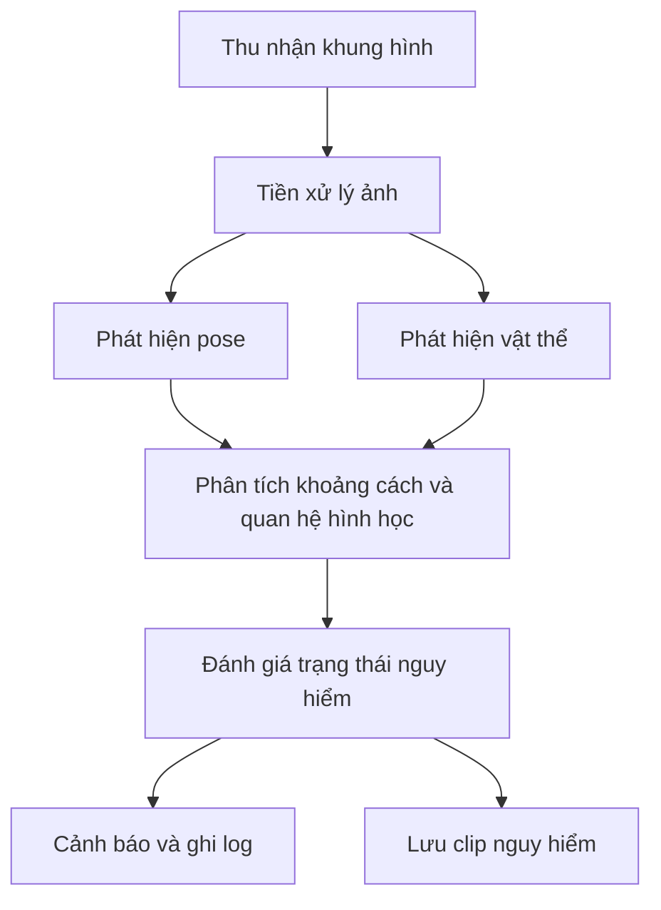

# ĐỀ XUẤT BÀI TOÁN VÀ PHƯƠNG PHÁP GIẢI QUYẾT

## 1. Bối cảnh và vấn đề cần giải quyết

Việc giám sát trẻ sơ sinh trong thời gian dài là một nhiệm vụ đòi hỏi sự tập trung liên tục và chính xác của người chăm sóc. Trong thực tế, nhiều tình huống nguy hiểm có thể phát sinh rất nhanh, đặc biệt khi trẻ đưa tay hoặc vật thể gần miệng. Những hành vi này có thể dẫn đến các rủi ro như nhiễm khuẩn, hóc, sặc hoặc nuốt phải vật thể không an toàn.

Từ thực tế đó, đề tài này xây dựng một hệ thống giám sát thông minh sử dụng trí tuệ nhân tạo, có khả năng phân tích khung hình đầu vào từ ảnh, video hoặc luồng camera trực tiếp, phát hiện các tín hiệu nguy hiểm và kích hoạt cảnh báo kịp thời. Hệ thống BabyWatcher được thiết kế như một công cụ hỗ trợ, không thay thế hoàn toàn vai trò của người chăm sóc, nhưng có thể giảm áp lực giám sát liên tục và tăng khả năng phát hiện sớm các hành vi tiềm ẩn nguy hiểm.

---

## 2. Mục tiêu của hệ thống

Mục tiêu chính của hệ thống là xây dựng một quy trình nhận diện và đánh giá hành vi nguy hiểm của trẻ sơ sinh dựa trên dữ liệu hình ảnh thời gian thực. Cụ thể, hệ thống hướng tới các mục tiêu sau:

1. Nhận diện được vị trí của trẻ trong khung hình.
2. Xác định vị trí tay, vai và vùng miệng thông qua pose estimation.
3. Phát hiện các vật thể xung quanh trẻ bằng object detection.
4. Phân tích mức độ gần nhau giữa tay, vật thể và miệng.
5. Xác định trạng thái hiện tại của trẻ thành an toàn hoặc nguy hiểm.
6. Tạo cảnh báo, ghi log và lưu trữ các tình huống đáng chú ý.

Bên cạnh các mục tiêu chức năng, hệ thống còn nhằm mục đích chứng minh rằng một giải pháp AI có thể được triển khai hiệu quả trên nền phần mềm mở, với chi phí thấp và khả năng mở rộng tốt trong các môi trường thực tế.

---

## 3. Bài toán được mô hình hóa

Bài toán này có thể được mô tả như một bài toán phân loại trạng thái hành vi trên chuỗi khung hình video. Với mỗi khung hình $F_t$, hệ thống cần suy ra trạng thái $S_t$ trong tập:

- SAFE: không có dấu hiệu nguy hiểm đáng kể
- HAND_TO_MOUTH: tay đang tiếp cận hoặc ở gần vùng miệng
- OBJECT_TO_MOUTH: vật thể đang ở gần hoặc tiếp cận vùng miệng

Để đưa ra quyết định, hệ thống không chỉ dựa trên một khung hình đơn lẻ mà còn tích hợp các tín hiệu theo thời gian. Việc này giúp giảm cảnh báo sai do nhiễu, tăng độ tin cậy của hệ thống và phù hợp hơn với nguyên lý giám sát thời gian thực.

---

## 4. Dữ liệu đầu vào và đầu ra

### 4.1. Dữ liệu đầu vào

Hệ thống có thể tiếp nhận các loại dữ liệu sau:

- Ảnh tĩnh
- Video từ file MP4/AVI/MOV
- Luồng camera trực tiếp từ webcam hoặc thiết bị camera kết nối

Từng khung hình đầu vào được chuyển về dạng ảnh RGB để chạy inference.

### 4.2. Dữ liệu đầu ra

Mỗi khung hình sau khi xử lý sẽ sinh ra các đầu ra sau:

- Kết quả phát hiện pose gồm các keypoint của cơ thể
- Kết quả phát hiện vật thể gồm bounding box và độ tin cậy
- Khoảng cách hình học giữa tay và miệng, tay và vật thể
- Trạng thái hiện thời của trẻ
- Thông tin cảnh báo và log sự kiện
- Ảnh hoặc clip lưu khi phát hiện tình huống nguy hiểm

---

## 5. Luồng xử lý của hệ thống

Tổng quan về quy trình xử lý của hệ thống được mô tả như sau:

### 5.1. Bước 1: Thu nhận khung hình

Hệ thống bắt đầu bằng việc đọc một khung hình từ đầu vào. Khung hình có thể đến từ camera, video hoặc ảnh tĩnh. Đây là đơn vị dữ liệu cơ bản cho toàn bộ quy trình.

### 5.2. Bước 2: Tiền xử lý khung hình

Khung hình được chuẩn hóa để phù hợp với mô hình inference. Quá trình này bao gồm:

- Đổi định dạng ảnh sang RGB
- Điều chỉnh kích thước phù hợp
- Loại bỏ nhiễu sơ bộ nếu cần
- Chuẩn bị dữ liệu cho hai nhánh phát hiện song song

### 5.3. Bước 3: Phát hiện pose

Hệ thống sử dụng mô hình YOLOv8-pose để xác định các điểm khớp trên cơ thể trẻ. Các keypoint quan trọng gồm:

- Nose: điểm tương ứng với vùng mũi/miệng
- Left/Right Shoulder: dùng để ước lượng kích thước cơ thể
- Left/Right Wrist: dùng để đánh giá vị trí tay
- Các keypoint khác hỗ trợ việc vẽ skeleton và phân tích tư thế

Các keypoint này được dùng làm nền tảng cho việc tính toán độ gần giữa tay và miệng.

### 5.4. Bước 4: Phát hiện vật thể

Đồng thời, hệ thống chạy mô hình YOLOv8-detect để phát hiện các vật thể có thể xuất hiện trong khung hình như chai, thìa, đồ chơi hoặc các đối tượng có thể được trẻ cầm hoặc đặt gần miệng.

Kết quả đầu ra bao gồm:

- Bounding box của vật thể
- Độ tin cậy của phát hiện
- Loại đối tượng nếu có

### 5.5. Bước 5: Tính toán khoảng cách hình học

Sau khi có các keypoint và bounding box, hệ thống tính toán các khoảng cách quan trọng:

- Khoảng cách từ tay đến miệng: $d_{hand-mouth}$
- Khoảng cách từ tay đến biên hộp của vật thể: $d_{hand-object}$
- Khoảng cách từ vật thể đến vùng miệng: $d_{object-mouth}$

Khoảng cách này được tính bằng khoảng cách Euclidean giữa hai điểm hoặc giữa một điểm và biên của box.

### 5.6. Bước 6: Xác định trạng thái nguy hiểm

Hệ thống không lập tức kết luận nguy hiểm chỉ dựa trên một khung hình. Thay vào đó, nó áp dụng ba lớp kiểm tra:

1. Kiểm tra mức độ gần giữa tay và miệng
2. Kiểm tra mức độ gần giữa vật thể và miệng
3. Kiểm tra tín hiệu này có lặp lại qua nhiều khung hình liên tiếp hay không

Nhờ vậy, hệ thống có thể giảm thiểu trường hợp báo động sai do nhiễu và tăng tính ổn định.

---

## 6. Logic quyết định trạng thái

### 6.1. Trạng thái SAFE

Trạng thái SAFE được gán khi hệ thống không phát hiện tín hiệu đủ lớn để cho rằng trẻ đang có hành vi nguy hiểm. Điều kiện này xảy ra khi:

- Tay không ở gần miệng
- Vật thể không xuất hiện ở vùng gần miệng
- Tín hiệu không lặp lại đủ lâu trên nhiều khung hình

### 6.2. Trạng thái HAND_TO_MOUTH

Trạng thái này được kích hoạt khi tay của trẻ xuất hiện ở gần vùng miệng. Đây là dấu hiệu ban đầu của hành vi đưa tay vào miệng. Hệ thống xem đây là một tín hiệu cảnh báo mức độ trung bình và có thể tăng mức độ cảnh báo khi tín hiệu này kéo dài.

### 6.3. Trạng thái OBJECT_TO_MOUTH

Trạng thái này được kích hoạt khi vật thể xuất hiện ở vùng gần miệng và có dấu hiệu liên quan đến hành vi trẻ cầm hoặc đưa vật vào miệng. Đây thường được xem là mức nguy hiểm cao hơn vì có thể liên quan đến việc nuốt phải vật thể hoặc gây sặc.

---

## 7. Ngưỡng động và cơ chế giảm cảnh báo giả

Một điểm quan trọng của hệ thống là sử dụng ngưỡng động thay vì ngưỡng cố định. Ngưỡng được tính toán dựa trên kích thước cơ thể trẻ, thông qua khoảng cách giữa hai vai. Vì mỗi trẻ có kích thước khác nhau, việc dùng ngưỡng động giúp hệ thống thích nghi tốt hơn với từng trường hợp cụ thể.

Trong phần triển khai hiện tại, hệ thống sử dụng các tham số như:

- hand_mouth_multiplier: dùng để điều chỉnh ngưỡng tay-miệng
- hand_object_multiplier: dùng để điều chỉnh ngưỡng tay-vật thể
- object_mouth_multiplier: dùng để điều chỉnh ngưỡng vật thể-miệng
- confirmation_frames: yêu cầu tín hiệu lặp lại qua nhiều frame trước khi xác nhận
- sustained_danger_duration: yêu cầu tín hiệu nguy hiểm phải duy trì trong một khoảng thời gian nhất định

Nhờ những cơ chế này, hệ thống có thể giảm đáng kể tình trạng báo động sai từ các chuyển động ngắn, ngẫu nhiên hoặc do nhiễu.

---

## 8. Cơ chế cảnh báo và lưu trữ

Khi trạng thái nguy hiểm được xác nhận, hệ thống sẽ kích hoạt các cơ chế sau:

- Phát âm thanh cảnh báo
- Gửi email nếu cấu hình được bật
- Gửi webhook nếu được cấu hình
- Ghi nhận sự kiện vào file CSV
- Lưu ảnh clip nguy hiểm vào thư mục lưu trữ

Mục tiêu của các cơ chế này là vừa giúp người dùng nhận biết tức thì vừa tạo ra dữ liệu lịch sử để kiểm tra và phân tích sau này.

---

## 9. Mô hình thực hiện hiện tại

Hệ thống hiện tại được triển khai theo kiến trúc modular, gồm các thành phần chính sau:

- Module phát hiện pose
- Module phát hiện vật thể
- Module phân tích hình học
- Module quyết định trạng thái
- Module cảnh báo
- Module ghi log và lưu clip

Điểm mạnh của kiến trúc này là mỗi thành phần có trách nhiệm rõ ràng, giúp hệ thống dễ bảo trì, kiểm thử và mở rộng trong tương lai.

### Bảng tổng hợp các thành phần chính

| Thành phần | Vai trò chính | Vai trò trong hệ thống |
|---|---|---|
| Pose estimation | Xác định keypoint cơ thể | Cung cấp vị trí tay, vai và vùng miệng |
| Object detection | Phát hiện vật thể | Xác định các vật thể có thể được trẻ cầm hoặc đặt gần miệng |
| Phân tích hình học | Tính khoảng cách | Đánh giá mức độ gần giữa tay, vật thể và miệng |
| Quản lý trạng thái | Quyết định trạng thái nguy hiểm | Chuyển đổi tín hiệu hình học thành trạng thái SAFE/HAND_TO_MOUTH/OBJECT_TO_MOUTH |
| Cảnh báo | Kích hoạt phản hồi | Phát âm thanh, gửi email hoặc webhook |
| Ghi log và lưu clip | Lưu dữ liệu lịch sử | Ghi nhận sự kiện và tạo bằng chứng hình ảnh |

---

## 10. Phương pháp giải quyết

Phương pháp giải quyết được xây dựng theo hướng kết hợp giữa nhận diện hình thái và phân tích tín hiệu theo thời gian. Với mỗi khung hình $F_t$, hệ thống xây dựng một tập đặc trưng hình học gồm vị trí miệng, vị trí tay, vị trí vai và các bounding box của vật thể. Tập này được ký hiệu là:

$$X_t = \{p_{mouth}, p_{lw}, p_{rw}, p_{shoulder}, B_{obj}\}$$

Trong đó, $p_{mouth}$ là vị trí vùng miệng, $p_{lw}$ và $p_{rw}$ lần lượt là vị trí tay trái và tay phải, $p_{shoulder}$ dùng để ước lượng kích thước cơ thể và $B_{obj}$ là hộp giới hạn của vật thể được phát hiện.

### 10.1. Biểu thức khoảng cách và ngưỡng động

Hai nhóm tín hiệu quan trọng được hệ thống quan sát là tín hiệu tay-miệng và tín hiệu vật thể-miệng. Khoảng cách được tính theo công thức Euclidean:

$$d_{hm}(t) = \|p_{hand}(t) - p_{mouth}(t)\|_2$$

$$d_{om}(t) = \|c_{obj}(t) - p_{mouth}(t)\|_2$$

$$d_{ho}(t) = \|p_{hand}(t) - c_{obj}(t)\|_2$$

Trong đó, $c_{obj}$ là tâm của bounding box vật thể. Vì mỗi trẻ có kích thước khác nhau, hệ thống không dùng ngưỡng cố định mà sử dụng ngưỡng động, được tính theo khoảng cách giữa hai vai:

$$T_{hm}(t) = \alpha_{hm} \cdot d_{shoulder}(t)$$

$$T_{om}(t) = \alpha_{om} \cdot d_{shoulder}(t)$$

$$T_{ho}(t) = \alpha_{ho} \cdot d_{shoulder}(t)$$

với $\alpha_{hm}$, $\alpha_{om}$ và $\alpha_{ho}$ là các hệ số điều chỉnh.

### 10.2. Đánh giá mức độ gần và độ tin cậy tín hiệu

Sau khi tính khoảng cách, hệ thống chuyển các giá trị này thành các điểm tín hiệu chuẩn hóa theo công thức:

$$S_{hm}(t) = \max(0, 1 - \frac{d_{hm}(t)}{T_{hm}(t)})$$

$$S_{om}(t) = \max(0, 1 - \frac{d_{om}(t)}{T_{om}(t)})$$

$$S_{ho}(t) = \max(0, 1 - \frac{d_{ho}(t)}{T_{ho}(t)})$$

Giá trị $S_{hm}$, $S_{om}$ và $S_{ho}$ gần 1 biểu thị mức độ gần gần miệng cao, còn giá trị gần 0 biểu thị tín hiệu yếu hoặc không tồn tại.

### 10.3. Quy trình phân loại trạng thái

Hệ thống không đưa ra quyết định chỉ dựa trên một khung hình duy nhất. Thay vào đó, nó tích hợp tín hiệu theo thời gian bằng cách làm mượt các giá trị tín hiệu:

$$C_k(t) = \lambda C_k(t-1) + (1-\lambda)S_k(t)$$

Trong đó, $k \in \{hm, om, ho\}$ và $\lambda$ là hệ số làm mịn. Công thức này cho phép hệ thống duy trì tín hiệu nếu hành vi nguy hiểm xuất hiện liên tục và giảm bớt ảnh hưởng của nhiễu ngắn hạn.

Quy trình phân loại được thực hiện theo các bước sau:

1. Trích xuất các điểm khớp và hộp vật thể từ khung hình hiện tại.
2. Tính toán các khoảng cách hình học $d_{hm}$, $d_{om}$ và $d_{ho}$.
3. So sánh với các ngưỡng động $T_{hm}$, $T_{om}$ và $T_{ho}$.
4. Chuyển đổi thành các giá trị tín hiệu chuẩn hóa $S_{hm}$, $S_{om}$, $S_{ho}$.
5. Tích hợp tín hiệu qua nhiều khung hình liên tiếp bằng $C_k(t)$.
6. Gán nhãn trạng thái dựa trên ngưỡng xác nhận:
   - Nếu $C_{om}(t)$ vượt ngưỡng xác nhận và vật thể ở gần miệng lâu đủ dài, hệ thống phân loại là OBJECT_TO_MOUTH.
   - Nếu $C_{hm}(t)$ vượt ngưỡng xác nhận và tay ở gần miệng lâu đủ dài, hệ thống phân loại là HAND_TO_MOUTH.
   - Nếu không có tín hiệu nào vượt ngưỡng, hệ thống giữ trạng thái SAFE.

Nhờ cách tiếp cận này, hệ thống có thể giảm đáng kể tình trạng cảnh báo sai do nhiễu, đồng thời tăng khả năng nhận diện các hành vi có tính nguy hiểm thực sự.

---

## 11. Đánh giá ban đầu về phương pháp

Phương pháp tiếp cận hiện tại có một số ưu điểm rõ ràng:

- Kết hợp được nhiều tín hiệu khác nhau: pose, object và khoảng cách hình học
- Có khả năng hoạt động gần thời gian thực
- Có thể giảm cảnh báo giả thông qua một số cơ chế kiểm tra theo thời gian
- Dễ mở rộng với các loại cảnh báo và dữ liệu mới

Tuy nhiên, hệ thống vẫn còn một số hạn chế:

- Hiệu quả phụ thuộc vào chất lượng hình ảnh và góc nhìn camera
- Độ tin cậy có thể giảm trong điều kiện ánh sáng yếu hoặc khung hình nhiễu
- Hệ thống hiện nay chủ yếu tập trung vào các hành vi nguy hiểm cơ bản
- Việc phân biệt giữa hành vi thật sự nguy hiểm và chuyển động bình thường vẫn cần được cải thiện liên tục

Nhận xét chung là, phương pháp này phù hợp với mục tiêu xây dựng một hệ thống giám sát hỗ trợ ban đầu, nhưng để đạt được độ tin cậy cao hơn trong môi trường thực tế, cần tiếp tục cải thiện dữ liệu huấn luyện, độ chính xác của mô hình và logic phân tích hành vi.

---

## 11. Hướng phát triển tiếp theo

Để nâng cao hiệu quả của hệ thống, các hướng phát triển tiếp theo có thể bao gồm:

1. Tăng cường dữ liệu huấn luyện để cải thiện độ chính xác.
2. Mở rộng phạm vi phát hiện sang các hành vi nguy hiểm khác.
3. Tối ưu hóa hiệu năng cho các thiết bị biên như Jetson Nano.
4. Cải thiện cơ chế phân biệt hành vi nguy hiểm và hành vi bình thường.
5. Tích hợp thêm giao diện giám sát từ xa hoặc nền tảng di động.

---

## 12. Kết luận

Bài toán giám sát an toàn trẻ sơ sinh bằng trí tuệ nhân tạo là một bài toán có giá trị thực tiễn cao. Với cách tiếp cận kết hợp giữa pose estimation, object detection và phân tích hình học, hệ thống BabyWatcher có thể hỗ trợ phát hiện sớm các hành vi nguy hiểm và cung cấp cảnh báo kịp thời. Mặc dù vẫn còn một số hạn chế, đây là một hướng đi phù hợp và có tiềm năng phát triển mạnh mẽ trong tương lai.
