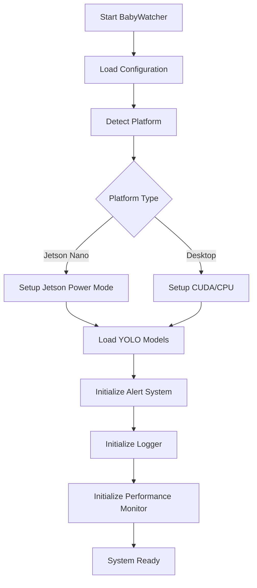
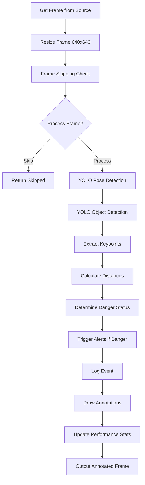
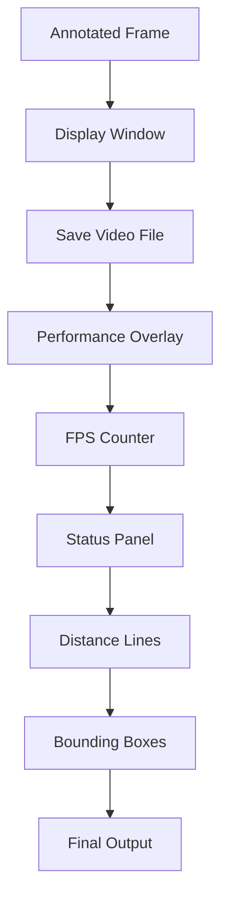

# BabyWatcher Workflow Documentation

## 📋 Tổng Quan Workflow

BabyWatcher là hệ thống giám sát an toàn trẻ em sử dụng AI với workflow hoàn chỉnh từ input đến output. Hệ thống xử lý thời gian thực và cung cấp cảnh báo kịp thời.

---

## 🎬 Workflow Chính

```
┌─────────────────┐    ┌─────────────────┐    ┌─────────────────┐
│   INPUT SOURCE  │───▶│   DETECTOR      │───▶│   ALERT SYSTEM  │
│                 │    │   ENGINE        │    │                 │
│ • Camera RTSP   │    │                 │    │ • Sound Alert   │
│ • Video File    │    │ • YOLO Pose     │    │ • Email Alert   │
│ • Image File    │    │ • YOLO Object   │    │ • Webhook       │
│ • CSI Camera    │    │ • Distance Calc │    │ • Log Event     │
│ • USB Camera    │    │ • Status Logic  │    │                 │
└─────────────────┘    └─────────────────┘    └─────────────────┘
                              │                        │
                              ▼                        ▼
                       ┌─────────────────┐    ┌─────────────────┐
                       │   LOGGER        │    │   PERFORMANCE   │
                       │   SYSTEM        │    │   MONITOR       │
                       │                 │    │                 │
                       │ • CSV Logs      │    │ • FPS Counter    │
                       │ • Event Stats   │    │ • Memory Usage   │
                       │ • Video Clips   │    │ • CPU Usage      │
                       └─────────────────┘    └─────────────────┘
```

---

##  Chi Tiết Workflow Theo Thời Gian

### Phase 1: Khởi Tạo Hệ Thống (Initialization)



**Các bước chi tiết:**
1. **Load Config**: Đọc `config.yaml` hoặc `config_jetson.yaml`
2. **Platform Detection**: Tự động phát hiện Jetson Nano/Desktop
3. **Device Setup**: Cấu hình CUDA/GPU hoặc CPU
4. **Model Loading**: Load YOLO pose và object detection models
5. **TensorRT Conversion** (Jetson): Chuyển model sang TensorRT engine
6. **System Initialization**: Khởi tạo alert, logger, performance monitor

### Phase 2: Xử Lý Frame (Frame Processing Loop)



**Luồng xử lý chi tiết:**

#### 2.1 Input Processing
- **Camera Sources**: RTSP, CSI, USB Webcam
- **File Sources**: Video files (.mp4, .avi), Image files (.jpg, .png)
- **Stream Processing**: Continuous frame capture

#### 2.2 YOLO Pose Detection
```python
# Phát hiện 17 keypoints của người
pose_results = pose_model.predict(frame, conf=0.4, verbose=False)
keypoints = pose_results.keypoints.xy.cpu().numpy()

# Extract important points
nose = keypoints[0]          # Mũi
left_wrist = keypoints[9]    # Tay trái
right_wrist = keypoints[10]  # Tay phải
left_shoulder = keypoints[5] # Vai trái
right_shoulder = keypoints[6] # Vai phải
```

#### 2.3 YOLO Object Detection
```python
# Phát hiện vật thể xung quanh
obj_results = obj_model.predict(frame, conf=0.4, verbose=False)
objects = obj_results.boxes.xyxy.cpu().numpy()
```

#### 2.4 Distance Calculation
```python
# Tính khoảng cách Euclidean
def distance(p1, p2):
    return np.linalg.norm(np.array(p1) - np.array(p2))

# Hand-Mouth Distance
hand_mouth_dist = min(
    distance(left_wrist, nose),
    distance(right_wrist, nose)
)

# Hand-Object Distance
hand_obj_dists = []
for obj_center in object_centers:
    d_left = distance(left_wrist, obj_center)
    d_right = distance(right_wrist, obj_center)
    hand_obj_dists.append(min(d_left, d_right))

hand_obj_dist = min(hand_obj_dists) if hand_obj_dists else 999.0
```

#### 2.5 Danger Status Logic
```python
# Threshold values
hand_mouth_thresh = 45  # pixels
hand_obj_thresh = 60    # pixels
danger_duration = 3.0   # seconds

# Status determination
if not hand_near_mouth:
    status = "SAFE"
    danger_start_time = None
elif hand_near_mouth and not hand_holding_obj:
    if danger_start_time is None:
        danger_start_time = current_time
    duration = current_time - danger_start_time
    status = "HAND_TO_MOUTH"
else:  # hand_near_mouth and hand_holding_obj
    if danger_start_time is None:
        danger_start_time = current_time
    duration = current_time - danger_start_time
    status = "OBJECT_TO_MOUTH"

# Trigger alerts
if duration > danger_duration:
    alert_manager.trigger_alert(status, duration)
```

#### 2.6 Alert System
```python
class AlertManager:
    def trigger_alert(self, status, duration):
        # Sound Alert
        if status == "OBJECT_TO_MOUTH":
            self.sound_alert.play_critical()  # Continuous beep
        elif status == "HAND_TO_MOUTH":
            self.sound_alert.play_warning()   # Single beep

        # Email Alert (if enabled)
        if self.email_enabled and duration > 5.0:
            self.email_alert.send_alert(status, duration)

        # Webhook Alert (if enabled)
        if self.webhook_enabled:
            self.webhook_alert.send_notification(status, duration)
```

#### 2.7 Event Logging
```python
class EventLogger:
    def log_event(self, status, duration, hand_mouth_dist, hand_obj_dist):
        # CSV Logging
        with open('logs/events_log.csv', 'a') as f:
            writer = csv.writer(f)
            writer.writerow([
                timestamp, status, duration,
                hand_mouth_dist, hand_obj_dist,
                frame_saved, notes
            ])

        # Video Clip Saving (for danger events)
        if status != "SAFE" and self.save_clips:
            self.save_danger_clip(frame, timestamp)
```

#### 2.8 Performance Monitoring
```python
class PerformanceMonitor:
    def start_frame(self):
        self.frame_start = time.time()
        return self.frame_start

    def end_frame(self, frame_start):
        frame_time = time.time() - frame_start
        self.fps_history.append(1.0 / frame_time)
        self.fps = np.mean(self.fps_history[-30:])  # Moving average

        # Memory and CPU monitoring
        self.update_system_stats()

        return {
            'fps': self.fps,
            'frame_time': frame_time,
            'memory_usage': self.memory_usage,
            'cpu_usage': self.cpu_usage
        }
```

### Phase 3: Output và Hiển Thị (Output Phase)



**Output Components:**
1. **Visual Annotations**:
   - Bounding boxes around detected persons/objects
   - Skeleton keypoints and connections
   - Distance measurement lines
   - Status banners (SAFE/HAND_TO_MOUTH/OBJECT_TO_MOUTH)

2. **Information Panel**:
   - Current status and color coding
   - Distance measurements
   - Danger duration timer
   - FPS and performance metrics

3. **File Outputs**:
   - Annotated video files (.mp4)
   - Danger event clips
   - CSV log files
   - Performance statistics

---

##  Workflow Theo Platform

### Desktop Workflow
```
Input → OpenCV Capture → CPU/GPU Processing → Display → File Output
```

### Jetson Nano Workflow
```
CSI Camera → GStreamer Pipeline → TensorRT Engine → Overlay → HDMI Output
```

**Jetson Specific Optimizations:**
- **TensorRT**: Model conversion for 2-3x speedup
- **Power Management**: Dynamic voltage/frequency scaling
- **CSI Pipeline**: Hardware-accelerated camera input
- **Memory Optimization**: Reduced precision (FP16/INT8)

---

##  Workflow Metrics và Monitoring

### Real-time Metrics
- **FPS**: Frames per second (target: 10+)
- **Frame Time**: Processing time per frame (target: <100ms)
- **Memory Usage**: RAM consumption (target: <1GB)
- **CPU/GPU Usage**: System resource utilization
- **Detection Accuracy**: mAP and precision/recall

### Event Metrics
- **Total Events**: Number of danger events detected
- **Average Duration**: Mean time of danger states
- **Response Time**: Time from detection to alert
- **False Positives**: Incorrect danger detections

### System Health
- **Uptime**: System availability percentage
- **Error Rate**: Failed frame processing rate
- **Temperature**: Hardware temperature monitoring
- **Power Consumption**: Energy usage tracking

---

##  Alert Workflow

### Alert Trigger Conditions
```python
# Alert levels
WARNING_DURATION = 2.0    # HAND_TO_MOUTH warning
CRITICAL_DURATION = 3.0   # OBJECT_TO_MOUTH critical

# Alert cooldown
ALERT_COOLDOWN = 2.0      # Min time between alerts

# Email threshold
EMAIL_THRESHOLD = 5.0     # Send email after 5s danger
```

### Multi-Channel Alert System
1. **Immediate Sound Alert**: Local audio feedback
2. **Email Notification**: Remote notification for parents
3. **Webhook Integration**: Integration with smart home systems
4. **Visual Indicators**: On-screen status display

### Alert Priority Levels
- **🔴 CRITICAL**: OBJECT_TO_MOUTH (highest priority)
- **🟡 WARNING**: HAND_TO_MOUTH (medium priority)
- **🟢 SAFE**: No danger detected (normal state)

---

##  Error Handling và Recovery

### Error Types
- **Camera Errors**: Connection lost, invalid stream
- **Model Errors**: Failed inference, corrupted models
- **Memory Errors**: Out of memory, GPU memory full
- **File System Errors**: Disk full, permission denied

### Recovery Strategies
```python
def handle_error(error_type, context):
    if error_type == "camera_lost":
        # Attempt reconnection
        self.reconnect_camera()
        # Fallback to file input
        self.switch_to_file_mode()

    elif error_type == "model_failure":
        # Reload model
        self.reload_models()
        # Use backup model if available
        self.activate_backup_model()

    elif error_type == "memory_full":
        # Reduce batch size
        self.reduce_batch_size()
        # Clear caches
        self.clear_memory_cache()
```

### Graceful Degradation
- **High Load**: Reduce image size, skip frames
- **Low Memory**: Use CPU instead of GPU
- **Network Issues**: Disable remote features
- **Hardware Failure**: Continue with available resources

---

##  Performance Optimization Workflow

### Continuous Optimization
1. **Monitor Performance**: Track FPS, memory, CPU usage
2. **Identify Bottlenecks**: Profile code execution
3. **Apply Optimizations**: Adjust parameters, enable features
4. **Validate Results**: Test with benchmark datasets
5. **Iterate**: Repeat optimization cycle

### Platform-Specific Tuning
```yaml
# Desktop Optimization
desktop_config:
  img_size: 640
  skip_frames: 0
  device: "cuda:0"
  half_precision: true

# Jetson Optimization
jetson_config:
  img_size: 416
  skip_frames: 1
  device: "cuda:0"
  tensorrt: true
  power_mode: "maxn"
```

### Adaptive Configuration
- **Auto-scaling**: Adjust parameters based on hardware
- **Dynamic Thresholds**: Adapt to lighting conditions
- **Load Balancing**: Distribute processing across cores

---

##  Security và Privacy Workflow

### Data Protection
- **Local Processing**: No cloud upload by default
- **Encrypted Logs**: Sensitive data encryption
- **Access Control**: User authentication for settings
- **Privacy Filters**: Blur faces in saved clips

### Network Security
- **Secure Webhooks**: HTTPS encryption
- **Email Security**: SMTP with authentication
- **API Keys**: Encrypted storage of credentials
- **Firewall Rules**: Restrict network access

---

##  Workflow Documentation và Maintenance

### Code Documentation
- **Inline Comments**: Explain complex logic
- **Function Docstrings**: API documentation
- **Workflow Diagrams**: Visual process flows
- **Configuration Guide**: Parameter explanations

### System Maintenance
- **Regular Updates**: Model and software updates
- **Performance Tuning**: Ongoing optimization
- **Bug Fixes**: Issue tracking and resolution
- **Feature Additions**: Planned enhancements

### User Training
- **Setup Guides**: Installation instructions
- **Configuration Help**: Parameter tuning guide
- **Troubleshooting**: Common issues and solutions
- **Best Practices**: Optimal usage recommendations

---

## 🎯 Workflow Summary

BabyWatcher workflow là một hệ thống hoàn chỉnh với:

✅ **Multi-input Support**: Camera, video, image files  
✅ **Real-time Processing**: AI-powered detection  
✅ **Multi-platform**: Desktop and Jetson Nano  
✅ **Comprehensive Alerts**: Sound, email, webhook  
✅ **Detailed Logging**: CSV logs and video clips  
✅ **Performance Monitoring**: FPS, memory, CPU tracking  
✅ **Error Recovery**: Graceful handling of failures  
✅ **Security**: Local processing, encrypted data  
✅ **Optimization**: TensorRT, power management  

**Core Philosophy**: *Simple, Reliable, Real-time Baby Safety Monitoring*

---

**Last Updated**: May 11, 2026  
**Version**: 1.1 (Jetson Nano Integrated)