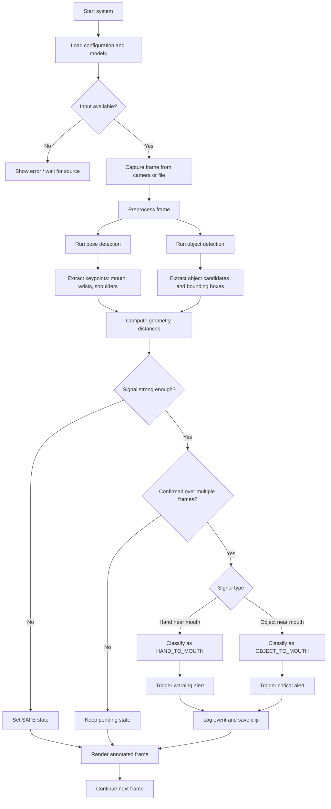

# WORKFLOW HỆ THỐNG BABYWATCHER

## 1. Mục tiêu của workflow

Workflow trong hệ thống BabyWatcher mô tả toàn bộ quy trình xử lý từ khung hình đầu vào cho đến khi hệ thống tạo cảnh báo, ghi log và lưu dữ liệu sự kiện. Mục tiêu của workflow là đảm bảo quá trình vận hành diễn ra liên tục, có cấu trúc rõ ràng, dễ kiểm tra và dễ mở rộng khi cần thêm chức năng mới.

---

## 2. Tổng quan kiến trúc workflow

Hệ thống hoạt động theo chuỗi xử lý tuần tự nhưng có các nhánh xử lý song song ở mức phát hiện. Cụ thể:

1. Thu nhận khung hình từ camera, video hoặc ảnh.
2. Chạy mô hình pose estimation để xác định vị trí tay, vai và vùng miệng.
3. Chạy mô hình object detection để phát hiện các vật thể quanh trẻ.
4. Tính toán các khoảng cách hình học giữa tay, vật thể và miệng.
5. Đánh giá tín hiệu nguy hiểm dựa trên ngưỡng động và xác nhận theo thời gian.
6. Nếu tín hiệu đủ mạnh, kích hoạt cảnh báo, ghi sự kiện và lưu clip nguy hiểm.



---

## 3. Các giai đoạn chính trong workflow

### 3.1. Khởi tạo hệ thống

Khi chương trình bắt đầu, hệ thống thực hiện các bước sau:

- Đọc cấu hình từ file YAML.
- Kiểm tra môi trường chạy: CPU hay GPU.
- Tải mô hình pose và mô hình object detection.
- Khởi tạo các module cảnh báo, logger và theo dõi hiệu suất.
- Chuẩn bị thư mục lưu log, clip và kết quả.

Vai trò của giai đoạn này là đảm bảo toàn bộ pipeline có thể hoạt động ổn định từ đầu.

### 3.2. Thu nhận và tiền xử lý khung hình

Hệ thống nhận khung hình từ một trong các nguồn sau:

- Camera trực tiếp
- File video
- File ảnh

Sau khi nhận khung hình, hệ thống chuyển đổi ảnh sang định dạng xử lý phù hợp, điều chỉnh kích thước và chuẩn bị dữ liệu cho mô hình inference.

### 3.3. Phát hiện pose và vật thể

Trong mỗi khung hình, hệ thống chạy hai nhánh phát hiện song song:

- Nhánh pose: xác định các keypoint trên cơ thể trẻ, bao gồm vị trí tay, vai và vùng miệng ước lượng.
- Nhánh object detection: phát hiện các vật thể có thể nằm gần trẻ hoặc có thể được trẻ cầm.

Các kết quả này là dữ liệu nền cho quá trình phân tích tiếp theo.

### 3.4. Phân tích hình học và khoảng cách

Sau khi có dữ liệu pose và object, hệ thống tính toán các đại lượng quan trọng như:

- Khoảng cách từ tay đến miệng.
- Khoảng cách từ tay đến vật thể.
- Khoảng cách từ vật thể đến miệng.
- Độ rộng vai để làm ngưỡng động theo kích thước cơ thể.

Quá trình này là trung tâm của hệ thống, vì đây là cơ sở để suy luận hành vi nguy hiểm.

### 3.5. Đánh giá trạng thái nguy hiểm

Hệ thống không quyết định trạng thái chỉ dựa trên một khung hình duy nhất. Thay vào đó, nó áp dụng logic theo thời gian:

- Nếu tín hiệu tay gần miệng xuất hiện liên tục, trạng thái được đánh giá là HAND_TO_MOUTH.
- Nếu vật thể gần miệng và tín hiệu lặp lại, trạng thái được đánh giá là OBJECT_TO_MOUTH.
- Nếu không có tín hiệu đủ mạnh, trạng thái giữ ở SAFE.

Để giảm cảnh báo giả, hệ thống sử dụng:

- Ngưỡng động theo kích thước cơ thể.
- Xác nhận qua nhiều frame liên tiếp.
- Thời gian duy trì tín hiệu trước khi cảnh báo.

### 3.6. Kích hoạt cảnh báo và lưu dữ liệu

Khi trạng thái nguy hiểm được xác nhận, hệ thống sẽ:

- Phát cảnh báo âm thanh.
- Gửi email hoặc webhook nếu được cấu hình.
- Ghi sự kiện vào file CSV.
- Lưu clip hoặc frame nguy hiểm vào thư mục lưu trữ.

Quá trình này giúp hệ thống vừa phản hồi tức thời, vừa tạo dữ liệu lịch sử để kiểm tra sau này.

---

## 4. Luồng xử lý chi tiết theo từng bước

### Bước 1: Nhận đầu vào

Hệ thống có thể nhận dữ liệu từ:

- Camera trực tiếp
- File video
- File ảnh

### Bước 2: Tiền xử lý

Các bước tiền xử lý gồm:

- Chuyển đổi ảnh sang định dạng phù hợp.
- Điều chỉnh kích thước khung hình.
- Chuẩn bị dữ liệu cho việc inference.

### Bước 3: Chạy mô hình

Hệ thống chạy mô hình pose và object detection trên khung hình hiện tại.

### Bước 4: Trích xuất đặc trưng

Từ kết quả mô hình, hệ thống trích xuất:

- Vị trí các keypoint quan trọng.
- Bounding box của vật thể.
- Các thông số hình học cần thiết.

### Bước 5: Xác định tín hiệu nguy hiểm

Hệ thống đánh giá mức độ gần của tay và vật thể với vùng miệng.

### Bước 6: Xác nhận theo thời gian

Nếu tín hiệu tiếp tục xuất hiện qua nhiều khung hình, hệ thống mới xem đây là hành vi đáng cảnh báo.

### Bước 7: Gửi phản hồi

Khi tín hiệu được xác nhận, hệ thống thực hiện:

- Cảnh báo người dùng.
- Ghi log sự kiện.
- Lưu clip hoặc frame liên quan.

---

## 5. Mô hình logic quyết định

Logic quyết định của hệ thống có thể được trình bày như sau:

```python
if not hand_near_mouth and not object_near_mouth:
    status = "SAFE"
elif object_near_mouth and object_signal_confirmed:
    status = "OBJECT_TO_MOUTH"
elif hand_near_mouth and hand_signal_confirmed:
    status = "HAND_TO_MOUTH"
else:
    status = "SAFE"
```

Trong thực tế, thuật toán được triển khai trong module xử lý khung hình có thêm các yếu tố như:

- Ngưỡng động theo kích thước cơ thể.
- Bộ đếm frame xác nhận.
- Thời gian duy trì tín hiệu.
- Cơ chế giảm cảnh báo giả.

---

## 6. Vai trò của các module trong workflow

| Module | Vai trò chính |
|---|---|
| Input handler | Nhận và chuẩn hóa dữ liệu đầu vào |
| Pose detector | Xác định keypoint và cấu trúc cơ thể |
| Object detector | Phát hiện vật thể quanh trẻ |
| Geometry analyzer | Tính khoảng cách và đánh giá mức độ gần |
| State evaluator | Quyết định trạng thái SAFE/HAND_TO_MOUTH/OBJECT_TO_MOUTH |
| Alert manager | Kích hoạt cảnh báo phù hợp |
| Logger | Ghi sự kiện và lưu lịch sử |
| Clip saver | Lưu frame hoặc clip nguy hiểm |

---

## 7. Workflow dành cho người phát triển

Khi phát triển hoặc sửa lỗi, người phát triển nên làm theo trình tự sau:

1. Kiểm tra đầu vào từ camera hoặc file.
2. Xác minh kết quả pose detection.
3. Xác minh kết quả object detection.
4. Theo dõi giá trị khoảng cách tính toán được.
5. Kiểm tra trạng thái đầu ra của module phân loại.
6. Xác nhận cảnh báo và log được kích hoạt đúng.

Quy trình này giúp nhanh chóng xác định nơi lỗi xảy ra nếu hệ thống phát hiện sai hoặc không tạo cảnh báo đúng.

---

## 8. Kết luận

Workflow của BabyWatcher được thiết kế theo hướng modular, liên tục và có thể mở rộng. Từ việc thu nhận khung hình, phân tích pose và object, đến việc đánh giá trạng thái nguy hiểm và kích hoạt cảnh báo, toàn bộ quy trình đều nhằm mục tiêu hỗ trợ giám sát trẻ sơ sinh một cách tự động, hiệu quả và ít sai lệch hơn so với cách giám sát thủ công.
