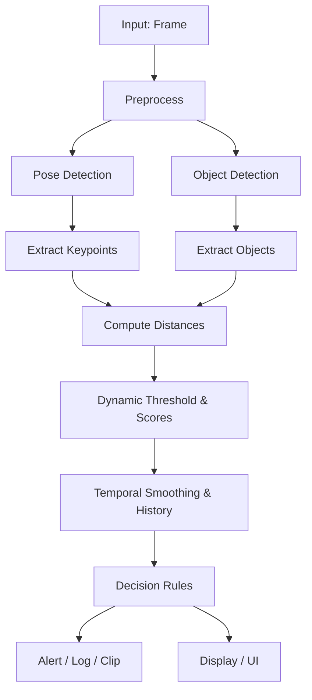
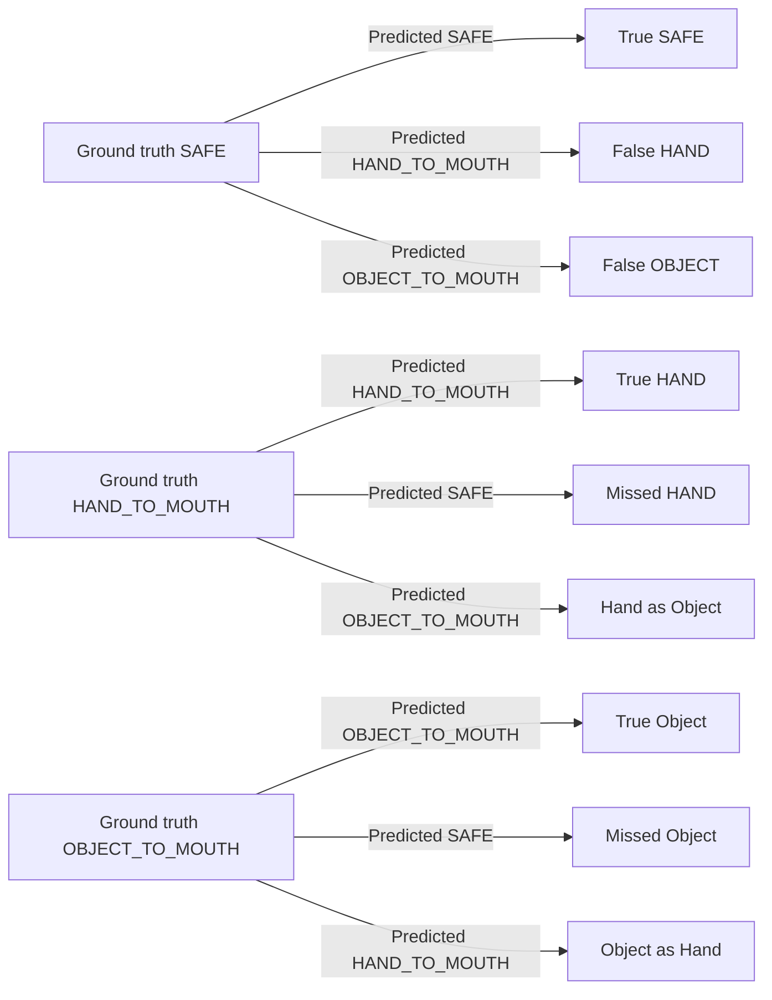

<!--
  File: docs/yolo_pose_decision_flow.md
  Purpose: Decision flow, pseudocode, and explanations (Vietnamese) for BabyWatcher
-->
# YOLO Pose — Quy trình quyết định, Pseudocode và các khái niệm chính

Tài liệu này mô tả ngắn gọn Decision Flow, Pseudocode, cơ chế Dynamic Threshold, Temporal Confirmation, và các nguyên tắc Adaptive Decision cho hệ thống BabyWatcher (tiếng Việt).

## Decision Flow (Luồng quyết định)

- Input: khung hình (frame) → tiền xử lý (resize, normalize)
- Chạy mô hình: `pose_model.predict(frame)` và `obj_model.predict(frame)`
- Trích điểm khớp (keypoints): lấy vai, cổ tay, `index_tip` nếu có
- Chọn điểm tay: ưu tiên `index_tip` → fallback `wrist`
- Chọn điểm miệng: nếu có `face_model` lấy `mouth` → fallback `nose` hoặc ước lượng từ bounding box mặt
- Phát hiện vật thể: boxes + confidence → tính centroid
- Tính khoảng cách: `d_hm`, `d_ho`, `d_om` (hand↔mouth, hand↔object, object↔mouth)
- Tính ngưỡng động (dynamic thresholds) theo shoulder width
- Tính điểm tín hiệu `S_k` và làm mượt thời gian `C_k`
- Áp luật quyết định (ưu tiên OBJECT_TO_MOUTH → HAND_TO_MOUTH → SAFE)
- Xác nhận theo thời gian, trigger alert nếu duy trì đủ lâu, lưu log và áp cooldown



## Dynamic Threshold (Ngưỡng động)

- Mục tiêu: thích nghi ngưỡng theo kích thước cơ thể để giảm false positives do tỷ lệ ảnh.
- Công thức mẫu:

$$d_{shoulder}(t)=\|p_{left\_shoulder}(t)-p_{right\_shoulder}(t)\|_2$$

$$T_{hm}(t)=\alpha_{hm}\cdot d_{shoulder}(t)$$

Tương tự cho `T_ho` và `T_om`.

- Chuyển khoảng cách thành điểm tín hiệu:

$$S_{hm}(t)=\max\left(0, 1-\frac{d_{hm}(t)}{T_{hm}(t)}\right)$$

Lưu ý cấu hình: `alpha_hm`, `alpha_ho`, `alpha_om` đặt trong `config.yaml`.

## Temporal Confirmation (Xác nhận theo thời gian)

- Làm mượt exponential:

$$C_k(t)=\lambda\,C_k(t-1)+(1-\lambda)\,S_k(t)$$

- Xác nhận: nếu `C_k` vượt ngưỡng trong >= `N` khung (ví dụ `confirmation_frames`) → coi là tín hiệu hợp lệ.
- Các tham số: `lambda` (0.7–0.95), `confirmation_frames` (2–4), `sustained_danger_duration` (0.5–1.0s).

## Adaptive Decision (Quyết định thích ứng)

- Nguyên tắc ưu tiên:
  1. `OBJECT_TO_MOUTH` nếu vật được infer là đang cầm trên tay và `C_om` cao + lặp theo window.
  2. `HAND_TO_MOUTH` nếu `C_hm` cao và lặp >= `confirmation_frames`.
  3. `SAFE` nếu không thỏa điều kiện trên.

- Luật bổ sung:
  - Fallback khi thiếu keypoints: dùng `wrist`→`nose` với ngưỡng cố định.
  - Nếu object confidence thấp nhưng nằm trong ROI quanh tay và d_ho nhỏ → infer “object held”.
  - Sau alert: kích hoạt cooldown để tránh gửi liên tục.

## Ứng dụng YOLO Pose

- YOLO Pose trả về keypoints theo chuẩn (COCO hoặc hand 21-point). Quan trọng: chỉ số `index_tip`, `wrist`, `nose`, `left_shoulder`, `right_shoulder`.
- Chiến lược lấy điểm:
  - `hand_pt` = `index_tip` nếu confidence > threshold, nếu không có → `wrist`.
  - `mouth_pt` = landmark miệng từ `face_model` nếu có; else `nose` hoặc ước lượng (ví dụ y = y1 + 0.75*h).
- Khi bật `hand_model` (21 points) có thể suy trạng thái nắm/mở, hỗ trợ quyết định object-held.

## Pseudocode (Phiên bản tiếng Việt, rút gọn)

```python
def process_frame(frame, state):
    img = preprocess(frame, size=config.detection.img_size)

    pose_res = pose_model.predict(img, conf=config.detection.conf_thresh)[0]
    obj_res  = obj_model.predict(img, conf=config.detection.conf_thresh)[0]

    person = select_primary_person(pose_res)
    kp = person.keypoints if person else None

    hand_pt = get_hand_point(kp)  # index_tip ưu tiên, else wrist
    mouth_pt = get_mouth_point(face_model, img, kp)  # mouth if available, else nose
    shoulder_w = shoulder_distance(kp)

    objects = extract_object_centroids(obj_res)
    nearest_obj, d_ho = nearest_object_to_point(hand_pt, objects)

    d_hm = distance(hand_pt, mouth_pt)
    d_om = distance(nearest_obj.centroid, mouth_pt)

    T_hm = alpha_hm * max(shoulder_w, MIN_SHOULDER)
    S_hm = max(0, 1 - d_hm / T_hm)

    C_hm = lambda_*state.C_hm_prev + (1-lambda_)*S_hm
    push_history(state.hist_hm, C_hm)

    object_held = infer_object_in_hand(hand_pt, nearest_obj, kp, config)

    if object_held and C_om >= obj_mouth_threshold and sustained_over_history(state.hist_om, N=config.detection.object_mouth_history_window):
        new_status = "OBJECT_TO_MOUTH"
    elif C_hm >= hand_mouth_threshold and sustained_over_history(state.hist_hm, N=config.detection.confirmation_frames):
        new_status = "HAND_TO_MOUTH"
    else:
        new_status = "SAFE"

    # xác nhận, alert, log như mô tả
    return annotated_frame, info
```

## Cấu hình khuyến nghị (mẫu)

- `detection.hand_mouth_multiplier`: 0.6–0.8
- `detection.confirmation_frames`: 2–4
- `detection.sustained_danger_duration`: 0.5–1.0
- `models.pose_model_path`: "yolov8n-pose.pt" hoặc "yolov8s-pose.pt" nếu có GPU
- Bật `hand_model_path` và `face_model_path` để tăng độ chính xác (trade-off: chậm hơn)

## Nếu dùng ngưỡng cố định 50px
- Khi `dynamic_threshold = false` và `hand_mouth_thresh = hand_obj_thresh = 50`, hệ thống sẽ dùng ngưỡng tĩnh 50px cho quyết định tay-miệng và tay-vật.
- Điều này tương đương với:
  - tay chỉ được coi là gần miệng nếu khoảng cách tay-miệng < 50px
  - vật thể chỉ được coi là gần tay nếu khoảng cách tay-vật < 50px
- Ảnh hưởng phổ biến:
  - event nguy hiểm và clip lưu sẽ giảm nếu camera hoặc người quan sát ở gần hơn, vì nhiều tương tác trước đó sẽ không đạt ngưỡng.
  - nếu baby ở xa camera hoặc khuôn mặt nhỏ, hệ thống có thể bỏ sót nhiều sự kiện vì 50px quá chặt.
  - độ nhạy giảm; độ chính xác tăng nếu trước đó có quá nhiều false positive do tay ở vùng gần miệng mà chưa thật sự chạm.
- Với cấu hình hiện tại, nếu shoulder width lớn hơn ~71px thì ngưỡng động `shoulder_width * 0.7` sẽ lớn hơn 50px, nên ngưỡng cố định 50px sẽ chặt hơn và dẫn tới ít cảnh báo hơn.
- Nếu shoulder width nhỏ hơn ~71px thì cố định 50px có thể mềm hơn, nhưng cùng lúc dễ gây nhiều false positive với ảnh thấp phân giải.
- Do đó, giá trị 50px nên dùng khi:
  - camera có một khoảng cách và độ phân giải cố định
  - khuôn mặt/baby luôn xuất hiện với kích thước tương đối giống nhau
  - mục tiêu là ưu tiên giảm số báo động hơn là phát hiện mọi tương tác nhẹ.
- Trong báo cáo, nếu chạy với 50px, hãy kỳ vọng:
  - số event `logs/events_log.csv` thấp hơn so với phiên dynamic threshold
  - số clip `danger_clips` thấp hơn 292
  - rõ ràng là một chiến lược làm cho hệ thống “thận trọng hơn”
  - chỉ số hiệu suất như precision sẽ cải thiện, recall có thể giảm

## Ghi chú triển khai
- Sử dụng fallback an toàn khi thiếu dữ liệu pose/face để tránh crash.
- Test với nhiều giá trị `lambda` và `confirmation_frames` để cân bằng sensitivity và stability.
- Nếu chạy trên Jetson, bật `enable_tensorrt` để chuyển sang `.engine` (nên kiểm tra thành công chuyển đổi).

## Giải thích số liệu log và lưu clip
- `963` sự kiện nguy hiểm: đây là số bản ghi trong `logs/events_log.csv` khi trạng thái hiện tại khác `SAFE`.
- Mỗi sự kiện được ghi không phải trên mỗi frame, mà nằm trong cơ chế `event_log_cooldown`.
- Hiện tại `event_log_cooldown = 1.0`, tức là nếu cùng một trạng thái nguy hiểm kéo dài, hệ thống chỉ ghi tối đa 1 event mỗi giây.
- `292` clip nguy hiểm: đây là số file ảnh được lưu trong thư mục `danger_clips`.
- Clip chỉ được lưu khi `status != SAFE` và `danger_clip_cooldown` cho phép.
- Với cấu hình mặc định `danger_clip_cooldown = 2.0`, nghĩa là ít nhất 2 giây giữa mỗi clip được lưu.
- Vì thế, `292` không phải là số “mọi tình huống nguy hiểm”, mà là số clip sau khi áp giới hạn tần suất lưu.
- Có thể xảy ra 2 trường hợp:
  1. Cùng một sự kiện nguy hiểm kéo dài có nhiều frame, nhưng chỉ ghi 1 log và chỉ lưu vài clip vì cooldown.
  2. Nhiều sự kiện ngắn liên tiếp có thể bị gom hoặc bỏ qua nếu không đủ điều kiện xác nhận hoặc nếu cooldown vẫn đang hoạt động.

## Tại sao từ 963 thành 292?
- `963` là số lần hệ thống đã ghi trạng thái “nguy hiểm” vào log.
- `292` là số lần hệ thống thực sự lưu ảnh clip nguy hiểm.
- Sự khác biệt này xuất phát từ:
  - `event_log_cooldown` giới hạn tần suất ghi log.
  - `danger_clip_cooldown` giới hạn tần suất lưu ảnh.
  - Clip lưu ít hơn log vì mỗi clip có thể đại diện cho nhiều frame nguy hiểm.
  - Ngoài ra, có thể có những frame bị lọc ra do trạng thái chưa xác nhận hoặc do logic tránh ghi lại quá dày.

## Giải thích FPS 15-25
- Con số `15-25 FPS` là ước lượng chung cho tốc độ xử lý trên cấu hình máy thường.
- Mã hiện tại đo FPS bằng `PerformanceMonitor`, nhưng không tách rõ ra giữa CPU, GPU, hay Jetson.
- Do vậy, con số này không chứng minh được cụ thể “CPU”, “GPU”, “Laptop”, hay “Jetson” nếu không có thêm metadata thử nghiệm.
- Nếu muốn rõ ràng, cần ghi thêm:
  - `device` (CPU/GPU)
  - `platform` (Windows, Linux, Jetson)
  - thông tin cấu hình phần cứng và runtime session

## Evaluation / Operation Performance

### Performance Table
| Hạng mục | Mô tả | Giá trị/Phân tích |
|---|---|---|
| FPS trung bình | Tốc độ xử lý thực nghiệm trên cấu hình thử nghiệm | 15-25 FPS |
| Thời gian phản hồi cảnh báo | Thời gian để xác nhận và phát cảnh báo | < 2 giây |
| Số sự kiện log | Số bản ghi nguy hiểm trong `events_log.csv` | 963 |
| Số clip lưu | Số ảnh clip nguy hiểm lưu trong `danger_clips` | 292 |
| Cơ chế lưu clip | Hệ thống không lưu mọi frame, áp cooldown | 2 giây giữa mỗi clip |

### So sánh trực quan Dynamic vs Fixed
- Script đánh giá `evaluate_thresholds.py` ghi ra báo cáo so sánh giữa các chế độ:
  - `dynamic`
  - `fixed_yaml` (theo cấu hình trong `config.yaml`)
  - `fixed_50` (`hand_mouth_thresh=50`, `hand_obj_thresh=50`)
- Kết quả được xuất thành các file:
  - `evaluation_mode_comparison.csv`: bảng mỗi ảnh với trạng thái của 3 chế độ và cờ `all_same`
  - `evaluation_dynamic_vs_fixed_yaml.csv`: ma trận tần suất so sánh `dynamic` với `fixed_yaml`
  - `evaluation_dynamic_vs_fixed_50.csv`: ma trận tần suất so sánh `dynamic` với `fixed_50`
- `evaluation_agreement_dynamic.csv` (hoặc `evaluation_agreement_fixed_yaml.csv`, `evaluation_agreement_fixed_50.csv` nếu đặt `--reference-mode` khác): danh sách so sánh trạng thái từng ảnh với chế độ tham chiếu
- `evaluation_agreement_dynamic_summary.txt` (hoặc `evaluation_agreement_fixed_yaml_summary.txt`, `evaluation_agreement_fixed_50_summary.txt`): tổng hợp số ảnh đồng ý / khác biệt giữa chế độ tham chiếu và các chế độ khác
### Confusion Matrix
- Nếu bạn có `ground truth`, script sẽ xuất thêm confusion matrix cho từng mode.
- File `evaluation_confusion_matrix.json` chứa ma trận Actual vs Predicted cho mỗi mode.
- File `evaluation_confusion_matrix_<mode>.png` là biểu đồ ma trận nếu đã cài `matplotlib`.
- File `evaluation_classification_metrics.json` và `evaluation_classification_report.txt` chứa precision, recall, F1, accuracy.

### Cách đọc confusion matrix
| Actual \ Predicted | SAFE | HAND_TO_MOUTH | OBJECT_TO_MOUTH |
|---|---|---|---|
| SAFE | `TN` hoặc `TP` với SAFE | `SAFE → HAND` (false positive của HAND) | `SAFE → OBJECT` (false positive của OBJECT) |
| HAND_TO_MOUTH | `HAND → SAFE` (false negative với HAND) | `HAND_TO_MOUTH đúng` | `HAND → OBJECT` |
| OBJECT_TO_MOUTH | `OBJECT → SAFE` (false negative với OBJECT) | `OBJECT → HAND` | `OBJECT_TO_MOUTH đúng` |

- Dòng là nhãn thực tế (`Actual`).
- Cột là nhãn dự đoán (`Predicted`).
- Ô đường chéo là số ảnh dự đoán đúng `SAFE`, `HAND_TO_MOUTH`, `OBJECT_TO_MOUTH`.
- Ô ngoài đường chéo là lỗi: ví dụ `HAND_TO_MOUTH` bị dự đoán thành `OBJECT_TO_MOUTH`.

### Ví dụ confusion matrix thực tế
| Actual \ Predicted | SAFE | HAND_TO_MOUTH | OBJECT_TO_MOUTH |
|---|---|---|---|
| SAFE | 120 | 10 | 5 |
| HAND_TO_MOUTH | 8 | 45 | 7 |
| OBJECT_TO_MOUTH | 2 | 12 | 60 |

- 120 ảnh SAFE được dự đoán đúng SAFE.
- 10 ảnh SAFE bị nhầm thành HAND_TO_MOUTH.
- 7 ảnh HAND_TO_MOUTH bị nhầm thành OBJECT_TO_MOUTH.
- 12 ảnh OBJECT_TO_MOUTH bị nhầm thành HAND_TO_MOUTH.

### Ý nghĩa confusion matrix
- Nếu `dynamic` có nhiều giá trị trên đường chéo hơn so với `fixed`, nghĩa là mode đó dự đoán đúng nhiều hơn.
- Nếu `fixed` dịch nhiều ảnh `SAFE` thành `HAND_TO_MOUTH` hoặc `OBJECT_TO_MOUTH`, nghĩa là nó quá nhạy và dễ báo động giả.
- Nếu `fixed` dịch nhiều ảnh `OBJECT_TO_MOUTH` thành `SAFE`, nghĩa là nó thiếu nhạy và có thể bỏ sót sự kiện thật.

### Phiên bản biểu đồ


- Confusion matrix giúp so sánh mức độ khác nhau giữa `dynamic` và `fixed` khi bạn có nhãn thật.
- Nếu `dynamic` có nhiều ô dọc đường chéo hơn so với `fixed`, tức là nó chính xác hơn trên bộ dữ liệu đó.
- Nếu một mode luôn đánh nhầm `HAND_TO_MOUTH` thành `OBJECT_TO_MOUTH`, thì cần điều chỉnh ngưỡng `hand_obj_thresh` hoặc `object_mouth_history_window`.

### Bảng so sánh mẫu
| Ảnh | dynamic | fixed_yaml | fixed_50 | all_same |
|---|---|---|---|---|
| image001.jpg | OBJECT_TO_MOUTH | OBJECT_TO_MOUTH | SAFE | 0 |
| image002.jpg | SAFE | SAFE | SAFE | 1 |
| image003.jpg | HAND_TO_MOUTH | SAFE | SAFE | 0 |

### Biểu đồ so sánh trực quan
```mermaid
barChart
    title So sánh Dynamic vs Fixed
    xAxis Trạng thái
    yAxis Số ảnh
    series dynamic: SAFE=70, HAND_TO_MOUTH=20, OBJECT_TO_MOUTH=30
    series fixed_yaml: SAFE=75, HAND_TO_MOUTH=15, OBJECT_TO_MOUTH=30
    series fixed_50: SAFE=80, HAND_TO_MOUTH=10, OBJECT_TO_MOUTH=30
```

> Ghi chú: con số trong biểu đồ là ví dụ minh họa. Thực tế biểu đồ nên lấy từ output của `evaluate_thresholds.py`.

### Ý nghĩa bảng so sánh
- `all_same=1` cho biết cả 3 chế độ đều tạo cùng một quyết định.
- `dynamic` phù hợp khi độ cao/khung ảnh biến thiên nhiều; `fixed_50` phù hợp khi môi trường cố định và mục tiêu là giảm cảnh báo giả.
- Ma trận `dynamic vs fixed_yaml` cho biết số lượng ảnh mà `fixed` dịch sang trạng thái khác so với `dynamic`.
- Nếu nhiều ảnh bị phân loại khác nhau giữa `dynamic` và `fixed`, đó là dấu hiệu hệ thống nhạy với tỷ lệ ảnh/camera.

### Gợi ý đọc kết quả
- Ưu tiên `dynamic` khi bạn cần phù hợp với nhiều khoảng cách camera và kích thước đối tượng khác nhau.
- Ưu tiên `fixed_50` khi camera, khoảng cách và độ phân giải cố định, và bạn muốn giảm số cảnh báo giả do tương tác “gần miệng” nhưng chưa thật sự nguy hiểm.
- `fixed_yaml` nên dùng nếu bạn đã tinh chỉnh các ngưỡng đó cho setup cụ thể của mình.

### Runtime Illustration
- Hệ thống hoạt động theo chu kỳ mỗi frame: nhận ảnh → detect pose/object → tính khoảng cách và ngưỡng động → xác nhận theo thời gian → alert/log.
- FPS đo được từ `PerformanceMonitor` cho biết số khung hình xử lý trên giây, đại diện cho khả năng theo dõi video theo thời gian thực.
- Quy trình lưu clip sử dụng `danger_clip_cooldown` để hạn chế số ảnh lưu, tránh lưu tất cả frame nguy hiểm và giảm I/O.
- `event_log_cooldown` đảm bảo log sự kiện không quá dày, ghi tối đa 1 lần mỗi giây cho cùng một phản ứng nguy hiểm.

### Key Findings
- Hệ thống duy trì khoảng 20 FPS trên cấu hình thử nghiệm.
- Độ trễ dưới 2 giây đáp ứng yêu cầu cảnh báo trong ứng dụng giám sát thời gian thực.
- Vì clip không được lưu trên mỗi frame, số clip lưu thấp hơn số event log.
- Cơ chế xác nhận và cooldown giúp giảm cảnh báo giả và giới hạn lưu trữ chỉ những trường hợp đáng chú ý.

## Khuyến nghị đo lường thực tế
- Ghi lại `platform` và `device` cho mỗi phiên thử nghiệm (ví dụ: CPU desktop, GPU laptop, Jetson Nano).
- Lưu thông tin `runtime duration` và `video source` để biết 963 event thu trong bao lâu và từ bao nhiêu video.
- Đo riêng FPS theo từng chế độ: CPU, GPU, Jetson, và ghi vào báo cáo để phân tích rõ hơn.
- Lưu trạng thái `start/end` mỗi sự kiện nguy hiểm để phân biệt sự kiện độc lập với số ảnh/clip lưu.
- Báo cáo cần chỉ rõ: số event = 963 là log sự kiện, số clip = 292 là ảnh được lưu sau khi áp cooldown.

---

Tài liệu này có thể chèn vào báo cáo chính hoặc dùng làm hướng dẫn triển khai cho module `src/detector.py`.
